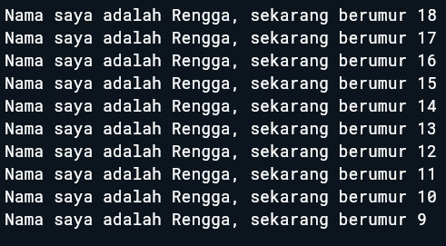

# Jobsheet Week 2 Pemrograman Mobile

## Soal 1
Modifikasilah kode pada baris 3 di VS Code atau Editor Code favorit Anda berikut ini agar mendapatkan keluaran (output) sesuai yang diminta!
```dart
void main() {
  for (int i = 0; i < 10; i++) {
    print('Nama saya adalah Rengga, sekarang berumur ${18 - i}');
  }
}
```
**Output yang diminta (Gantilah Fulan dengan nama Anda):**

---


## Soal 2
Mengapa sangat penting untuk memahami bahasa pemrograman Dart sebelum kita menggunakan framework Flutter? Jelaskan!

**Jawaban:**

Bahasa Dart merupakan dasar dari framework Flutter. jadi pemahaman terhadap Dart sangat penting agar tidak mengalami kesulitan ketika menulis kode di Flutter. Dengan menguasai konsep dasar Dart, seperti variabel, fungsi, dan null safety, proses pembelajaran Flutter akan menjadi lebih mudah, terarah, dan efisien.

---

## Soal 3
Rangkumlah materi dari codelab ini menjadi poin-poin penting yang dapat Anda gunakan untuk membantu proses pengembangan aplikasi mobile menggunakan framework Flutter.

**Jawaban:**

Dart merupakan bahasa pemrograman inti yang digunakan oleh Flutter. Pemahaman terhadap Dart akan mempermudah pengembang dalam membangun aplikasi, karena hampir seluruh komponen Flutter ditulis menggunakan bahasa ini. Dart dirancang agar sederhana dipelajari, tetapi tetap tangguh untuk kebutuhan pengembangan aplikasi berskala besar. Bahasa ini menggabungkan berbagai kelebihan dari bahasa pemrograman tingkat tinggi sekaligus menghadirkan fitur modern yang mendukung efisiensi kerja.

Beberapa poin penting mengenai Dart dalam konteks pengembangan Flutter adalah sebagai berikut:

1. **Peran Utama dalam Flutter**  
   Dart menjadi fondasi bagi Flutter, sehingga menguasainya akan mempercepat proses penulisan kode, pemahaman struktur proyek, serta penyelesaian masalah yang muncul selama pengembangan.

2. **Kelebihan Bahasa Dart**  
   - Memiliki **portabilitas tinggi**, dapat berjalan di berbagai platform melalui kompilasi ke JavaScript atau kode mesin.  
   - Mendukung **type safety** untuk mengurangi kesalahan, tetapi tetap fleksibel dengan anotasi tipe opsional.  
   - Dilengkapi **perkakas modern** seperti plugin IDE dan alat analisis kode yang meningkatkan produktivitas.  
   - Menyediakan **garbage collection otomatis** yang mengelola memori tanpa intervensi manual.  

3. **Mekanisme Eksekusi Kode**  
   Dart dapat dijalankan melalui dua mode kompilasi:  
   - **Just-In-Time (JIT):** biasanya digunakan saat pengembangan karena memungkinkan fitur `hot reload`, yaitu pembaruan kode yang langsung terlihat tanpa perlu menjalankan ulang aplikasi.  
   - **Ahead-Of-Time (AOT):** digunakan untuk aplikasi rilis dengan hasil performa lebih cepat dan stabil.  

4. **Konsep Dasar Pemrograman Dart**  
   Dart menggunakan paradigma **berorientasi objek (OOP)**, di mana semua data dan fungsi dikemas dalam kelas. Eksekusi program dimulai dari fungsi `main()`, dengan sintaksis yang mirip C atau JavaScript sehingga mudah dipahami oleh pengembang yang sudah terbiasa dengan bahasa serupa. Selain itu, Dart menyediakan beragam operator, baik untuk aritmatika (`+`, `-`, `*`, `/`, `%`), perbandingan (`==`, `!=`), maupun logika (`!`, `||`), yang memudahkan penulisan kode.


---

## Soal 4
Buatlah penjelasan dan contoh eksekusi kode tentang perbedaan Null Safety dan Late variabel!

**Jawaban:**

Dalam bahasa Dart ada dua fitur penting yang sering dipakai, yaitu **Null Safety** dan **late variable**. Keduanya sama-sama berkaitan dengan cara kita mengatur nilai pada variabel, tetapi penggunaannya berbeda.

**Null Safety** membantu kita agar variabel tidak bisa sembarangan bernilai `null`. Kalau memang ada kemungkinan variabel tersebut kosong, kita harus menandainya dengan tanda tanya (`?`). Dengan cara ini, kesalahan seperti *null reference error* bisa dicegah sejak awal, bahkan sebelum program dijalankan.

```dart
void main() {
  String nama = "Andi";    // non-nullable, wajib langsung ada nilai
  String? alamat;          // nullable, boleh bernilai null

  print(nama);             // Output: Andi
  print(alamat);           // Output: null
}
```

Sementara itu, **late variable** dipakai ketika kita ingin membuat variabel non-nullable, tetapi nilainya baru bisa diberikan nanti. Jadi meskipun variabel tersebut tidak langsung diisi, kita tetap bisa memastikannya akan punya nilai sebelum digunakan. Kalau variabel `late` dipanggil sebelum diberi nilai, barulah akan muncul error.

**Contoh kode Null Safety dan late:**
```dart
void main() {
  late String namaLengkap;   // non-nullable, tapi nilainya diberikan belakangan

  namaLengkap = "Budi Santoso";  // inisialisasi dilakukan kemudian

  print(namaLengkap);        // Output: Budi Santoso
}
```

---