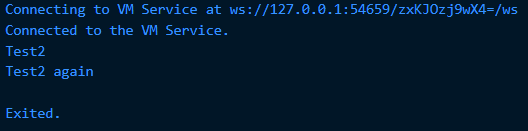
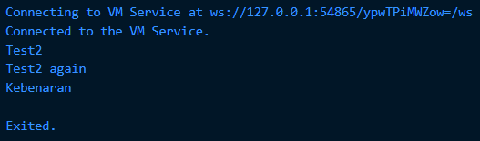
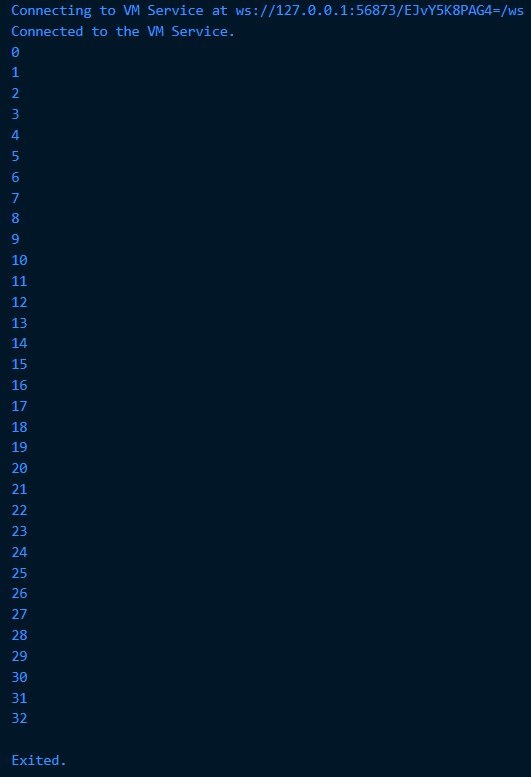
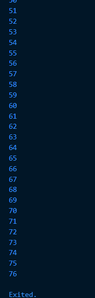
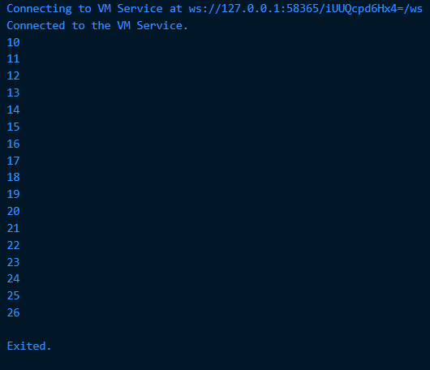
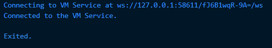
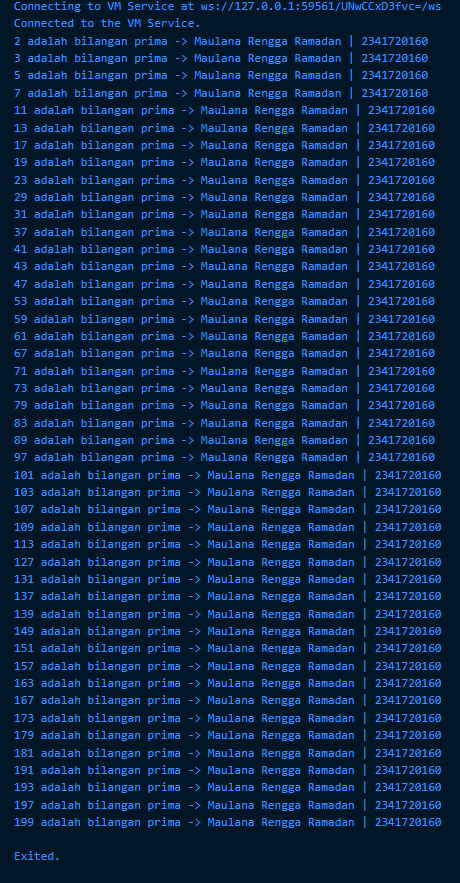

# Jobsheet Week 3 Pemrograman Mobile

## Praktikum 1
```dart
void main() {
  String test = "test2";
  if (test == "test1") {
    print("Test1");
  } else If (test == "test2") {
    print("Test2");
  } Else {
    print("Something else");
  }

  if (test == "test2") print("Test2 again");
}
```
*sebelum kode diubah terjadi error karena if dan else harus ditulis huruf kecil semua, tidak boleh If atau Else*

---
*Output yang dihasilkan:*
---

---
```dart
void main() {
  String test = "test2";

  if (test == "test1") {
    print("Test1");
  } else if (test == "test2") {
    print("Test2");
  } else {
    print("Something else");
  }

  if (test == "test2") print("Test2 again");

  String check = "true";

  if (check == "true") {
    print("Kebenaran");
  } else {
    print("Bukan kebenaran");
  }

  //bool test1 = true;

  //if (test1) {
    //print("Kebenaran");  
  //}
}
```
*sebelum kode diubah terjadi error karena kondisi if hanya bisa menerima bool, sedangkan pada kode sebelumnya menggunakan String jadi ada 2 cara yaitu menambahkan kondisi else atau mengubahnya menjadi bool*

---
*Output yang dihasilkan:*
---

---
## Praktikum 2
---
```dart
void main() {
  int counter = 0;

  while (counter < 33) {
    print(counter);
    counter++;
  }
}
```
*sebelum kode diubah terjadi error karena variabel counter belum pernah dideklarasikan*

---
*Output yang dihasilkan:*
---

---
```dart
void main() {
  int counter = 0;

  while (counter < 33) {
    print(counter);
    counter++;
  }

    do {
    print(counter);
    counter++;
  } while (counter < 77);
}
```
*sebelum diubah, sama seperti kode sebelumnya terjadi error karena variabel counter belum pernah dideklarasikan*

---
*Output yang dihasilkan:*
---


*Note: dari 0 sampai 76*

---
## Praktikum 3
---
```dart
void main() {
  for (int index = 10; index < 27; index++) {
    print(index);
  }
}
```
*sebelum kode diubah terjadi error karena variabel Index belum dideklarasikan dan penulisan Index serta index tidak konsisten huruf besar/kecilnya*

---
*Output yang dihasilkan:*
---

---
```dart
void main() {
  for (int index = 10; index < 27; index++) {
    if (index == 21) break;
    else if (index > 1 || index < 7) continue;
    print(index);
  }
}
```
*sebelum kode diubah terjadi error karena if dan else if harus ditulis huruf kecil semua, tidak boleh If atau Else If. Selain itu penggunaan variabel Index tidak konsisten dengan index.*

---
*Output yang dihasilkan:*
---

## TUGAS
---
```dart
void main() {
  String nama = "Maulana Rengga Ramadan"; 
  String nim = "2341720160";             

  for (int i = 0; i <= 201; i++) {
    if (isPrima(i)) {
      print("$i adalah bilangan prima -> $nama | $nim");
    }
  }
}

bool isPrima(int n) {
  if (n < 2) return false;
  for (int i = 2; i * i <= n; i++) {
    if (n % i == 0) return false;
  }
  return true;
}
```
---
*Output yang dihasilkan:*
---
