# Jobsheet Week 3 Pemrograman Mobile

## Praktikum 1
```dart
void main() {
  var list = [1, 2, 3];
  assert(list.length == 3);
  assert(list[1] == 2);
  print(list.length);
  print(list[1]);

  list[1] = 1;
  assert(list[1] == 1);
  print(list[1]);
}
```
*Penjelasan:*

Kode tersebut membuat list [1, 2, 3], lalu memastikan panjangnya tiga dan elemen kedua bernilai dua. Program mencetak panjang list (3) serta elemen kedua (2). Setelah itu, elemen kedua diganti menjadi satu, diverifikasi dengan assert, kemudian dicetak lagi sehingga keluaran terakhir adalah 1.

---
*Output yang dihasilkan:*
---
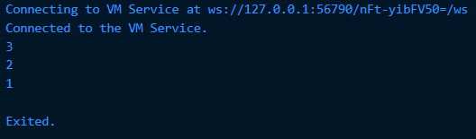
---
```dart
void main() {
  final list = List<String?>.filled(5, null); 

  list[1] = 'Maulana Rengga Ramadan';
  list[2] = '2341720160';

  print(list); 
}
```
*Penjelasan:*

Pada kode ini tidak terjadi error. Program membuat sebuah list dengan panjang lima elemen bertipe String?, sehingga setiap elemen dapat berisi teks atau null. Secara default, list diisi null pada semua indeks. Karena list ini dideklarasikan dengan final, referensinya tidak bisa diganti dengan list baru, tetapi isi list tetap dapat diubah. Yang disebut mutable, yaitu data dalam list masih bisa dimodifikasi.

---
*Output yang dihasilkan:*
---
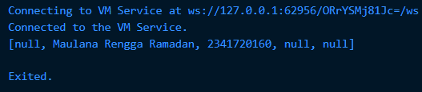
---
## Praktikum 2
---
```dart
void main() {
  var halogens = {'fluorine', 'chlorine', 'bromine', 'iodine', 'astatine'};
  print(halogens);
}
```
*Penjelasan:*

Ketika kode dijalankan, program membentuk sebuah set bernama halogens yang berisi lima string, yaitu 'fluorine', 'chlorine', 'bromine', 'iodine', dan 'astatine'. Tipe data set pada Dart berbeda dengan list karena elemennya bersifat unik dan tidak memiliki indeks maupun urutan yang tetap. Akibatnya, saat perintah print(halogens); dipanggil, semua elemen akan ditampilkan, tetapi susunan urutannya bisa berbeda setiap kali program dijalankan, misalnya {fluorine, chlorine, bromine, iodine, astatine} atau dengan urutan lain.

---
*Output yang dihasilkan:*
---
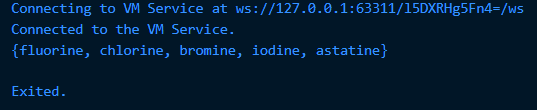
---
```dart
void main() {
  var names1 = <String>{};
  Set<String> names2 = {}; // This works, too.
  var names3 = {}; // Creates a map, not a set.

  print(names1);
  print(names2);
  print(names3);
}
```
*Penjelasan:*

Saat dijalankan, names1 dan names2 menjadi set kosong bertipe String sehingga tercetak {}. Sedangkan names3 dianggap sebagai map kosong karena tidak diberi tipe, jadi meski tercetak {}, tipenya adalah Map<dynamic, dynamic>.

---
*Output yang dihasilkan:*
---
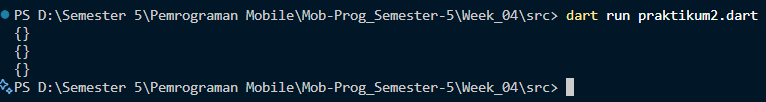

---
*Note: Menggunakan Terminal (dart run) agar semua output {} tampil, karena Debug Console menggabungkan output yang sama.*

---
*Menambahkan Nama dan NIM Prak 2*
---
```dart
void main() {
  var names1 = <String>{};
  Set<String> names2 = {};

  names1.add('Maulana Rengga Ramadan');

  names2.addAll({'Maulana Rengga Ramadan', '2341720160'});

  print(names1);
  print(names2);
}
```
---
*Output yang dihasilkan:*
---
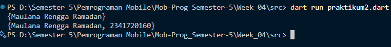

---
## Praktikum 3
---
```dart
void main() {
  var gifts = {
    // Key:    Value
    'first': 'partridge',
    'second': 'turtledoves',
    'fifth': 1
  };

  var nobleGases = {
    2: 'helium',
    10: 'neon',
    18: 2,
  };

  print(gifts);
  print(nobleGases);
}
```
*Penjelasan:*

Ketika kode dijalankan, gifts menjadi sebuah map dengan kunci bertipe String dan nilai berupa kombinasi String serta int, misalnya 'first': 'partridge' dan 'fifth': 1. Sedangkan nobleGases juga berupa map, tetapi kuncinya bertipe int dengan nilai campuran String dan int, misalnya 2: 'helium' dan 18: 2. Saat dicetak, print(gifts); menampilkan {first: partridge, second: turtledoves, fifth: 1}, dan print(nobleGases); menampilkan {2: helium, 10: neon, 18: 2}. Jadi perbedaannya ada pada tipe kunci yang digunakan: gifts memakai String sedangkan nobleGases memakai int.

---
*Output yang dihasilkan:*
---
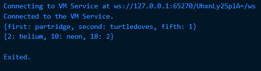
---
```dart
void main() {
  var gifts = {
    // Key:    Value
    'first': 'partridge',
    'second': 'turtledoves',
    'fifth': 1
  };

  var nobleGases = {
    2: 'helium',
    10: 'neon',
    18: 2,
  };
  print(gifts);
  print(nobleGases);

  var mhs1 = Map<String, String>();
  gifts['first'] = 'partridge';
  gifts['second'] = 'turtledoves';
  gifts['fifth'] = 'golden rings';

  var mhs2 = Map<int, String>();
  nobleGases[2] = 'helium';
  nobleGases[10] = 'neon';
  nobleGases[18] = 'argon';

  print(gifts);
  print(nobleGases);
}
```
*Penjelasan:*

Ketika kode dijalankan, gifts merupakan map dengan kunci String dan nobleGases map dengan kunci int. Awalnya masing-masing berisi data sesuai deklarasi. Setelah itu, nilai pada kunci 'fifth' di gifts diubah menjadi 'golden rings', sedangkan pada nobleGases nilai dengan kunci 18 diubah menjadi 'argon'. Variabel mhs1 dan mhs2 hanya membuat map kosong baru tetapi tidak dipakai. Oleh karena itu, hasil cetakan akhir menjadi:

---
*Output yang dihasilkan:*
---
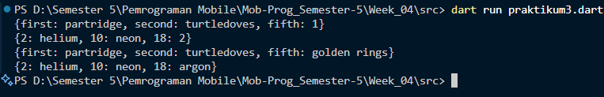
---
*Menambahkan Nama dan NIM Prak 3*
---
```dart
void main() {
  var gifts = {
    // Key:    Value
    'first': 'partridge',
    'second': 'turtledoves',
    'fifth': 1
  };

  var nobleGases = {
    2: 'helium',
    10: 'neon',
    18: 2,
  };
  print(gifts);
  print(nobleGases);

  var mhs1 = Map<String, String>();
  gifts['Nama'] = 'Maulana Rengga Ramadan';
  gifts['NIM'] = '2341720160';

  var mhs2 = Map<int, String>();
  nobleGases[99] = 'Maulana Rengga Ramadan';
  nobleGases[100] = '2341720160';

  mhs1['Nama'] = 'Maulana Rengga Ramadan';
  mhs1['NIM'] = '2341720160';

  mhs2[101] = 'Nama: Maulana Rengga Ramadan';
  mhs2[102] = 'NIM: 2341720160';

  print(gifts);
  print(nobleGases);
  print(mhs1);
  print(mhs2);
}
```
---
*Output yang dihasilkan:*
---
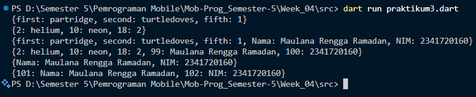

---
## Praktikum 4
---
```dart
void main() {
  var list = [1, 2, 3];
  var list2 = [0, ...list];
  print(list);
  print(list2);
  print(list2.length);
}
```
*Penjelasan:*

Sebelum diperbaiki kode mengamlami error dikarenakan variabel list1 tidak pernah di deklarasikan.

---
*Output yang dihasilkan:*
---
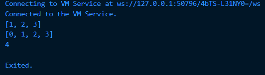
---
```dart
void main() {
  var list1 = [1, 2, null];
  print(list1);

  var list3 = [0, ...?list1];
  print(list3.length);
}
```
*Penjelasan:*

Sebelum diperbaiki kode mengamlami error dikarenakan variabel list1 tidak pernah di deklarasikan.

---
*Output yang dihasilkan:*
---
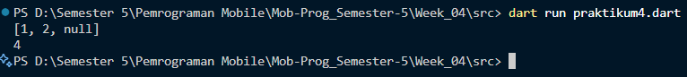
---
*Menambahkan Nama dan NIM Prak 4*
---
```dart
void main() {
  var nim = ['2', '3', '4', '1', '7', '2', '0', '1', '6', '0'];

  var listNIM = [...nim];
  print("NIM saya: $listNIM");
}
```
---
*Output yang dihasilkan:*
---

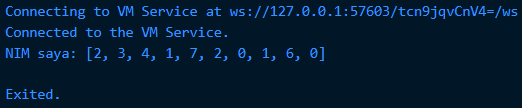
---
```dart
void main() {
  var promoActive = true;
  var nav = ['Home', 'Furniture', 'Plants', if (promoActive) 'Outlet'];
  print("promoActive = true → $nav");

  promoActive = false;
  nav = ['Home', 'Furniture', 'Plants', if (promoActive) 'Outlet'];
  print("promoActive = false → $nav");
}
```
*Penjelasan:*

Sebelum diperbaiki kode mengamlami error dikarenakan variabel promoActive tidak pernah di deklarasikan.

---
*Output yang dihasilkan:*
---
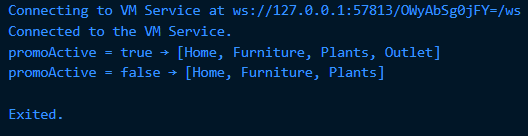
---
```dart
void main() {
  var login = 'Manager';
  var nav2 = ['Home', 'Furniture', 'Plants', if (login case 'Manager') 'Inventory'];
  print(nav2);
}
```
*Penjelasan:*

Sebelum diperbaiki kode mengamlami error dikarenakan variabel login tidak pernah di deklarasikan.

---
*Output yang dihasilkan:*
---
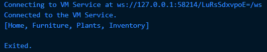
---
```dart
void main() {
  var login = 'Manager';
  var nav2 = ['Home', 'Furniture', 'Plants', if (login case 'Manager') 'Inventory'];
  print(nav2);
}
```
*Penjelasan:*

Sebelum diperbaiki kode mengamlami error dikarenakan variabel login tidak pernah di deklarasikan.

*Jelaskan manfaat Collection For:*

Manfaat Collection For pada Dart adalah untuk membentuk list baru secara lebih ringkas dengan cara melakukan perulangan langsung di dalam list literal. Fitur ini memudahkan penulisan kode karena kita bisa menghasilkan elemen-elemen list tanpa harus membuat loop terpisah.

---
*Output yang dihasilkan:*
---
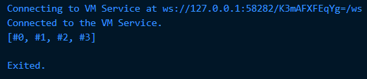
---
## Praktikum 5
---
```dart
void main() {
  var record = ('first', a: 2, b: true, 'last');
  print(record);
}
```
*Penjelasan:*

Record pada Dart digunakan untuk menyimpan beberapa data dalam satu variabel tanpa perlu membuat sebuah kelas. Record dapat berisi data berurutan maupun data yang memiliki nama sehingga lebih fleksibel dalam penggunaannya. 

---
*Output yang dihasilkan:*
---
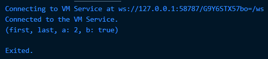
---
```dart
void main() {
  var record = ('first', a: 2, b: true, 'last');
  print(record);

  var angka = (10, 20);
  print("Sebelum ditukar: $angka");

  var hasil = tukar(angka);
  print("Sesudah ditukar: $hasil");
}

(int, int) tukar((int, int) record) {
  var (a, b) = record;
  return (b, a);
}
```
*Penjelasan:*

Fungsi tukar() pada kode tersebut bekerja untuk menerima sebuah record yang berisi dua bilangan bulat. Ketika record tersebut masuk ke dalam fungsi, nilai di dalamnya langsung didestruktur menjadi dua variabel, yaitu a dan b. Setelah itu, fungsi mengembalikan record baru dengan posisi nilai yang ditukar, sehingga nilai yang awalnya berada di depan akan berpindah ke belakang, dan sebaliknya.

---
*Output yang dihasilkan:*
---
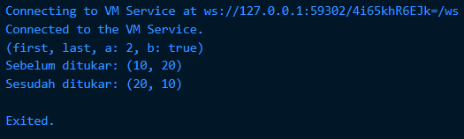
---
```dart
void main() {
  (String, int) mahasiswa = ('Maulana', 2341720160);
  print(mahasiswa);
}
```
*Penjelasan:*

Error pada kode sebelumnya muncul karena variabel mahasiswa dideklarasikan dengan tipe record (String, int) tetapi tidak langsung diberi nilai awal. Dalam Dart, variabel dengan tipe non-nullable harus diinisialisasi sebelum digunakan.

---
*Output yang dihasilkan:*
---
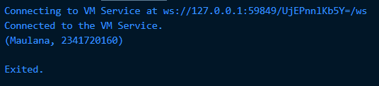
---
```dart
void main() {
  var mahasiswa2 = ('first', a: 2, b: true, 'last');

  print(mahasiswa2.$1); // Prints 'first'
  print(mahasiswa2.a); // Prints 2
  print(mahasiswa2.b); // Prints true
  print(mahasiswa2.$2); // Prints 'last'
}
```
*Penjelasan:*

Kode diatas membuat record mahasiswa2 dengan kombinasi field berurutan dan bernama. Positional field diakses menggunakan $1 dan $2 yang menghasilkan 'first' dan 'last', sedangkan named field diakses dengan .a dan .b yang menghasilkan 2 dan true. Ini menunjukkan bahwa record dapat menyimpan data dan diakses baik berdasarkan posisi maupun nama field.

---
*Output yang dihasilkan:*
---
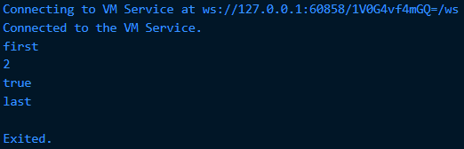
---

*Menambahkan Nama dan NIM Prak 5*

```dart
void main() {
  var mahasiswa2 = ('Maulana Rengga Ramadan', a: 2341720160, b: true, 'last');

  print(mahasiswa2.$1); // Prints 'first'
  print(mahasiswa2.a); // Prints 2
  print(mahasiswa2.b); // Prints true
  print(mahasiswa2.$2); // Prints 'last'
}
```
---
*Output yang dihasilkan:*
---
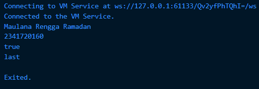
---

## TUGAS PRAKTIKUM

---
## 1. Silakan selesaikan Praktikum 1 sampai 5, lalu dokumentasikan berupa screenshot hasil pekerjaan Anda beserta penjelasannya!

DONE

## 2. Jelaskan yang dimaksud Functions dalam bahasa Dart!

Functions di Dart adalah blok kode yang dapat dipanggil untuk menerima input, menjalankan serangkaian instruksi, dan (opsional) mengembalikan nilai. Fungsi memisahkan logika menjadi unit yang dapat digunakan ulang sehingga memudahkan pengorganisasian program, pengujian, dan pembacaan kode. Deklarasi fungsi menentukan tipe nilai kembaliannya (atau `void` bila tidak mengembalikan apa-apa), daftar parameter, dan badan fungsi yang berisi perintah yang dieksekusi saat fungsi dipanggil.

## 3. Jelaskan jenis-jenis parameter di Functions beserta contoh sintaksnya!

Parameter fungsi di Dart bisa berupa positional yang wajib, positional opsional yang diletakkan dalam tanda kurung siku, atau named parameter yang ditulis dalam kurung kurawal. Positional wajib mengikuti urutan pemanggilan; positional opsional dapat diberi nilai default atau nullable; named parameter dapat ditandai `required` agar wajib atau diberi nilai default bila opsional. Berikut contoh sintaks singkat:

```dart
// Positional wajib
int tambah(int x, int y) => x + y;

// Positional opsional
String gabung(String a, [String? b = '']) => a + b;

// Named parameter opsional dengan default
void cetak({String pesan = 'Halo', int ulang = 1}) {
  for (var i = 0; i < ulang; i++) print(pesan);
}

// Named parameter wajib
void buatUser({required String nama, required int nim}) {
  print('Nama: $nama, NIM: $nim');
}
```

## 4. Jelaskan maksud Functions sebagai first-class objects beserta contoh sintaknya!

Fungsi disebut first-class object ketika fungsi diperlakukan seperti nilai: dapat disimpan dalam variabel, dikirim sebagai argumen ke fungsi lain, atau dikembalikan dari fungsi lain. Sifat ini memungkinkan pola pemrograman fungsional seperti callback dan higher-order functions, serta komposisi fungsi. Contoh sederhana adalah menyimpan referensi fungsi ke variabel lalu mengoperkannya ke fungsi lain sebagai parameter.

```dart
int kuadrat(int x) => x * x;

void applyAndPrint(int Function(int) f, int value) {
  print(f(value));
}

void main() {
  var fn = kuadrat; // menyimpan fungsi ke variabel
  applyAndPrint(fn, 5); // meneruskan fungsi sebagai argumen
}
```

## 5. Apa itu Anonymous Functions? Jelaskan dan berikan contohnya!

Anonymous functions adalah fungsi tanpa nama yang dibuat inline untuk keperluan singkat, misalnya sebagai callback. Karena tidak memiliki nama, anonymous function biasa digunakan pada tempat fungsi hanya diperlukan sekali atau tidak perlu dipanggil ulang dari lokasi lain. Bentuknya bisa menggunakan arrow expression untuk satu baris atau blok fungsi untuk beberapa pernyataan.

```dart
var list = [1, 2, 3];
list.forEach((n) => print(n));
var doubled = list.map((n) => n * 2).toList();
```

## 6. Jelaskan perbedaan Lexical scope dan Lexical closures! Berikan contohnya!

Lexical scope adalah aturan visibilitas variabel berdasarkan struktur kode statis: variabel yang dideklarasikan dalam suatu blok hanya terlihat di dalam blok tersebut dan blok-blok yang tertanam di dalamnya. Lexical closure muncul ketika sebuah fungsi menangkap dan menyimpan akses ke variabel dari lingkungan leksikalnya sehingga variabel tersebut tetap dapat diakses meskipun lingkungan asalnya sudah selesai dieksekusi. Closure memungkinkan fungsi mempertahankan state privat dari scope luar.

```dart
Function buatCounter() {
  var count = 0; // variabel dalam lexical scope
  return () {
    count += 1;  // fungsi anonim menangkap 'count'
    return count;
  };
}

void main() {
  var counter = buatCounter();
  print(counter()); // 1
  print(counter()); // 2
}
```

## 7. Jelaskan dengan contoh cara membuat return multiple value di Functions!

Mengembalikan multiple value di Dart dapat dilakukan dengan beberapa cara; opsi ringkas di Dart 3 adalah menggunakan Record, namun bisa juga menggunakan `Map`, `List`, atau membuat class. Record memungkinkan fungsi mengembalikan beberapa nilai terstruktur tanpa membuat tipe baru dan pemanggil bisa mengakses field positional atau named atau langsung melakukan destrukturisasi.

```dart
(String, int) ambilNamaDanNim() => ('Maulana Rengga Ramadan', 2341720160);

void main() {
  var hasil = ambilNamaDanNim();
  print(hasil.$1); // nama
  print(hasil.$2); // nim

  var (nama, nim) = ambilNamaDanNim(); // destruktur
  print(nama);
  print(nim);
}
```

## 8. Kumpulkan berupa link commit repo GitHub pada tautan yang telah disediakan di grup Telegram!

DONE

---