# Jobsheet Week 6 Layout dan Navigasi

## Praktikum 1: Membangun Layout di Flutter
*Langkah 1: Buat Project Baru*
---

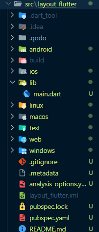
---
*Langkah 2: Buka file `lib/main.dart`*
---
```dart
import 'package:flutter/material.dart';

void main() => runApp(const MyApp());

class MyApp extends StatelessWidget {
  const MyApp({super.key});

  @override
  Widget build(BuildContext context) {
    return MaterialApp(
      title: 'Flutter layout: Maulana Rengga Ramadan | 2341720160',
      home: Scaffold(
        appBar: AppBar(
          title: const Text('Flutter layout demo'),
        ),
        body: const Center(
          child: Text('Hello World'),
        ),
      ),
    );
  }
}
```

*Output yang dihasilkan:*
---
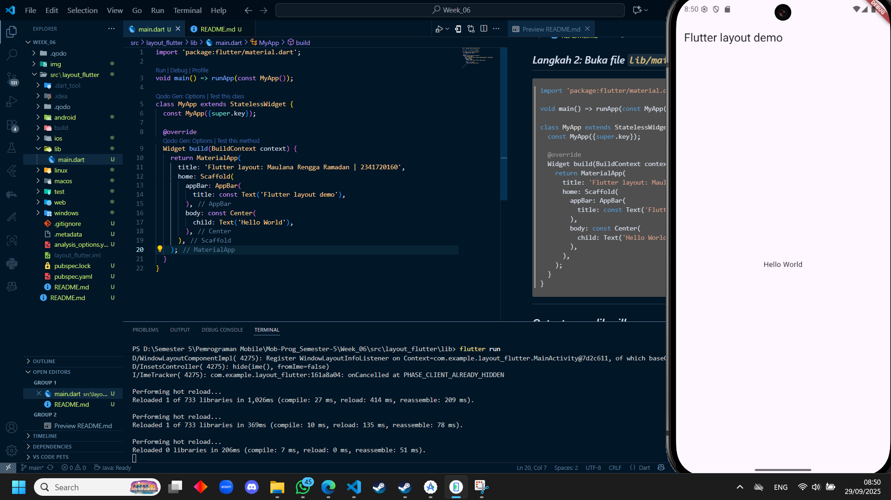
---
*Langkah 3: Identifikasi layout diagram*
---
Langkah pertama adalah memecah tata letak menjadi elemen dasarnya.

  * Identifikasi baris dan kolom.
  * Apakah tata letaknya menyertakan kisi-kisi (grid)?
  * Apakah ada elemen yang tumpang tindih?
  * Apakah UI memerlukan tab?
  * Perhatikan area yang memerlukan **alignment**, **padding**, atau **borders**.

Pertama, identifikasi elemen yang lebih besar. Dalam contoh ini, empat elemen disusun menjadi sebuah kolom: sebuah gambar, dua baris, dan satu blok teks.

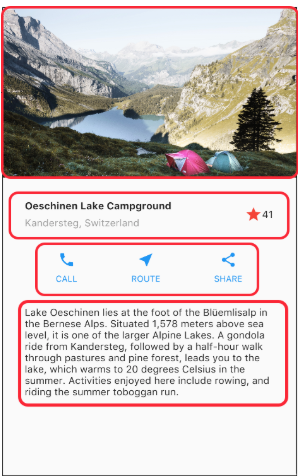

Selanjutnya, buat diagram setiap baris. Baris pertama, disebut bagian **Judul**, memiliki 3 anak: kolom teks, ikon bintang, dan angka. Anak pertamanya, Kolom, berisi 2 baris teks. Kolom pertama itu memakan banyak ruang, sehingga harus dibungkus dengan widget yang Diperluas.

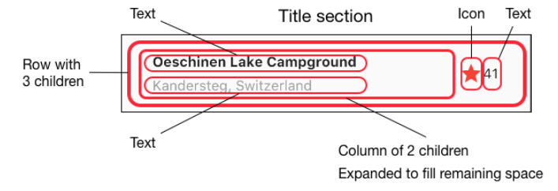

Baris kedua, disebut bagian **Tombol**, juga memiliki 3 anak: setiap anak merupakan kolom yang berisi ikon dan teks.

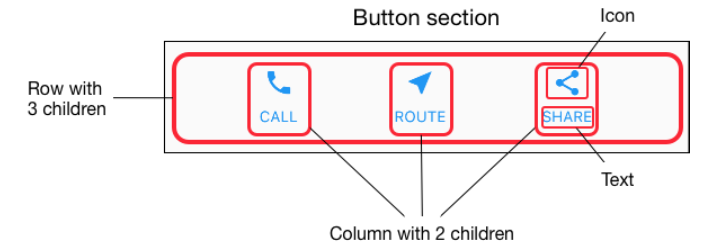

Setelah tata letak telah dibuat diagramnya, cara termudah adalah dengan menerapkan pendekatan **bottom-up**. Untuk menyederhanakan kebingungan visual dari kode tata letak yang banyak bertumpuk, tempatkan beberapa implementasi dalam variabel dan fungsi.

---
*Langkah 4: Implementasi title row*
---
```dart
import 'package:flutter/material.dart';

void main() => runApp(const MyApp());

class MyApp extends StatelessWidget {
  const MyApp({super.key});

  @override
  
  Widget build(BuildContext context) {
    Widget titleSection = Container(
  padding: const EdgeInsets.all(32),
  child: Row(
    children: [
      Expanded(
        /* soal 1*/
        child: Column(
          crossAxisAlignment: CrossAxisAlignment.start,
          children: [
            /* soal 2*/
            Container(
              padding: const EdgeInsets.only(bottom: 8),
              child: const Text(
                'Wisata Gunung di Batu',
                style: TextStyle(
                  fontWeight: FontWeight.bold,
                ),
              ),
            ),
            Text(
              'Batu, Malang, Indonesia',
              style: TextStyle(
                color: Colors.grey[500],
              ),
            ),
          ],
        ),
      ),
      /* soal 3*/
      const Icon(
        Icons.star,
        color: Colors.red,
      ),
      const Text('41'),
    ],
  ),
);

    return MaterialApp(
      title: 'Flutter layout: Maulana Rengga Ramadan | 2341720160',
      home: Scaffold(
        appBar: AppBar(
          title: const Text('Flutter layout demo'),
        ),
        body: Column(children: [titleSection]),
        ),
      );
  }
}
```
---
/* soal 1 */ Letakkan widget Column di dalam widget Expanded agar menyesuaikan ruang yang tersisa di dalam widget Row. Tambahkan properti crossAxisAlignment ke CrossAxisAlignment.start sehingga posisi kolom berada di awal baris.

/* soal 2 */ Letakkan baris pertama teks di dalam Container sehingga memungkinkan Anda untuk menambahkan padding = 8. Teks ‘Batu, Malang, Indonesia' di dalam Column, set warna menjadi abu-abu.

/* soal 3 */ Dua item terakhir di baris judul adalah ikon bintang, set dengan warna merah, dan teks "41". Seluruh baris ada di dalam Container dan beri padding di sepanjang setiap tepinya sebesar 32 piksel. Kemudian ganti isi body text ‘Hello World' dengan variabel titleSection seperti berikut:

*Output yang dihasilkan:*
---
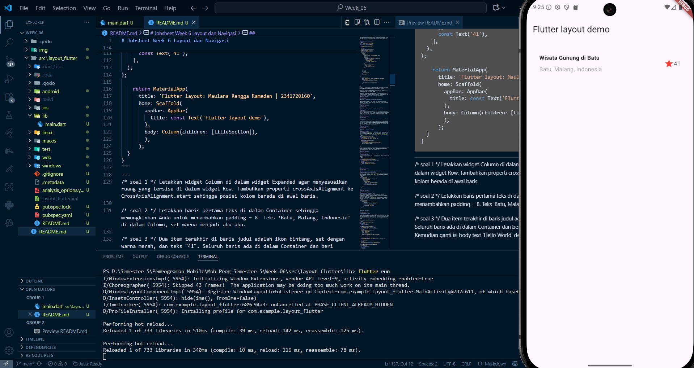
---
## Praktikum 2: Implementasi button row
*Langkah 1: Buat method Column _buildButtonColumn*
---

```dart
class MyApp extends StatelessWidget {
  const MyApp({super.key});

  @override
  Widget build(BuildContext context) {
    // ···
  }

  Column _buildButtonColumn(Color color, IconData icon, String label) {
    return Column(
      mainAxisSize: MainAxisSize.min,
      mainAxisAlignment: MainAxisAlignment.center,
      children: [
        Icon(icon, color: color),
        Container(
          margin: const EdgeInsets.only(top: 8),
          child: Text(
            label,
            style: TextStyle(
              fontSize: 12,
              fontWeight: FontWeight.w400,
              color: color,
            ),
          ),
        ),
      ],
    );
  }
}
```
---
*Langkah 2: Buat widget buttonSection*
---

```dart
Color color = Theme.of(context).primaryColor;

Widget buttonSection = Row(
  mainAxisAlignment: MainAxisAlignment.spaceEvenly,
  children: [
    _buildButtonColumn(color, Icons.call, 'CALL'),
    _buildButtonColumn(color, Icons.near_me, 'ROUTE'),
    _buildButtonColumn(color, Icons.share, 'SHARE'),
  ],
);
```
---
*Langkah 3: Tambah button section ke body*
---

*Output yang dihasilkan:*
---
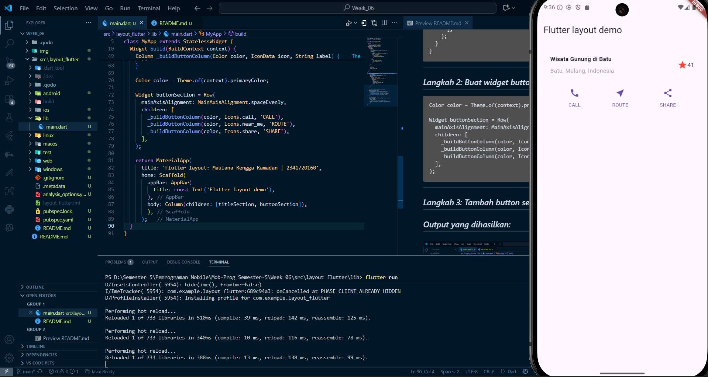
---
## Praktikum 3: Implementasi text section

*Langkah 1: Buat widget textSection*
---
```dart
Widget textSection = Container(
  padding: const EdgeInsets.all(32),
  child: const Text(
    'Carilah teks di internet yang sesuai '
    'dengan foto atau tempat wisata yang ingin '
    'Anda tampilkan. '
    'Tambahkan nama dan NIM Anda sebagai '
    'identitas hasil pekerjaan Anda. '
    'Selamat mengerjakan 🙂.',
    softWrap: true,
  ),
);
```
---
*Langkah 2: Tambahkan variabel text section ke body*
---

*Output yang dihasilkan:*
---
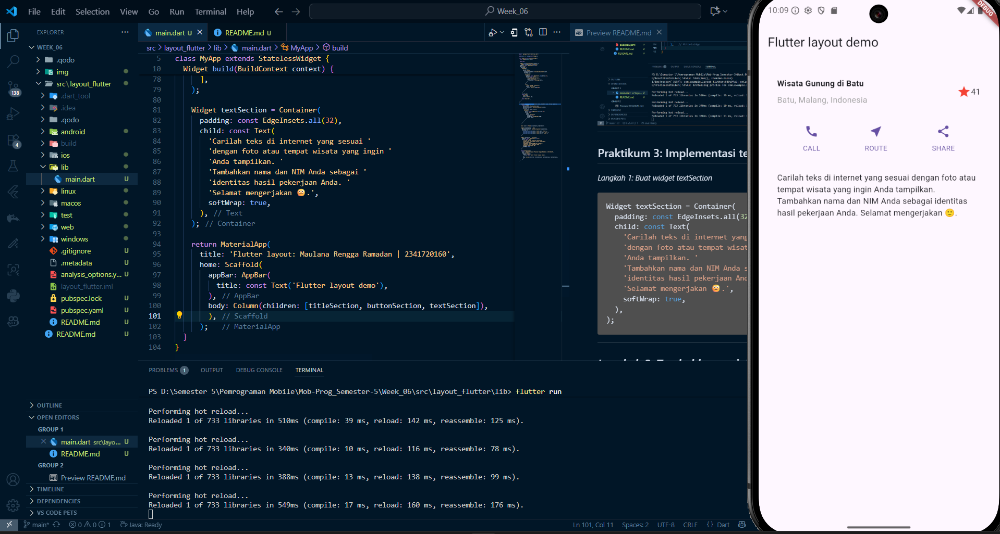
---

## Praktikum 4: Implementasi image section
*Langkah 1: Siapkan aset gambar*
---
```
  assets:
      - images/lake.jpg
```
---
*Langkah 2: Tambahkan gambar ke body*
---
```
        body: Column(children: [
          Image.asset(
            'images/lake.jpg',
            width: 600,
            height: 240,
            fit: BoxFit.cover,
          )
          ,titleSection, buttonSection, textSection])
```
---
*Output yang dihasilkan:*
---
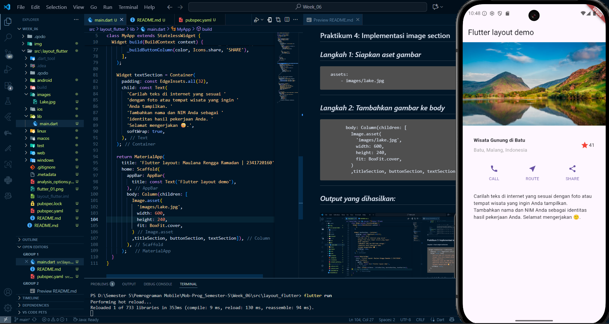
---

*Langkah 3: Terakhir, ubah menjadi ListView*
---
```
        body: ListView(children: [
          Image.asset(
            'images/lake.jpg',
            width: 600,
            height: 240,
            fit: BoxFit.cover,
          )
          ,titleSection, buttonSection, textSection])
```
---
*Output yang dihasilkan:*
---
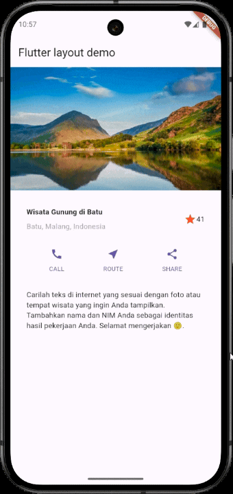
---

## Tugas Praktikum 1
---
## 1. Selesaikan Praktikum 1 sampai 4, lalu dokumentasikan dan push ke repository Anda berupa screenshot setiap hasil pekerjaan beserta penjelasannya di file `README.md`!

DONE

## 2. Silakan implementasikan di project baru "**basic_layout_flutter**" dengan mengakses sumber ini: https://docs.flutter.dev/codelabs/layout-basics

## Implementasi Widget Flutter

### 1. `Container` dan `Card`

**`Container`** digunakan sebagai wadah serbaguna untuk mengatur tata letak, seperti memberikan **padding** (jarak di dalam). Dalam kode ini, `Container` membungkus `Row` pada `titleSection` untuk memberinya padding.

**`Card`** adalah widget Material Design yang memberikan efek "timbul" dengan sudut membulat dan bayangan. Dalam kode ini, `Card` digunakan untuk membungkus `titleSection`, `ListTile` dan juga mengelompokkan `buttonSection` dan `textSection` agar terlihat lebih terstruktur dan rapi.

```dart
// Container untuk padding pada titleSection
Container(
  padding: const EdgeInsets.all(32),
  child: Row(
    // ...
  ),
);

// Card untuk membungkus titleSection
Card(
  margin: const EdgeInsets.symmetric(horizontal: 16.0, vertical: 8.0),
  elevation: 4.0,
  child: titleSection,
);
```

-----

### 2. `ListView`

**`ListView`** adalah widget yang menampilkan daftar item secara linear dan dapat digulir. Ini adalah pilihan yang tepat untuk menampung konten yang panjang, memastikan semua elemen dapat terlihat meskipun melebihi tinggi layar.

Di dalam kode ini, `ListView` digunakan sebagai **body** dari **`Scaffold`** untuk menampung semua bagian UI, mulai dari `Stack` yang berisi gambar, `Card` yang berisi judul, hingga bagian tombol dan teks deskripsi.

```dart
body: ListView(
  children: [
    // ... Stack, Card, dan widget lainnya
  ],
);
```

-----

### 3. `Stack`

**`Stack`** digunakan untuk menumpuk widget di atas satu sama lain. Widget pertama yang dimasukkan akan menjadi lapisan paling bawah, sementara widget terakhir berada di paling atas.

Dalam kode ini, `Stack` digunakan untuk meletakkan teks "Danau Oeschinen" di atas gambar pemandangan. Widget **`Positioned`** digunakan di dalam `Stack` untuk mengontrol posisi teks secara spesifik di bagian kiri bawah gambar.

```dart
Stack(
  children: [
    // Lapisan bawah: Gambar
    Image.asset(
      'images/Lake.jpg',
      // ...
    ),
    // Lapisan atas: Teks
    const Positioned(
      bottom: 16,
      left: 16,
      child: Text(
        'Danau Oeschinen',
        // ...
      ),
    ),
  ],
);
```

-----

### 4. `ListTile`

**`ListTile`** adalah widget yang dibuat khusus untuk satu baris dalam daftar, menampilkan informasi seperti ikon di awal (`leading`), judul (`title`), dan subjudul (`subtitle`). `ListTile` sering digunakan di dalam `ListView` atau `Card` untuk membuat item yang terorganisir.

Di dalam kode Anda, `ListTile` digunakan untuk menampilkan informasi identitas "Nama | NIM" di dalam sebuah `Card`, membuatnya terlihat rapi dan profesional.

```dart
Card(
  // ...
  child: ListTile(
    leading: Icon(Icons.person),
    title: Text('Nama | NIM'),
    subtitle: Text('Maulana Rengga Ramadan | 2341720160'),
  ),
);
```

*Output yang dihasilkan:*
---


## 3. Kumpulkan link commit repository GitHub Anda kepada dosen yang telah disepakati!

DONE

## Praktikum 5: Membangun Navigasi di Flutter
*Langkah 1: Siapkan project baru*
---
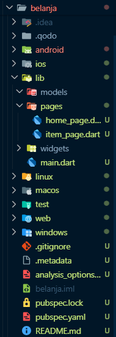
---
*Langkah 2: Mendefinisikan Route*
---
```dart
class HomePage extends StatelessWidget {
  @override
  Widget build(BuildContext context) {
        //TODO: Implement build

    throw UnimplementedError();
  }
}
```
---
```dart
import 'package:flutter/material.dart';

class ItemPage extends StatelessWidget {
  @override
  Widget build(BuildContext context) {
    //TODO: Implement build

    throw UnimplementedError();
  }
}
```

*Langkah 3: Lengkapi Kode di main.dart*
---
```dart
        body: ListView(children: [
          Image.asset(
            'images/lake.jpg',
            width: 600,
            height: 240,
            fit: BoxFit.cover,
          )
          ,titleSection, buttonSection, textSection])
```
*Langkah 4: Membuat data model*
---
```dart
class Item {
  String name;
  int price;

  Item({required this.name, required this.price});
}
```
*Langkah 5: Lengkapi kode di class HomePage*
---
```dart
class HomePage extends StatelessWidget {
    final List<Item> items = [
      Item(name: 'Sugar', price: 5000),
      Item(name: 'Salt', price: 2000)
    ];
    ...
}
```
*Langkah 6: Membuat ListView dan itemBuilder*
---
```dart
import 'package:flutter/material.dart';
import 'package:belanja/models/item.dart';

class HomePage extends StatelessWidget {
  final List<Item> items = [
    Item(name: 'Sugar', price: 5000),
    Item(name: 'Salt', price: 2000),
  ];

  @override
  Widget build(BuildContext context) {
    return Scaffold(
      appBar: AppBar(
        title: const Text('Shopping List'),
        backgroundColor: Colors.brown[300],
      ),
      body: Container(
        margin: const EdgeInsets.all(8),
        child: ListView.builder(
          padding: const EdgeInsets.all(8),
          itemCount: items.length,
          itemBuilder: (context, index) {
            final item = items[index];
            return Card(
              margin: const EdgeInsets.symmetric(vertical: 4.0),
              child: Container(
                padding: const EdgeInsets.all(8),
                child: Row(
                  children: [
                    Expanded(
                      child: Text(
                        item.name,
                        style: const TextStyle(
                          fontSize: 16,
                          fontWeight: FontWeight.bold,
                        ),
                      ),
                    ),
                    Expanded(
                      child: Text(
                        item.price.toString(),
                        textAlign: TextAlign.end,
                        style: const TextStyle(
                          fontSize: 16,
                          color: Colors.green,
                        ),
                      ),
                    ),
                  ],
                ), 
              ), 
            );
          },
        ),
      ),
    );
  }
}

```
*Output yang dihasilkan:*
---
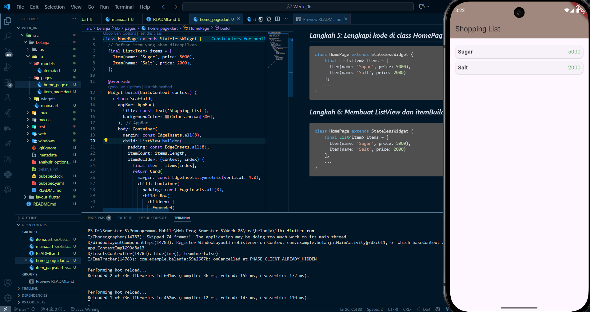
---
*Langkah 7: Menambahkan aksi pada ListView*
---
```dart
return InkWell(
  onTap: () {
    Navigator.pushNamed(context, '/item'); 
  },
)
```
*Output yang dihasilkan:*
---
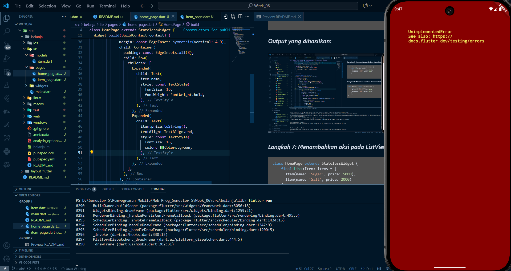
---
Muncul error karena tidak ada kode untuk menampilkan pada item_page

---
## Tugas Praktikum 2

## 1. Untuk melakukan pengiriman data ke halaman berikutnya, cukup menambahkan informasi arguments pada penggunaan `Navigator`. Perbarui kode pada bagian `Navigator` menjadi seperti berikut.

```dart
import 'package:flutter/material.dart';
import 'package:belanja/models/item.dart'; 

class ItemPage extends StatelessWidget {
  const ItemPage({super.key});

  @override
  Widget build(BuildContext context) {
    final item = ModalRoute.of(context)!.settings.arguments as Item;

    return Scaffold(
      appBar: AppBar(
        title: Text(item.name), 
        backgroundColor: Colors.brown[300],
      ),
      body: Center(
        child: Column(
          mainAxisAlignment: MainAxisAlignment.center,
          children: [
            Text(
              'Item: ${item.name}',
              style: const TextStyle(fontSize: 24, fontWeight: FontWeight.bold),
            ),
            const SizedBox(height: 10),
            Text(
              'Harga: Rp ${item.price.toString()}',
              style: const TextStyle(fontSize: 20, color: Colors.green),
            ),
            const SizedBox(height: 30),
            ElevatedButton(
              onPressed: () {
                Navigator.pop(context);
              },
              child: const Text('Kembali ke Daftar'),
            ),
          ],
        ),
      ),
    );
  }
}
```
*Output yang dihasilkan:*
---
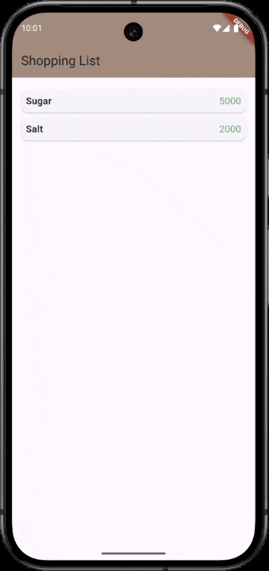
---
## 2. Pembacaan nilai yang dikirimkan pada halaman sebelumnya dapat dilakukan menggunakan `ModalRoute`. Tambahkan kode berikut pada blok fungsi build dalam halaman `ItemPage`. Setelah nilai didapatkan, anda dapat menggunakannya seperti penggunaan variabel pada umumnya. (https://docs.flutter.dev/cookbook/navigation/navigate-with-arguments)

```dart
import 'package:flutter/material.dart';
import 'package:belanja/models/item.dart'; 

class ItemPage extends StatelessWidget {
  const ItemPage({super.key});

  @override
  Widget build(BuildContext context) {
final itemArgs = ModalRoute.of(context)!.settings.arguments as Item;

    return Scaffold(
      appBar: AppBar(
        title: Text(itemArgs.name),
        backgroundColor: Colors.brown[300],
      ),
      body: Center(
        child: Column(
          mainAxisAlignment: MainAxisAlignment.center,
          children: [
            Text(
              'Item: ${itemArgs.name}',
              style: const TextStyle(fontSize: 24, fontWeight: FontWeight.bold),
            ),
            const SizedBox(height: 10),
            Text(
              'Harga: Rp ${itemArgs.price.toString()}',
              style: const TextStyle(fontSize: 20, color: Colors.green),
            ),
            const SizedBox(height: 30),
            ElevatedButton(
              onPressed: () {
                Navigator.pop(context);
              },
              child: const Text('Kembali ke Daftar'),
            ),
          ],
        ),
      ),
    );
  }
}
```
---
## 3. Pada hasil akhir dari aplikasi **belanja** yang telah anda selesaikan, tambahkan atribut foto produk, stok, dan rating. Ubahlah tampilan menjadi `GridView` seperti di aplikasi marketplace pada umumnya.

```dart
import 'package:flutter/material.dart';
import 'package:belanja/models/item.dart';
import 'package:belanja/widgets/item_card.dart';

class HomePage extends StatelessWidget {
  final List<Item> items = [
    Item(name: 'Sugar', price: 5000, photo: 'images/sugar.jpg', stock: 50, rating: 4.5),
    Item(name: 'Salt', price: 2000, photo: 'images/salt.jpg', stock: 100, rating: 4.8),
    Item(name: 'Flour', price: 10000, photo: 'images/flour.png', stock: 75, rating: 4.2),
    Item(name: 'Oil', price: 18000, photo: 'images/oil.avif', stock: 30, rating: 4.9),
  ];

  @override
  Widget build(BuildContext context) {
    return Scaffold(
      appBar: AppBar(
        title: const Text('Aplikasi Belanja'),
        backgroundColor: Colors.brown[300],
      ),
      body: Column(
        children: [
          Expanded(
            child: GridView.builder(
              padding: const EdgeInsets.all(12),
              itemCount: items.length,
              gridDelegate: const SliverGridDelegateWithFixedCrossAxisCount(
                crossAxisCount: 2, 
                crossAxisSpacing: 12,
                mainAxisSpacing: 12,
                childAspectRatio: 0.7,
              ),
              itemBuilder: (context, index) {
                return ItemCard(item: items[index]);
              },
            ),
          ),
          const Padding(
            padding: EdgeInsets.all(16.0),
            child: Text(
              'Maulana Rengga Ramadan | 2341720160',
              style: TextStyle(color: Colors.grey, fontSize: 12),
            ),
          ),
        ],
      ),
    );
  }
}
```
---
## 4. Silakan implementasikan `Hero widget` pada aplikasi **belanja** Anda dengan mempelajari dari sumber ini: https://docs.flutter.dev/cookbook/navigation/hero-animations

```dart
import 'package:flutter/material.dart';
import 'package:belanja/models/item.dart'; 

class ItemPage extends StatelessWidget {
  const ItemPage({super.key});

  @override
  Widget build(BuildContext context) {
    final item = ModalRoute.of(context)!.settings.arguments as Item;

    return Scaffold(
      appBar: AppBar(
        title: Text(item.name),
        backgroundColor: Colors.brown[300],
      ),
      body: SingleChildScrollView(
        child: Padding(
          padding: const EdgeInsets.all(16.0),
          child: Column(
            crossAxisAlignment: CrossAxisAlignment.start,
            children: [
              Hero(
                tag: 'product-photo-${item.name}', 
                child: Center(
                  child: ClipRRect(
                    borderRadius: BorderRadius.circular(16.0),
                    child: Image.asset(
                      item.photo, 
                      height: 250,
                      fit: BoxFit.cover,
                    ),
                  ),
                ),
              ),
              const SizedBox(height: 20),
              Text(
                item.name,
                style: const TextStyle(fontSize: 32, fontWeight: FontWeight.bold),
              ),
              const Divider(),
              Row(
                mainAxisAlignment: MainAxisAlignment.spaceBetween,
                children: [
                  Text(
                    'Harga: Rp ${item.price}',
                    style: const TextStyle(fontSize: 24, color: Colors.green, fontWeight: FontWeight.w600),
                  ),
                  Row(
                    children: [
                      const Icon(Icons.star, color: Colors.amber, size: 24),
                      Text(
                        item.rating.toString(),
                        style: const TextStyle(fontSize: 20, fontWeight: FontWeight.bold),
                      ),
                    ],
                  ),
                ],
              ),
              const SizedBox(height: 10),
              Text(
                'Stok Tersedia: ${item.stock} unit',
                style: TextStyle(fontSize: 16, color: item.stock > 0 ? Colors.blueGrey : Colors.red),
              ),
              const SizedBox(height: 40),
              Center(
                child: ElevatedButton(
                  onPressed: () {
                    Navigator.pop(context);
                  },
                  style: ElevatedButton.styleFrom(
                    backgroundColor: Colors.brown[400],
                    padding: const EdgeInsets.symmetric(horizontal: 40, vertical: 15),
                    shape: RoundedRectangleBorder(borderRadius: BorderRadius.circular(10)),
                  ),
                  child: const Text('Beli Sekarang', style: TextStyle(color: Colors.white, fontSize: 18)),
                ),
              ),
            ],
          ),
        ),
      ),
    );
  }
}
```
---

## 5. Sesuaikan dan modifikasi tampilan sehingga menjadi aplikasi yang menarik. Selain itu, pecah widget menjadi kode yang lebih kecil. Tambahkan **Nama** dan **NIM** di footer aplikasi **belanja** Anda.

```dart
child: Text(
  'Maulana Rengga Ramadan | 2341720160',
   style: TextStyle(color: Colors.grey, fontSize: 12),
),
```
*Output keseluruhan kode:*
---

---
## 6. Selesaikan Praktikum 5: Navigasi dan Rute tersebut. Cobalah modifikasi menggunakan plugin go_router, lalu dokumentasikan dan push ke repository Anda berupa screenshot setiap hasil pekerjaan beserta penjelasannya di file `README.md`. Kumpulkan link commit repository GitHub Anda kepada dosen yang telah disepakati!

**pubspec.yaml:**
```dart
dependencies:
  flutter:
    sdk: flutter
  go_router: ^12.1.3 
```
---
**main.dart:**
```dart
import 'package:flutter/material.dart';
import 'package:go_router/go_router.dart';
import 'package:belanja/pages/home_page.dart';
import 'package:belanja/pages/item_page.dart';
import 'package:belanja/models/item.dart';

void main() {
  runApp(MyApp());
}

class MyApp extends StatelessWidget {
  @override
  Widget build(BuildContext context) {
    return MaterialApp.router(
      title: 'Belanja App',
      routerConfig: _router,
    );
  }
}

final GoRouter _router = GoRouter(
  routes: <RouteBase>[
    GoRoute(
      path: '/',
      builder: (BuildContext context, GoRouterState state) {
        return HomePage();
      },
    ),
    GoRoute(
      path: '/item',
      builder: (BuildContext context, GoRouterState state) {
        final item = state.extra as Item;
        return ItemPage(item: item);
      },
    ),
  ],
);
```
---
**item_card.dart:**
```dart
import 'package:flutter/material.dart';
import 'package:go_router/go_router.dart';
import 'package:belanja/models/item.dart';

class ItemCard extends StatelessWidget {
  final Item item;

  const ItemCard({Key? key, required this.item}) : super(key: key);

  @override
  Widget build(BuildContext context) {
    return Card(
      elevation: 4,
      shape: RoundedRectangleBorder(
        borderRadius: BorderRadius.circular(12),
      ),
      child: InkWell(
        onTap: () {
          // UBAH: Gunakan context.push() bukan context.go()
          context.push('/item', extra: item);
        },
        borderRadius: BorderRadius.circular(12),
        child: Stack(
          children: [
            Column(
              crossAxisAlignment: CrossAxisAlignment.start,
              children: [
                // Gambar item
                Expanded(
                  flex: 3,
                  child: Container(
                    width: double.infinity,
                    decoration: const BoxDecoration(
                      borderRadius: BorderRadius.vertical(top: Radius.circular(12)),
                    ),
                    child: ClipRRect(
                      borderRadius: const BorderRadius.vertical(top: Radius.circular(12)),
                      child: Hero(
                        tag: 'product-photo-${item.name}',
                        child: Image.asset(
                          item.photo,
                          fit: BoxFit.cover,
                          errorBuilder: (context, error, stackTrace) {
                            return Container(
                              color: Colors.grey[200],
                              child: const Icon(
                                Icons.image_not_supported,
                                size: 50,
                                color: Colors.grey,
                              ),
                            );
                          },
                        ),
                      ),
                    ),
                  ),
                ),
                // Informasi item
                Expanded(
                  flex: 2,
                  child: Padding(
                    padding: const EdgeInsets.all(8.0),
                    child: Column(
                      crossAxisAlignment: CrossAxisAlignment.start,
                      children: [
                        Text(
                          item.name,
                          style: const TextStyle(
                            fontWeight: FontWeight.bold,
                            fontSize: 14,
                          ),
                          maxLines: 2,
                          overflow: TextOverflow.ellipsis,
                        ),
                        const Spacer(),
                        Text(
                          'Rp ${item.price.toString()}',
                          style: const TextStyle(
                            color: Colors.orange,
                            fontWeight: FontWeight.bold,
                            fontSize: 16,
                          ),
                        ),
                        Row(
                          children: [
                            Text(
                              'Stok: ${item.stock}',
                              style: const TextStyle(
                                fontSize: 12,
                                color: Colors.grey,
                              ),
                            ),
                            const Spacer(),
                            Row(
                              children: [
                                const Icon(
                                  Icons.star,
                                  size: 16,
                                  color: Colors.amber,
                                ),
                                Text(
                                  item.rating.toString(),
                                  style: const TextStyle(
                                    fontSize: 12,
                                    color: Colors.grey,
                                  ),
                                ),
                              ],
                            ),
                          ],
                        ),
                      ],
                    ),
                  ),
                ),
              ],
            ),
            if (item.stock < 40)
              Positioned(
                top: 8,
                right: 8,
                child: Container(
                  padding: const EdgeInsets.symmetric(horizontal: 6, vertical: 2),
                  decoration: BoxDecoration(
                    color: Colors.red,
                    borderRadius: BorderRadius.circular(8),
                  ),
                  child: const Text(
                    'Stok Rendah',
                    style: TextStyle(
                      color: Colors.white,
                      fontSize: 10,
                      fontWeight: FontWeight.bold,
                    ),
                  ),
                ),
              ),
          ],
        ),
      ),
    );
  }
}
```
---
**item_page.dart:**
```dart
import 'package:flutter/material.dart';
import 'package:go_router/go_router.dart'; 
import 'package:belanja/models/item.dart'; 

class ItemPage extends StatelessWidget {
  final Item item; 

  const ItemPage({super.key, required this.item}); 

  @override
  Widget build(BuildContext context) {
    return Scaffold(
      appBar: AppBar(
        title: Text(item.name),
        backgroundColor: Colors.brown[300],
      ),
      body: SingleChildScrollView(
        child: Padding(
          padding: const EdgeInsets.all(16.0),
          child: Column(
            crossAxisAlignment: CrossAxisAlignment.start,
            children: [
              Hero(
                tag: 'product-photo-${item.name}', 
                child: Center(
                  child: ClipRRect(
                    borderRadius: BorderRadius.circular(16.0),
                    child: Image.asset(
                      item.photo, 
                      height: 250,
                      fit: BoxFit.cover,
                    ),
                  ),
                ),
              ),
              const SizedBox(height: 20),
              Text(
                item.name,
                style: const TextStyle(fontSize: 32, fontWeight: FontWeight.bold),
              ),
              const Divider(),
              Row(
                mainAxisAlignment: MainAxisAlignment.spaceBetween,
                children: [
                  Text(
                    'Harga: Rp ${item.price}',
                    style: const TextStyle(fontSize: 24, color: Colors.green, fontWeight: FontWeight.w600),
                  ),
                  Row(
                    children: [
                      const Icon(Icons.star, color: Colors.amber, size: 24),
                      Text(
                        item.rating.toString(),
                        style: const TextStyle(fontSize: 20, fontWeight: FontWeight.bold),
                      ),
                    ],
                  ),
                ],
              ),
              const SizedBox(height: 10),
              Text(
                'Stok Tersedia: ${item.stock} unit',
                style: TextStyle(fontSize: 16, color: item.stock > 0 ? Colors.blueGrey : Colors.red),
              ),
              const SizedBox(height: 40),
              Center(
                child: ElevatedButton(
                  onPressed: () {
                    // UBAH: Gunakan context.pop() bukan context.go('/')
                    context.pop();
                  },
                  style: ElevatedButton.styleFrom(
                    backgroundColor: Colors.brown[400],
                    padding: const EdgeInsets.symmetric(horizontal: 40, vertical: 15),
                    shape: RoundedRectangleBorder(borderRadius: BorderRadius.circular(10)),
                  ),
                  child: const Text('Beli Sekarang', style: TextStyle(color: Colors.white, fontSize: 18)),
                ),
              ),
            ],
          ),
        ),
      ),
    );
  }
}
```
*Output keseluruhan kode:*
---
