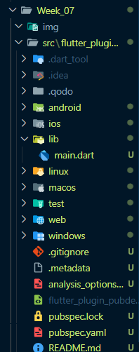

# Jobsheet Week 7 Manajemen Plugin

## Praktikum Menerapkan Plugin di Project Flutter
*Langkah 1: Buat Project Baru*
---


---
*Langkah 2: Menambahkan Plugin*
---
Tambahkan plugin `auto_size_text` menggunakan perintah berikut di terminal
```dart
flutter pub add auto_size_text
```
---

---

---
*Langkah 3: Buat file red_text_widget.dart*
---
Buat file baru bernama `red_text_widget.dart` di dalam folder lib lalu isi kode seperti berikut.

```dart
import 'package:flutter/material.dart';

class RedTextWidget extends StatelessWidget {
  const RedTextWidget({Key? key}) : super(key: key);

  @override
  Widget build(BuildContext context) {
    return Container();
  }
}
```
---
*Langkah 4: Tambah Widget AutoSizeText*
---
Masih di file `red_text_widget.dart`, untuk menggunakan plugin `auto_size_text`, ubahlah kode return `Container()` menjadi seperti berikut.
```dart
return AutoSizeText(
      text,
      style: const TextStyle(color: Colors.red, fontSize: 14),
      maxLines: 2,
      overflow: TextOverflow.ellipsis,
);
```
Setelah Anda menambahkan kode di atas, Anda akan mendapatkan info error. Mengapa demikian? Jelaskan dalam laporan praktikum Anda!
>Error muncul karena variabel text belum dideklarasikan sebagai properti dari kelas RedTextWidget
---
*Langkah 5: Buat Variabel text dan parameter di constructor*
---
Tambahkan variabel `text` dan parameter di constructor seperti berikut.
```dart
final String text;

const RedTextWidget({Key? key, required this.text}) : super(key: key);
```
*Langkah 6: Tambahkan widget di main.dart*
---
Buka file `main.dart` lalu tambahkan di dalam `children`: pada class `_MyHomePageState`
```dart
Container(
   color: Colors.yellowAccent,
   width: 50,
   child: const RedTextWidget(
             text: 'You have pushed the button this many times:',
          ),
),
Container(
    color: Colors.greenAccent,
    width: 100,
    child: const Text(
           'You have pushed the button this many times:',
          ),
),
```
Run aplikasi tersebut dengan tekan F5, maka hasilnya akan seperti berikut.

*Output yang dihasilkan:*
---

---
## Tugas Praktikum 

## 1. Selesaikan Praktikum tersebut, lalu dokumentasikan dan push ke repository Anda berupa screenshot hasil pekerjaan beserta penjelasannya di file `README.md`!
>DONE
## 2. Jelaskan maksud dari langkah 2 pada praktikum tersebut!
>Langkah 2 menjelaskan cara menambahkan libarary eksternal ke dalam proyek Flutter. dengan cara menggunakan perintah `flutter pub add auto_size_text` di terminal untuk menambahkan libarary tersebut. Perintah ini akan secara otomatis menambahkan `auto_size_text` ke dalam file konfigurasi proyek, yaitu pubspec.yaml, sehingga dapat digunakan di dalam kode Dart.
---
## 3. Jelaskan maksud dari langkah 5 pada praktikum tersebut!
>Langkah 5 menjelaskan cara mengatasi error yang muncul pada langkah sebelumnya. Error tersebut terjadi karena widget `AutoSizeText` membutuhkan data teks untuk ditampilkan, tetapi variabel `text` belum tersedia di dalam kelas `RedTextWidget`.
---
## 4. Pada langkah 6 terdapat dua widget yang ditambahkan, jelaskan fungsi dan perbedaannya!
>Kedua widget yang ditambahkan pada langkah 6 memiliki fungsi yang sama, yaitu menampilkan teks, namun dengan cara dan tujuan yang berbeda.
>* Widget pertama menggunakan `RedTextWidget`, sebuah widget kustom yang telah dibuat pada langkah-langkah sebelumnya. Widget ini sudah memiliki semua properti yang didefinisikan di dalamnya (warna teks merah, ukuran font 14, dan `overflow` ellipsis). Tujuannya adalah untuk menggunakan kembali (reusable) tampilan teks yang spesifik ini di berbagai tempat tanpa harus menulis ulang semua propertinya.

>* Widget kedua menggunakan widget `Text` standar dari Flutter. Widget ini tidak memiliki konfigurasi khusus seperti `RedTextWidget`. Fungsi utamanya hanya untuk menampilkan teks, dan semua properti seperti warna, ukuran, atau gaya harus diatur secara manual saat widget ini digunakan. Tujuannya adalah untuk menampilkan teks biasa tanpa memerlukan penyesuaian otomatis seperti `AutoSizeText` atau gaya yang sudah ditentukan.
---

## 5. Jelaskan maksud dari tiap parameter yang ada di dalam plugin auto_size_text berdasarkan tautan pada dokumentasi ini !
>Penjelasan Parameter `auto_size_text` 
>* `key`: Ini adalah parameter standar Flutter yang digunakan untuk mengontrol bagaimana sebuah widget diganti oleh widget lain di dalam widget tree.

>* `textKey`: Digunakan untuk menetapkan `key` khusus pada widget `Text` yang dihasilkan oleh `AutoSizeText`. Ini berguna jika Anda perlu memanipulasi widget `Text` secara spesifik, misalnya untuk keperluan pengujian.

>* `stepGranularity`: Parameter ini menentukan seberapa besar langkah (step) perubahan ukuran font saat `AutoSizeText` mencoba menyesuaikan teks. Misalnya, jika `stepGranularity` diatur ke 0.5, ukuran font akan berkurang dari 14 ke 13.5, lalu 13, dan seterusnya. Nilai yang lebih kecil akan menghasilkan penyesuaian yang lebih presisi, tetapi mungkin membutuhkan sedikit lebih banyak waktu pemrosesan.

>* `presetFontSizes`: Parameter ini memungkinkan Anda untuk mendefinisikan daftar ukuran font yang diizinkan secara spesifik. Jika parameter ini digunakan, `minFontSize` dan `maxFontSize` akan diabaikan. Penting: ukuran font dalam daftar ini harus diurutkan secara menurun (`descending order`).

>* `textDirection`: Digunakan untuk menentukan arah teks, apakah dari kiri ke kanan (`TextDirection.ltr`) atau dari kanan ke kiri (`TextDirection.rtl`). Ini memengaruhi bagaimana perataan teks seperti `start` dan `end` diinterpretasikan.

>* `locale`: Berguna untuk memilih font yang tepat ketika sebuah karakter Unicode memiliki rendering yang berbeda-beda tergantung pada lokasi bahasa (`locale`).

>* `softWrap`: Mengontrol apakah teks diizinkan untuk melakukan line break pada spasi (kata) atau tidak. Nilai defaultnya adalah `true`.

>* `wrapWords`: Mirip dengan `softWrap`, parameter ini menentukan apakah kata-kata yang terlalu panjang untuk satu baris harus dipaksa pindah ke baris baru. Nilai defaultnya adalah `true`.

>* `overflowReplacement`: Jika teks masih overflow (meluap) setelah semua penyesuaian dilakukan, widget yang Anda berikan pada parameter ini akan ditampilkan sebagai pengganti teks yang meluap tersebut. Ini adalah alternatif dari `TextOverflow.ellipsis`.

>* `textScaleFactor`: Mengatur faktor penskalaan untuk font. Parameter ini juga akan memengaruhi nilai `minFontSize`, `maxFontSize`, dan `presetFontSizes`.

>* `maxLines`: Parameter ini menentukan jumlah maksimum baris yang diizinkan untuk teks. `AutoSizeText` akan mengecilkan ukuran font hingga teks tersebut muat dalam jumlah baris yang ditentukan.

>* `semanticsLabel`: Label alternatif untuk teks, yang berguna untuk keperluan aksesibilitas, misalnya untuk pembaca layar (`screen reader`).
---
## 6. Kumpulkan laporan praktikum Anda berupa link repository GitHub kepada dosen!
> DONE