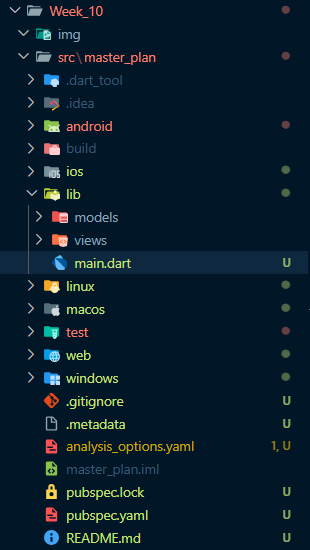
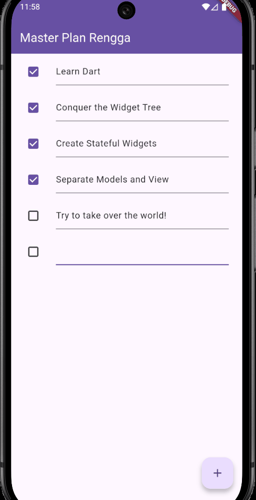
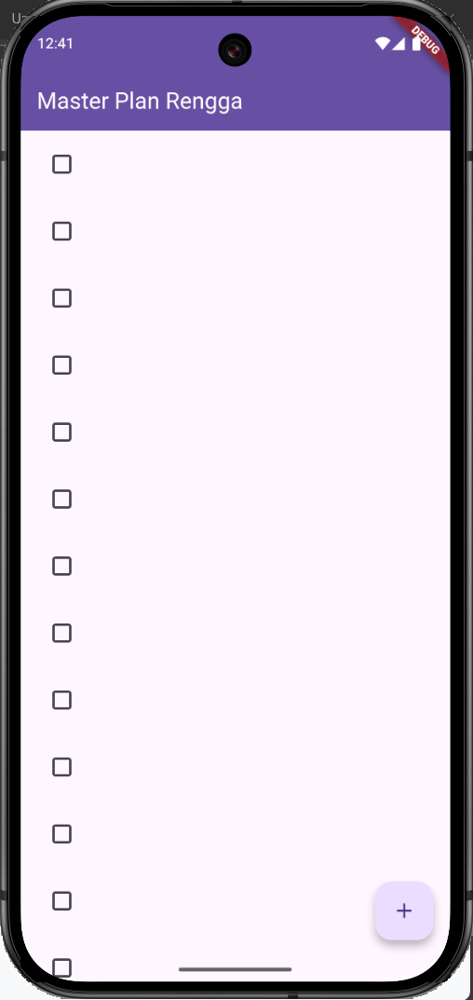
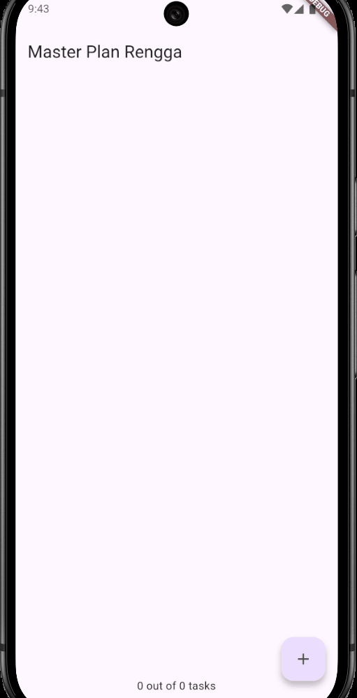
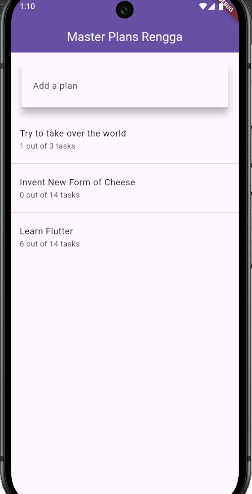

# Jobsheet Week 10 - Dasar State Management  

## Praktikum 1: Dasar State dengan Model-View
*Langkah 1: Buat Project Baru*
---


---
*Langkah 2: Membuat model task.dart*
---
Praktik terbaik untuk memulai adalah pada lapisan data (`data layer`). Ini akan memberi Anda gambaran yang jelas tentang aplikasi Anda, tanpa masuk ke detail antarmuka pengguna Anda. Di folder `model`, buat file bernama `task.dart` dan buat `class Task`. Class ini memiliki atribut `description` dengan tipe data String dan `complete` dengan tipe data Boolean, serta ada konstruktor. Kelas ini akan menyimpan data tugas untuk aplikasi kita. Tambahkan kode berikut:
```dart
class Task {
  final String description;
  final bool complete;
  
  const Task({
    this.complete = false,
    this.description = '',
  });
}
```
---
*Langkah 3: Buat file plan.dart*
---
Kita juga perlu sebuah List untuk menyimpan daftar rencana dalam aplikasi to-do ini. Buat file `plan.dart` di dalam folder **models** dan isi kode seperti berikut.

```dart
import './task.dart';

class Plan {
  final String name;
  final List<Task> tasks;

  const Plan({this.name = '', this.tasks = const []});
}
```
---
*Langkah 4: Buat file data_layer.dart*
---
Kita dapat membungkus beberapa data layer ke dalam sebuah file yang nanti akan mengekspor kedua model tersebut. Dengan begitu, proses impor akan lebih ringkas seiring berkembangnya aplikasi. Buat file bernama `data_layer.dart` di folder models. Kodenya hanya berisi `export` seperti berikut.

```dart
export 'plan.dart';
export 'task.dart';
```
---
*Langkah 5: Pindah ke file main.dart*
---
Ubah isi kode `main.dart` sebagai berikut.

```dart
import 'package:flutter/material.dart';
import './views/plan_screen.dart';

void main() => runApp(const MasterPlanApp()); 

class MasterPlanApp extends StatelessWidget {
  const MasterPlanApp({super.key}); 

  @override
  Widget build(BuildContext context) {
    return MaterialApp(
      theme: ThemeData(primarySwatch: Colors.purple), 
      home: const PlanScreen(), 
    );
  }
}
```
---
*Langkah 6: buat plan_screen.dart*
---
Pada folder `views`, buatlah sebuah file `plan_screen.dart` dan gunakan templat `StatefulWidget` untuk membuat `class PlanScreen`. Isi kodenya adalah sebagai berikut. Gantilah teks **'Namaku'** dengan nama panggilan Anda pada `title AppBar`.

```dart
import '../models/data_layer.dart';
import 'package:flutter/material.dart';

class PlanScreen extends StatefulWidget {
  const PlanScreen({super.key});

  @override
  State createState() => _PlanScreenState();
}

class _PlanScreenState extends State<PlanScreen> {
  Plan plan = const Plan();

  @override
  Widget build(BuildContext context) {
   return Scaffold(
    // ganti ‘Namaku' dengan Nama panggilan Anda
    appBar: AppBar(title: const Text('Master Plan Namaku')),
    body: _buildList(),
    floatingActionButton: _buildAddTaskButton(),
   );
  }
}
```
---
*Langkah 7: buat method _buildAddTaskButton()*
---
Anda akan melihat beberapa *error* di langkah 6, karena *method* yang belum dibuat. Ayo kita buat mulai dari yang paling mudah yaitu tombol **Tambah Rencana**. Tambah kode berikut di bawah *method* `build` di dalam `class _PlanScreenState`.
```dart
Widget _buildAddTaskButton() {
  return FloatingActionButton(
   child: const Icon(Icons.add),
   onPressed: () {
     setState(() {
      plan = Plan(
       name: plan.name,
       tasks: List<Task>.from(plan.tasks)
       ..add(const Task()),
     );
    });
   },
  );
}
```
---
*Langkah 8: buat widget _buildList()*
---
Kita akan buat *widget* berupa **List** yang dapat dilakukan *scroll*, yaitu `ListView.builder`. Buat *widget* `ListView` seperti kode berikut ini.
```dart
Widget _buildList() {
  return ListView.builder(
   itemCount: plan.tasks.length,
   itemBuilder: (context, index) =>
   _buildTaskTile(plan.tasks[index], index),
  );
}
```
---
*Langkah 9: buat widget _buildTaskTile*
---
Dari langkah 8, kita butuh `ListTile` untuk menampilkan setiap nilai dari `plan.tasks`. Kita buat dinamis untuk setiap `index` data, sehingga membuat *view* menjadi lebih mudah. Tambahkan kode berikut ini.
```dart
 Widget _buildTaskTile(Task task, int index) {
    return ListTile(
      leading: Checkbox(
          value: task.complete,
          onChanged: (selected) {
            setState(() {
              plan = Plan(
                name: plan.name,
                tasks: List<Task>.from(plan.tasks)
                  ..[index] = Task(
                    description: task.description,
                    complete: selected ?? false,
                  ),
              );
            });
          }),
      title: TextFormField(
        initialValue: task.description,
        onChanged: (text) {
          setState(() {
            plan = Plan(
              name: plan.name,
              tasks: List<Task>.from(plan.tasks)
                ..[index] = Task(
                  description: text,
                  complete: task.complete,
                ),
            );
          });
        },
      ),
    );
  }
```
---
*Langkah 10: Tambah Scroll Controller*
---
Anda dapat menambah tugas sebanyak-banyaknya, menandainya jika sudah beres, dan melakukan *scroll* jika sudah semakin banyak isinya. Namun, ada salah satu fitur tertentu di iOS perlu kita tambahkan. Ketika *keyboard* tampil, Anda akan kesulitan untuk mengisi yang paling bawah. Untuk mengatasi itu, Anda dapat menggunakan `ScrollController` untuk menghapus *focus* dari semua `TextField` selama *event scroll* dilakukan. Pada file **`plan_screen.dart`**, tambahkan variabel *scroll controller* di *class* **State** tepat setelah variabel **`plan`**.
```dart
late ScrollController scrollController;
```
---
*Langkah 11: Tambah Scroll Listener*
---
Tambahkan method `initState()` setelah deklarasi variabel `scrollController` seperti kode berikut.
```dart
@override
void initState() {
  super.initState();
  scrollController = ScrollController()
    ..addListener(() {
      FocusScope.of(context).requestFocus(FocusNode());
    });
}
```
---
*Langkah 12: Tambah controller dan keyboard behavior*
---
Tambahkan controller dan keyboard behavior pada ListView di method `_buildList` seperti kode berikut ini.
```dart
return ListView.builder(
  controller: scrollController,
 keyboardDismissBehavior: Theme.of(context).platform ==
 TargetPlatform.iOS
          ? ScrollViewKeyboardDismissBehavior.onDrag
          : ScrollViewKeyboardDismissBehavior.manual,
```
---
*Langkah 13: Terakhir, tambah method dispose()*
---
Terakhir, tambahkan method `dispose()` berguna ketika widget sudah tidak digunakan lagi.
```dart
@override
void dispose() {
  scrollController.dispose();
  super.dispose();
}
```
---
*Langkah 14: Hasil*
---
Lakukan Hot restart (**bukan** hot reload) pada aplikasi Flutter Anda. Anda akan melihat tampilan akhir seperti gambar berikut. Jika masih terdapat error, silakan diperbaiki hingga bisa running.
---
*Hasil keseluruhan kode:*
---

---
## Tugas Praktikum 1: Dasar State dengan Model-View

## 1. Selesaikan langkah-langkah praktikum tersebut, lalu dokumentasikan berupa GIF hasil akhir praktikum beserta penjelasannya di file `README.md`! Jika Anda menemukan ada yang error atau tidak berjalan dengan baik, silakan diperbaiki.
>DONE
## 2. Jelaskan maksud dari langkah 4 pada praktikum tersebut! Mengapa dilakukan demikian?

Langkah 4 adalah membuat file **`data_layer.dart`** di dalam folder `models` yang berisi kode `export 'plan.dart';` dan `export 'task.dart';`.

### Maksud Langkah 4

Maksud dari langkah ini adalah untuk menciptakan **satu titik akses terpusat** (*single point of entry*) untuk semua *model* data yang ada di *data layer* aplikasi.

### Mengapa Dilakukan Demikian?

Hal ini dilakukan untuk menerapkan prinsip **kohesi yang tinggi** (*high cohesion*) dan membuat proses *import* menjadi lebih rapi dan ringkas.

* **Kemudahan Import:** Daripada mengimpor setiap *file model* (`task.dart` dan `plan.dart`) secara terpisah di setiap *file view* yang membutuhkannya, kita cukup mengimpor satu *file* saja: `import '../models/data_layer.dart';`.
* **Skalabilitas:** Jika aplikasi tumbuh dan Anda memiliki 10 atau 20 *file model* (misalnya `user.dart`, `settings.dart`, dll.), Anda hanya perlu memperbarui `data_layer.dart` dan tidak perlu mengubah kode *import* di puluhan *file view* Anda.

---
## 3. Mengapa perlu variabel `plan` di langkah 6 pada praktikum tersebut? Mengapa dibuat konstanta?

Variabel `plan` dideklarasikan di dalam `class _PlanScreenState` di Langkah 6, dan diinisialisasi sebagai konstanta (`const Plan()`).

### Mengapa perlu variabel `plan`?

Variabel `plan` diperlukan karena ia bertindak sebagai **state** (kondisi data) utama untuk seluruh `PlanScreen`.

1.  **Sumber Data (Model):** Variabel ini menyimpan data aktual yang akan ditampilkan, yaitu nama rencana (`name`) dan daftar tugas (`List<Task>`).
2.  **Manajemen State:** Karena dideklarasikan di dalam *class* `State`, variabel ini dapat diubah menggunakan *method* **`setState()`**. Setiap kali `plan` diubah dan `setState()` dipanggil (misalnya saat tombol tambah ditekan atau *checkbox* dicentang), Flutter akan membangun ulang tampilan (*widget*) berdasarkan data `plan` yang baru.

### Mengapa dibuat konstanta (`const Plan()`)?

Model `Plan` dan `Task` diinisialisasi sebagai **konstanta** (`const`) untuk memastikan bahwa objek-objek tersebut adalah **immutable** (tidak dapat diubah setelah dibuat).

1.  **Immutability:** Dalam praktik manajemen *state* modern (termasuk di Flutter), data yang disimpan sebagai *state* sebaiknya tidak diubah secara langsung. Jika Anda ingin mengubah data, Anda harus membuat **objek baru** dengan nilai yang diperbarui.
2.  **Mendukung State Management:** Ketika kita memanggil `setState()`, kita tidak memodifikasi `plan` secara langsung, tetapi kita **menetapkan `plan` dengan objek `Plan` baru**. Logika ini memaksa Anda untuk memperbarui *state* secara eksplisit dan konsisten, yang membantu Flutter mendeteksi perubahan dan mengoptimalkan proses *rendering*.

---
## 4. Lakukan capture hasil dari Langkah 9 berupa GIF, kemudian jelaskan apa yang telah Anda buat!


Pada Langkah 9, saya telah membuat antarmuka pengguna dasar untuk aplikasi **Master Plan** menggunakan konsep **Model-View** dan **StatefulWidget**.

Secara spesifik, saya membuat *widget* `_buildTaskTile` yang berfungsi menampilkan setiap item tugas dalam daftar, terdiri dari:

1.  **`Checkbox`**: Untuk menandai tugas sebagai selesai (`complete: true`) atau belum selesai (`complete: false`).
    * Menggunakan **`setState()`** di *callback* `onChanged` untuk memperbarui status `Task` yang relevan.
2.  **`TextFormField`**: Untuk menampilkan dan memungkinkan pengguna mengedit deskripsi tugas.
    * Menggunakan **`setState()`** di *callback* `onChanged` untuk memperbarui *description* `Task` yang relevan.

Hasilnya adalah daftar tugas yang dinamis. Pengguna dapat:

* Menambahkan tugas baru dengan tombol `+`.
* Mengubah teks setiap tugas.
* Mencentang status penyelesaian tugas.

Semua perubahan ini dikelola dalam *state* lokal `plan` di `_PlanScreenState` melalui pemanggilan `setState()`, yang mendemonstrasikan dasar-dasar **manajemen *state***.

---
## 5. Apa kegunaan *method* pada Langkah 11 dan 13 dalam *lifecycle state*?

Langkah 11 adalah *method* **`initState()`** dan Langkah 13 adalah *method* **`dispose()`**. Keduanya adalah *method* kunci dalam **siklus hidup *StatefulWidget***.

### A. Kegunaan `initState()` (Langkah 11)

* **Kegunaan Umum:** `initState()` adalah *method* pertama yang dipanggil ketika objek `State` dibuat dan dimasukkan ke dalam *widget tree*. Ini adalah tempat yang ideal untuk inisialisasi satu kali.
* **Implementasi di Codelab:** Digunakan untuk **menginisialisasi `ScrollController`** dan **menambahkan *listener***. *Listener* tersebut bertugas mendeteksi peristiwa *scroll* dan kemudian secara paksa menghilangkan fokus dari *TextFormField* (menutup *keyboard*) untuk meningkatkan pengalaman pengguna, terutama pada perangkat iOS.

### B. Kegunaan `dispose()` (Langkah 13)

* **Kegunaan Umum:** `dispose()` adalah *method* terakhir yang dipanggil sebelum objek `State` dihapus secara permanen dari *widget tree*.
* **Implementasi di Codelab:** Digunakan untuk **membersihkan (`dispose()`) `ScrollController`**. Ini sangat penting untuk mencegah **kebocoran memori** (*memory leak*). Setiap *resource* yang memiliki *listener* atau mengelola sumber daya eksternal (seperti *controller* atau *stream*) harus selalu dibersihkan di `dispose()` untuk membebaskan sumber daya sistem.

## 6. Kumpulkan laporan praktikum Anda berupa link commit atau repository GitHub ke dosen yang telah disepakati !
>DONE

## Praktikum 2: Mengelola Data Layer dengan InheritedWidget dan InheritedNotifier
*Langkah 1: Buat file `plan_provider.dart`*
---
Buat folder baru **`provider`** di dalam folder **`lib`**, lalu buat *file* baru dengan nama **`plan_provider.dart`** berisi kode seperti berikut.

```dart
import 'package:flutter/material.dart';
import '../models/data_layer.dart';

class PlanProvider extends InheritedNotifier<ValueNotifier<Plan>> {
  const PlanProvider({super.key, required Widget child, required
   ValueNotifier<Plan> notifier})
  : super(child: child, notifier: notifier);

  static ValueNotifier<Plan> of(BuildContext context) {
   return context.
    dependOnInheritedWidgetOfExactType<PlanProvider>()!.notifier!;
  }
}
```
*Langkah 2: Edit main.dart*
---
Gantilah pada bagian atribut `home` dengan `PlanProvider` seperti berikut. Jangan lupa sesuaikan bagian impor jika dibutuhkan.
```dart
return MaterialApp(
  theme: ThemeData(primarySwatch: Colors.purple),
  home: PlanProvider(
    notifier: ValueNotifier<Plan>(const Plan()),
    child: const PlanScreen(),
   ),
);
```
---
*Langkah 3: Tambah method pada model plan.dart*
---
Tambahkan dua method di dalam model `class Plan` seperti kode berikut.
```dart
int get completedCount => tasks
  .where((task) => task.complete)
  .length;

String get completenessMessage =>
  '$completedCount out of ${tasks.length} tasks';
```
---
*Langkah 4: Pindah ke PlanScreen*
---
Edit `PlanScreen` agar menggunakan data dari `PlanProvider`. Hapus deklarasi variabel `plan` (ini akan membuat error). Kita akan perbaiki pada langkah 5 berikut ini.

---
*Langkah 5: Edit method _buildAddTaskButton*
---
Tambahkan `BuildContext` sebagai parameter dan gunakan `PlanProvider` sebagai sumber datanya. Edit bagian kode seperti berikut.

---
```dart
Widget _buildAddTaskButton(BuildContext context) {
  ValueNotifier<Plan> planNotifier = PlanProvider.of(context);
  return FloatingActionButton(
    child: const Icon(Icons.add),
    onPressed: () {
      Plan currentPlan = planNotifier.value;
      planNotifier.value = Plan(
        name: currentPlan.name,
        tasks: List<Task>.from(currentPlan.tasks)..add(const Task()),
      );
    },
  );
}
```
---
*Langkah 6: Edit method _buildTaskTile*
---
Tambahkan parameter **`BuildContext`**, gunakan **`PlanProvider`** sebagai sumber data. Ganti **`TextField`** menjadi **`TextFormField`** untuk membuat inisial data *provider* menjadi lebih mudah.
```dart
void main() {
  runApp(
    const MaterialApp(
      home: PhotoFilterCarousel(),
      debugShowCheckedModeBanner: false,
    ),
  );
}
```
---
*Langkah 7: Edit _buildList*
---
Sesuaikan parameter pada bagian `_buildTaskTile` seperti kode berikut.
```dart
Widget _buildList(Plan plan) {
   return ListView.builder(
     controller: scrollController,
     itemCount: plan.tasks.length,
     itemBuilder: (context, index) =>
        _buildTaskTile(plan.tasks[index], index, context),
   );
}
```
---
*Langkah 8: Tetap di class PlanScreen*
---
Edit method build sehingga bisa tampil progress pada bagian bawah (footer). Caranya, bungkus (wrap) _buildList dengan widget Expanded dan masukkan ke dalam widget Column seperti kode pada Langkah 9.

---
*Langkah 9: Tambah widget SafeArea*
---
Terakhir, tambahkan *widget* **`SafeArea`** dengan berisi **`completenessMessage`** pada akhir *widget* **`Column`**.

Perhatikan kode berikut ini.
```dart
@override
Widget build(BuildContext context) {
   return Scaffold(
     appBar: AppBar(title: const Text('Master Plan')),
     body: ValueListenableBuilder<Plan>(
       valueListenable: PlanProvider.of(context),
       builder: (context, plan, child) {
         return Column(
           children: [
             Expanded(child: _buildList(plan)),
             SafeArea(child: Text(plan.completenessMessage))
           ],
         );
       },
     ),
     floatingActionButton: _buildAddTaskButton(context),
   );
}
```
---
*Hasil keseluruhan kode:*
---

---
## Tugas Praktikum 2

## 1. Selesaikan langkah-langkah praktikum tersebut, lalu dokumentasikan berupa GIF hasil akhir praktikum beserta penjelasannya di file `README`.md! Jika Anda menemukan ada yang error atau tidak berjalan dengan baik, silakan diperbaiki sesuai dengan tujuan aplikasi tersebut dibuat.
>DONE
## 2. Jelaskan mana yang dimaksud `InheritedWidget` pada langkah 1 tersebut! Mengapa yang digunakan `InheritedNotifier`?

Yang dimaksud sebagai `InheritedWidget` adalah **kelas `PlanProvider` itu sendiri**, karena kelas tersebut secara langsung **mewarisi (`extends`)** dari **`InheritedNotifier`**.

```dart
class PlanProvider extends InheritedNotifier<ValueNotifier<Plan>> { ... }
```

### Mengapa Menggunakan `InheritedNotifier`?

`InheritedNotifier` digunakan karena menggabungkan dua fungsionalitas utama yang dibutuhkan untuk manajemen *state* dinamis:

1.  **Kemampuan Akses Data (`InheritedWidget`):** Sebagai turunan dari `InheritedWidget`, ia memungkinkan *widget* manapun di bawahnya dalam *widget tree* untuk mengakses data (`Plan`).
2.  **Kemampuan Notifikasi Perubahan (`Notifier`):** Ia dapat "mendengarkan" perubahan pada objek *notifier* yang disematkan di dalamnya (dalam kasus ini, **`ValueNotifier<Plan>`**).

**Fungsi Kunci:** Setiap kali nilai di dalam `ValueNotifier` berubah (`planNotifier.value = NewPlan`), `InheritedNotifier` secara otomatis memberi tahu semua *widget* yang bergantung padanya (melalui `dependOnInheritedWidgetOfExactType`) untuk di-*rebuild*. Ini menghilangkan kebutuhan untuk memanggil `setState()` secara manual di *View* (seperti yang dilakukan pada Praktikum 1).

-----

## 3. Jelaskan maksud dari *method* di langkah 3 pada praktikum tersebut! Mengapa dilakukan demikian?

### Maksud dari kedua *Method* yang ditambahkan di langkah 3:

  * **`int get completedCount`**: Berfungsi untuk **menghitung jumlah tugas** (`Task`) yang memiliki status `complete` bernilai `true` di dalam daftar `tasks`.
  * **`String get completenessMessage`**: Berfungsi untuk **membuat pesan *string*** yang menunjukkan *progress* penyelesaian tugas (misalnya, "2 out of 5 tasks") menggunakan hasil dari `completedCount` dan total `tasks.length`.

### Mengapa Dilakukan Demikian?

Hal ini dilakukan untuk menjaga prinsip utama arsitektur yang dikenal sebagai **Pemisahan Kekhawatiran (*Separation of Concerns*)**:

1.  **Data Logic di Model:** Logika yang berkaitan dengan data (*business logic*), seperti penghitungan dan format *progress* data, diletakkan di dalam **Model** (`Plan`).
2.  **View Logic di View:** *Widget View* (`PlanScreen`) hanya bertugas menampilkan hasil perhitungan tersebut.

Dengan memisahkan logika ini, *model* menjadi *self-contained* (mandiri) dan kode di bagian *View* (`PlanScreen`) menjadi lebih bersih dan mudah dibaca karena tidak perlu lagi melakukan penghitungan *progress* secara manual.

-----
## 4. Lakukan capture hasil dari Langkah 9 berupa GIF, kemudian jelaskan apa yang telah Anda buat!
---

---

Hasil pada Langkah 9 adalah aplikasi telah diubah secara fundamental untuk menggunakan pola **Provider** (`InheritedNotifier` dan `ValueListenableBuilder`) untuk manajemen *state*.

Meskipun tampilan visualnya **sama** dengan akhir Praktikum 1, fungsionalitas di balik layar telah ditingkatkan:

1.  **Pemisahan State (InheritedNotifier):** Data utama (`Plan`) kini tidak lagi disimpan di dalam *widget* `PlanScreen`. Sebaliknya, data disematkan ke dalam **`PlanProvider`** di bagian atas *widget tree* (`main.dart`).
2.  **Akses Data Efisien:** Setiap *widget* turunan (seperti `_buildTaskTile` dan `_buildAddTaskButton`) kini mengambil *state* secara langsung menggunakan **`PlanProvider.of(context)`**, tanpa harus *drilling* data melalui konstruktor *widget* perantara.
3.  **Progress Otomatis (ValueListenableBuilder):** Di bagian bawah layar, saya menampilkan **pesan *progress*** (`plan.completenessMessage`) yang secara otomatis di-*update* dan di-*rebuild* (digambar ulang) setiap kali *state* `Plan` diubah (misalnya, saat Anda mencentang tugas atau menambah tugas baru), berkat penggunaan **`ValueListenableBuilder`**.

Intinya, pada praktikum ini saya telah memisahkan data dari tampilan, membuat *View* (UI) lebih efisien dan terpisah dari *Logic* (Model).

## 5. Kumpulkan link commit repository GitHub Anda kepada dosen yang telah disepakati!
>DONE
## Praktikum 3: Membuat State di Multiple Screens
*Langkah 1: Edit PlanProvider*
---
Perhatikan kode berikut, edit class `PlanProvider` sehingga dapat menangani List Plan.
```dart
class PlanProvider extends
InheritedNotifier<ValueNotifier<List<Plan>>> {
  const PlanProvider({super.key, required Widget child, required
ValueNotifier<List<Plan>> notifier})
     : super(child: child, notifier: notifier);

  static ValueNotifier<List<Plan>> of(BuildContext context) {
    return context.
dependOnInheritedWidgetOfExactType<PlanProvider>()!.notifier!;
  }
}
```
---
*Langkah 2: Edit main.dart*
---
Langkah sebelumnya dapat menyebabkan error pada `main.dart` dan `plan_screen.dart`. Pada method `build`, gantilah menjadi kode seperti ini.
```dart
Widget build(BuildContext context) {
  return PlanProvider(
    notifier: ValueNotifier<List<Plan>>(const []),
    child: MaterialApp(
      title: 'State management app',
      theme: ThemeData(
        primarySwatch: Colors.blue,
      ),
      home: const PlanScreen(),
    ),
  );
}
```
---
*Langkah 3: Edit plan_screen.dart*
---
Tambahkan variabel `plan` dan atribut pada constructor-nya seperti berikut.

```dart
final Plan plan;
const PlanScreen({super.key, required this.plan});
```
---
*Langkah 4: Error*
---
Itu akan terjadi error setiap kali memanggil `PlanProvider.of(context)`. Itu terjadi karena screen saat ini hanya menerima tugas-tugas untuk satu kelompok `Plan`, tapi sekarang `PlanProvider` menjadi list dari objek plan tersebut.

---
*Langkah 5: Tambah getter Plan*
---
Tambahkan getter pada `_PlanScreenState` seperti kode berikut.

```dart
class _PlanScreenState extends State<PlanScreen> {
  late ScrollController scrollController;
  Plan get plan => widget.plan;
```
---
*Langkah 6: Method initState()*
---
Pada bagian ini kode tetap seperti berikut.

```dart
@override
void initState() {
   super.initState();
   scrollController = ScrollController()
    ..addListener(() {
      FocusScope.of(context).requestFocus(FocusNode());
    });
}
```
---
*Langkah 7: Widget build*
---
Pastikan Anda telah merubah ke `List` dan mengubah nilai pada `currentPlan` seperti kode berikut ini.
```dart
  @override
  Widget build(BuildContext context) {
    ValueNotifier<List<Plan>> plansNotifier = PlanProvider.of(context);

    return Scaffold(
      appBar: AppBar(title: Text(_plan.name)),
      body: ValueListenableBuilder<List<Plan>>(
        valueListenable: plansNotifier,
        builder: (context, plans, child) {
          Plan currentPlan = plans.firstWhere((p) => p.name == plan.
name);
          return Column(
            children: [
              Expanded(child: _buildList(currentPlan)),
              SafeArea(child: Text(currentPlan.
completenessMessage)),
            ],);},),
      floatingActionButton: _buildAddTaskButton(context,)
  ,);
 }

  Widget _buildAddTaskButton(BuildContext context) {
    ValueNotifier<List<Plan>> planNotifier = PlanProvider.
of(context);
    return FloatingActionButton(
      child: const Icon(Icons.add),
      onPressed: () {
        Plan currentPlan = plan;
        int planIndex =
            planNotifier.value.indexWhere((p) => p.name == currentPlan.name);
        List<Task> updatedTasks = List<Task>.from(currentPlan.tasks)
          ..add(const Task());
        planNotifier.value = List<Plan>.from(planNotifier.value)
          ..[planIndex] = Plan(
            name: currentPlan.name,
            tasks: updatedTasks,
          );
        plan = Plan(
          name: currentPlan.name,
          tasks: updatedTasks,
        );},);
  }
```
---
*Langkah 8: Edit _buildTaskTile*
---
Pastikan ubah ke `List` dan variabel `planNotifier` seperti kode berikut ini.
```dart
  Widget _buildTaskTile(Task task, int index, BuildContext context)
{
    ValueNotifier<List<Plan>> planNotifier = PlanProvider.
of(context);

    return ListTile(
      leading: Checkbox(
         value: task.complete,
         onChanged: (selected) {
           Plan currentPlan = plan;
           int planIndex = planNotifier.value
              .indexWhere((p) => p.name == currentPlan.name);
           planNotifier.value = List<Plan>.from(planNotifier.value)
             ..[planIndex] = Plan(
               name: currentPlan.name,
               tasks: List<Task>.from(currentPlan.tasks)
                 ..[index] = Task(
                   description: task.description,
                   complete: selected ?? false,
                 ),);
         }),
      title: TextFormField(
        initialValue: task.description,
        onChanged: (text) {
          Plan currentPlan = plan;
          int planIndex =
             planNotifier.value.indexWhere((p) => p.name ==
currentPlan.name);
          planNotifier.value = List<Plan>.from(planNotifier.value)
            ..[planIndex] = Plan(
              name: currentPlan.name,
              tasks: List<Task>.from(currentPlan.tasks)
                ..[index] = Task(
                  description: text,
                  complete: task.complete,
                ),
            );
},),);}
```
---
*Langkah 9: Buat screen baru*
---
Pada folder **view**, buatlah file baru dengan nama `plan_creator_screen.dart` dan deklarasikan dengan `StatefulWidget` bernama `PlanCreatorScreen`. Gantilah di `main.dart` pada atribut home menjadi seperti berikut.
```dart
home: const PlanCreatorScreen(),
```
---
*Langkah 10: Pindah ke class _PlanCreatorScreenState*
---
Kita perlu tambahkan variabel `TextEditingController` sehingga bisa membuat `TextField` sederhana untuk menambah Plan baru. Jangan lupa tambahkan dispose ketika widget unmounted seperti kode berikut.
```dart
final textController = TextEditingController();

@override
void dispose() {
  textController.dispose();
  super.dispose();
}
```
---
*Langkah 11: Pindah ke method build*
---
Letakkan method `Widget` build berikut di atas `void dispose`. Gantilah **‘Namaku'** dengan nama panggilan Anda.
```dart
@override
Widget build(BuildContext context) {
  return Scaffold(
    // ganti ‘Namaku' dengan nama panggilan Anda
    appBar: AppBar(title: const Text('Master Plans Namaku')),
    body: Column(children: [
      _buildListCreator(),
      Expanded(child: _buildMasterPlans())
    ]),
  );
}
```
---
*Langkah 12: Buat widget _buildListCreator*
---
Buatlah widget berikut setelah widget build.
```dart
Widget _buildListCreator() {
  return Padding(
     padding: const EdgeInsets.all(20.0),
     child: Material(
       color: Theme.of(context).cardColor,
       elevation: 10,
       child: TextField(
          controller: textController,
          decoration: const InputDecoration(
             labelText: 'Add a plan',
             contentPadding: EdgeInsets.all(20)),
          onEditingComplete: addPlan),
     ));
}
```
---
*Langkah 13: Buat void addPlan()*
---
Tambahkan method berikut untuk menerima inputan dari user berupa text plan.
```dart
void addPlan() {
  final text = textController.text;
    if (text.isEmpty) {
      return;
    }
    final plan = Plan(name: text, tasks: []);
    ValueNotifier<List<Plan>> planNotifier =
PlanProvider.of(context);
    planNotifier.value = List<Plan>.from(planNotifier.value)..
add(plan);
    textController.clear();
    FocusScope.of(context).requestFocus(FocusNode());
    setState(() {});
}
```
---
*Langkah 14: Buat widget _buildMasterPlans()*
---
Tambahkan widget seperti kode berikut.
```dart
Widget _buildMasterPlans() {
  ValueNotifier<List<Plan>> planNotifier = PlanProvider.of(context);
    List<Plan> plans = planNotifier.value;

    if (plans.isEmpty) {
      return Column(
         mainAxisAlignment: MainAxisAlignment.center,
         children: <Widget>[
           const Icon(Icons.note, size: 100, color: Colors.grey),
           Text('Anda belum memiliki rencana apapun.',
              style: Theme.of(context).textTheme.headlineSmall)
         ]);
    }
    return ListView.builder(
        itemCount: plans.length,
        itemBuilder: (context, index) {
          final plan = plans[index];
          return ListTile(
              title: Text(plan.name),
              subtitle: Text(plan.completenessMessage),
              onTap: () {
                Navigator.of(context).push(
                   MaterialPageRoute(builder: (_) =>
PlanScreen(plan: plan,)));
              });
        });
}
```
---
*Hasil keseluruhan kode:*
---

---
## Tugas Praktikum 3: State di Multiple Screens

## 1. Selesaikan langkah-langkah praktikum tersebut, lalu dokumentasikan berupa GIF hasil akhir praktikum beserta penjelasannya di file `README.md`! Jika Anda menemukan ada yang error atau tidak berjalan dengan baik, silakan diperbaiki sesuai dengan tujuan aplikasi tersebut dibuat.
>DONE
## 2. Berdasarkan Praktikum 3 yang telah Anda lakukan, jelaskan maksud dari gambar diagram berikut ini!

---
Diagram tersebut menjelaskan tentang **aliran data dan struktur *widget tree* (pohon *widget*)** di aplikasi Master Plan, terutama saat terjadi **Navigasi Multi-Screen** dengan menggunakan **`InheritedWidget`** (`PlanProvider`) sebagai *state management*.

### Maksud Diagram (Struktur Widget Tree)

#### 1. Sisi Kiri: Master List Screen (`PlanCreatorScreen`)

* **Tujuan:** Menampilkan daftar semua rencana (`List<Plan>`) dan memungkinkan pembuatan rencana baru.
* **Akses Data Global:** `PlanProvider` diletakkan tepat di bawah `MaterialApp`. Ini menjadikan **semua *widget* di bawahnya** (termasuk `PlanCreatorScreen` dan semua turunannya) memiliki akses ke *state* global (`List<Plan>`) tanpa harus melewatkan data melalui konstruktor.
* **Struktur:** `PlanCreatorScreen` berisi `Column` yang memisahkan bagian *input* (`TextField`) dari daftar rencana (`Expanded` -> `ListView`) yang ditampilkan menggunakan `ValueListenableBuilder`.

#### 2. Sisi Kanan: Detail Screen (`PlanScreen`)

* **Tujuan:** Menampilkan dan mengelola tugas (`Task`) dari satu rencana yang dipilih.
* **Transisi:** Ketika pengguna mengetuk (`onTap`) salah satu rencana di `ListView` (sisi kiri), terjadi **`Navigator Push`** yang membuat `PlanScreen` muncul di atas layar.
* **Koneksi Data:** Meskipun `PlanScreen` tidak memiliki `PlanProvider` di bawahnya, ia **tetap memiliki akses** ke `PlanProvider` yang berada jauh di atasnya (di bawah `MaterialApp`). Data (`Plan` yang dipilih) diteruskan ke `PlanScreen` melalui **konstruktor**.
* **Struktur:** `PlanScreen` menggunakan `Column` untuk membagi tampilan antara daftar tugas yang dapat di-*scroll* (`Expanded` -> `ListView`) dan *progress* penyelesaian tugas (`SafeArea` -> `Text`).

### Kesimpulan

Diagram ini menunjukkan bagaimana **`PlanProvider` memungkinkan *state* global diakses oleh dua layar yang berbeda** melalui *widget tree*. Kedua layar dapat membaca dan memodifikasi *state* global yang sama (daftar `Plan`) meskipun layar detail (`PlanScreen`) di-*"push"* di atas layar utama.

---

## 3. Lakukan capture hasil dari Langkah 14 berupa GIF, kemudian jelaskan apa yang telah Anda buat!

---
Pada Langkah 14, saya telah menyelesaikan implementasi **Manajemen *State* Multi-Screen**. Hasil akhirnya adalah aplikasi yang memiliki dua layar utama:

1.  **Layar Pembuat Rencana (`PlanCreatorScreen`):** Menampilkan semua rencana dan formulir untuk membuat rencana baru.
2.  **Layar Detail Tugas (`PlanScreen`):** Menampilkan daftar tugas untuk rencana yang dipilih, memungkinkan penambahan/pengeditan tugas, dan menampilkan *progress* penyelesaian.

Aplikasi telah berhasil mengimplementasikan *state management* menggunakan **`InheritedNotifier`** (`PlanProvider`) dengan `ValueNotifier<List<Plan>>`. Ini memungkinkan:

* Penambahan Rencana baru di layar pertama (`PlanCreatorScreen`).
* Navigasi ke layar kedua (`PlanScreen`) dengan membawa objek `Plan` yang spesifik.
* Setiap perubahan pada tugas di layar kedua (seperti mencentang tugas) secara otomatis **memperbarui *state* global** dan juga **memperbarui *progress* di layar pertama** (jika pengguna kembali), menjamin konsistensi data di seluruh aplikasi.
## 4. Kumpulkan laporan praktikum Anda berupa link commit atau repository GitHub ke dosen yang telah disepakati !
>DONE