# Jobsheet Week 11 - Pemrograman Asynchronous

## Praktikum 1: Mengunduh Data dari Web Service (API)
*Langkah 1: Buat Project Baru*
---
Buatlah sebuah project flutter baru dengan nama **books** di folder src **week-11** repository GitHub Anda.

Kemudian Tambahkan dependensi `http` dengan mengetik perintah berikut di terminal.
```dart
flutter pub add http
```
---
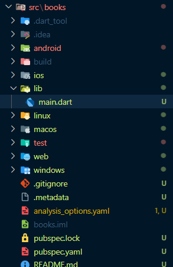
---
*Langkah 2: Cek file pubspec.yaml*
---
Jika berhasil install plugin, pastikan plugin `http` telah ada di file pubspec ini seperti berikut.

---
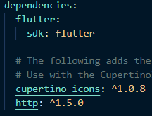
---
*Langkah 3: Buka file main.dart*
---
Ketiklah kode seperti berikut ini.

```dart
import 'dart:async';
import 'package:http/http.dart'; // Catatan: Import ini mungkin tidak diperlukan
import 'package:flutter/material.dart';
import 'package:http/http.dart' as http; // Import untuk package http

void main() {
  runApp(const MyApp());
}

class MyApp extends StatelessWidget {
  const MyApp({super.key});

  @override
  Widget build(BuildContext context) {
    return MaterialApp(
      title: 'Future Demo - Rengga',
      theme: ThemeData(
        primarySwatch: Colors.blue,
        visualDensity: VisualDensity.adaptivePlatformDensity,
      ),
      home: const FuturePage(),
    );
  }
}

class FuturePage extends StatefulWidget {
  const FuturePage({super.key});

  @override
  State<FuturePage> createState() => _FuturePageState();
}

class _FuturePageState extends State<FuturePage> {
  String result = '';

  @override
  Widget build(BuildContext context) {
    return Scaffold(
      appBar: AppBar(
        title: const Text('Back from the Future'),
      ),
      body: Center(
        child: Column(
          children: [
            const Spacer(),
            ElevatedButton(
              child: const Text('GO!'),
              onPressed: () {},
            ),
            const Spacer(),
            Text(result),
            const Spacer(),
            const CircularProgressIndicator(),
            const Spacer(),
          ],
        ),
      ),
    );
  }
}
```
---
*Langkah 4: Tambah method `getData()`*
---
Tambahkan method ini ke dalam class `_FuturePageState` yang berguna untuk mengambil data dari API Google Books.

```dart
  Future<Response> getData() async {
    const authority = 'www.googleapis.com';
    const path = '/books/v1/volumes/junbDwAAQBAJ';
    Uri url = Uri.https(authority, path);
    return http.get(url);
  }
```
---
*Langkah 5: Tambah kode di ElevatedButton*
---
Tambahkan kode pada `onPressed` di `ElevatedButton` seperti berikut.

```dart
import 'package:flutter/material.dart';
import './views/plan_screen.dart';

void main() => runApp(const MasterPlanApp()); 

class MasterPlanApp extends StatelessWidget {
  const MasterPlanApp({super.key}); 

  @override
  Widget build(BuildContext context) {
    return MaterialApp(
      theme: ThemeData(primarySwatch: Colors.purple), 
      home: const PlanScreen(), 
    );
  }
}
```
---
*Hasil keseluruhan kode:*
---
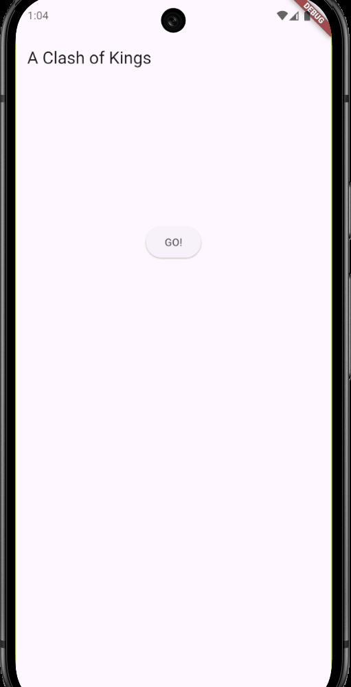
---
## Soal di praktikum 1

## 1. Tambahkan nama panggilan Anda pada `title` app sebagai identitas hasil pekerjaan Anda.
```dart
  title: 'Future Demo - Rengga',
```
## 2. 
* Carilah judul buku favorit Anda di Google Books, lalu ganti ID buku pada variabel `path` di kode tersebut. Caranya ambil di URL browser Anda seperti gambar berikut ini.
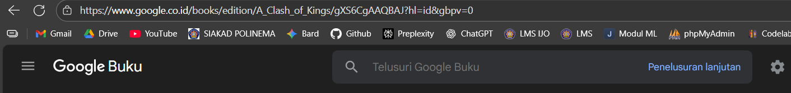
---
* Kemudian cobalah akses di browser URI tersebut dengan lengkap seperti ini. Jika menampilkan data JSON, maka Anda telah berhasil. Lakukan capture milik Anda dan tulis di `README` pada laporan praktikum. Lalu lakukan commit dengan pesan **"W11: Soal 2"**.
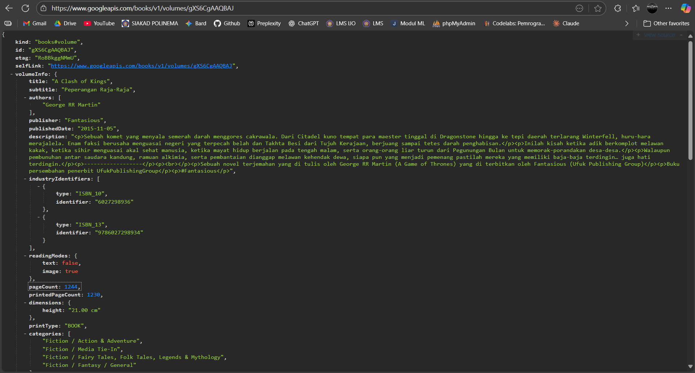
---
## 3. 
* Jelaskan maksud kode langkah 5 tersebut terkait `substring` dan `catchError`!

### 1. Maksud dari `.catchError()`

* **Fungsi:** Untuk **menangkap dan mengelola kesalahan** yang terjadi saat `Future` (panggilan API ke Google Books) gagal.
* **Contoh Kegagalan:** Tidak ada koneksi internet, *server* API Google bermasalah (misalnya *Error 503*), atau URI tidak valid.
* **Aksi:** Jika terjadi kegagalan, kode akan mengatur variabel `result` menjadi `'An error occurred'` dan memanggil `setState({})` agar pesan error ditampilkan di layar. Ini **mencegah aplikasi *crash***.

### 2. Maksud dari `.substring(0, 450)`

* **Fungsi:** Untuk **memotong** data string yang sangat panjang.
* **Tujuan:** Data dari API (`value.body.toString()`) adalah data JSON mentah yang sangat panjang. Pemotongan `substring(0, 450)` dilakukan agar hanya **450 karakter pertama** yang diambil.
* **Alasan:** Ini dilakukan untuk menampilkan sebagian kecil dari data JSON tersebut sebagai pratinjau di layar (widget `Text(result)`), karena menampilkan seluruh *body* JSON akan membuat tampilan aplikasi menjadi sangat panjang dan tidak rapi.
---
* Capture hasil praktikum Anda berupa GIF dan lampirkan di README. Lalu lakukan commit dengan pesan "W11: Soal 3".


---
## Praktikum 2: Menggunakan await/async untuk menghindari callbacks
*Langkah 1: Buka file main.dart*
---
Tambahkan tiga method berisi kode seperti berikut di dalam class `_FuturePageState`.
```dart
Future<int> returnOneAsync() async {
  await Future.delayed(const Duration(seconds: 3));
  return 1;
}

Future<int> returnTwoAsync() async {
  await Future.delayed(const Duration(seconds: 3));
  return 2;
}

Future<int> returnThreeAsync() async {
  await Future.delayed(const Duration(seconds: 3));
  return 3;
}
```
---

---
*Langkah 2: Tambah method count()*
---
Lalu tambahkan lagi method ini di bawah ketiga method sebelumnya.
```dart
Future count() async {
  int total = 0;
  total = await returnOneAsync();
  total += await returnTwoAsync();
  total += await returnThreeAsync();
  setState(() {
    result = total.toString();
  });
}
```
*Langkah 3: Panggil count()*
---
Lakukan comment kode sebelumnya, ubah isi kode `onPressed() `menjadi seperti berikut.

```dart
ElevatedButton(
  child: Text('GO!'),
  onPressed: () {
    count();
  },
),
...
```
---
*Langkah 4: Run*
---
Akhirnya, **run** atau tekan **F5** jika aplikasi belum running. Maka Anda akan melihat seperti gambar berikut, hasil angka 6 akan tampil setelah delay 9 detik..

---
*Hasil keseluruhan kode:*
---
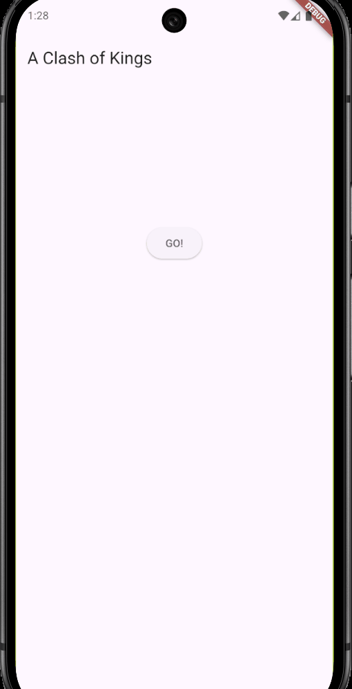
---
## Soal di praktikum 2

## 4. 
* Jelaskan maksud kode langkah 1 dan 2 tersebut!
### 1. Maksud Kode Langkah 1 (Tiga Fungsi `async`)

* **Fungsi:** `returnOneAsync()`, `returnTwoAsync()`, dan `returnThreeAsync()`.
* **Intinya:** Ketiga fungsi ini adalah "janji" (*Future*) untuk mengembalikan angka (1, 2, atau 3) setelah melakukan **delay selama 3 detik** (`await Future.delayed(...)`).
* **Maksud:** Mereka menyimulasikan tiga tugas yang membutuhkan waktu (misalnya, mengambil tiga data berbeda dari internet). Kata kunci `async` memungkinkan mereka berjalan di latar belakang.

### 2. Maksud Kode Langkah 2 (Fungsi `count()`)

* **Fungsi:** `count()`.
* **Intinya:** Fungsi ini memanggil ketiga fungsi dari Langkah 1, tetapi menggunakan kata kunci **`await`** di setiap panggilan.
* **Maksud:**
    1.  `count()` **menunggu** `returnOneAsync()` selesai (3 detik).
    2.  Baru kemudian `count()` **menunggu** `returnTwoAsync()` selesai (3 detik lagi).
    3.  Baru kemudian `count()` **menunggu** `returnThreeAsync()` selesai (3 detik lagi).
* **Hasil:** Karena dipaksa menunggu satu per satu, total waktu yang dibutuhkan adalah **9 detik** (3 + 3 + 3) untuk mendapatkan hasil akhir 6. Ini menunjukkan bahwa `await` digunakan untuk menjaga urutan (sekuensial) operasi *asynchronous*.

---
* Capture hasil praktikum Anda berupa GIF dan lampirkan di README. Lalu lakukan commit dengan pesan "**W11: Soal 4**".


---
## Praktikum 3: Menggunakan Completer di Future
*Langkah 1: Buka file main.dart*
---
Pastikan telah impor package async berikut.
```dart
import 'package:async/async.dart';
```
---
*Langkah 2: Tambahkan variabel dan method*
---
Tambahkan variabel late dan method di `class _FuturePageState` seperti ini.
```dart
late Completer completer;

Future getNumber() {
  completer = Completer<int>();
  calculate();
  return completer.future;
}

Future calculate() async {
  await Future.delayed(const Duration(seconds : 5));
  completer.complete(42);
}
```
*Langkah 3: Ganti isi kode onPressed()*
---
Tambahkan kode berikut pada fungsi `onPressed()`. Kode sebelumnya bisa Anda comment.

```dart
getNumber().then((value) {
  setState(() {
    result = value.toString();
  });
});
```
---
*Langkah 4:*
---
Terakhir, run atau tekan F5 untuk melihat hasilnya jika memang belum running. Bisa juga lakukan hot restart jika aplikasi sudah running. Maka hasilnya akan seperti gambar berikut ini. Setelah 5 detik, maka angka 42 akan tampil.

---
*Hasil kode:*
---
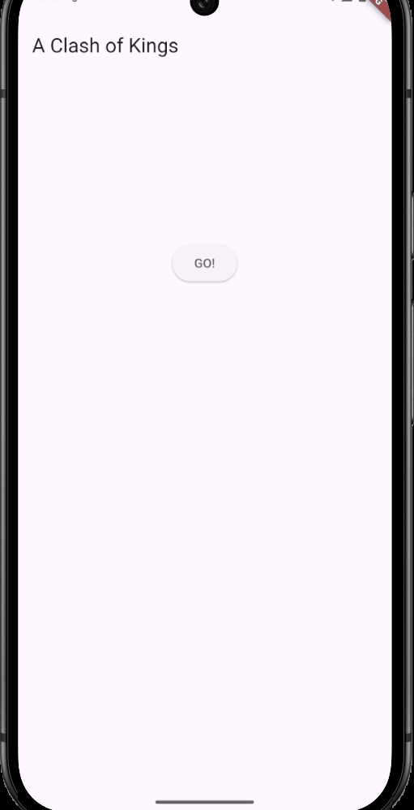
---
*Langkah 5: Ganti method calculate()*
---
Gantilah isi code method `calculate()` seperti kode berikut, atau Anda dapat membuat `calculate2()`

```dart
calculate() async {
  try {
    await new Future.delayed(const Duration(seconds: 5));
    completer.complete(42);
    // throw Exception();
  }
  catch (_) {
    completer.completeError({});
  }
}
```
---
*Langkah 6: Pindah ke onPressed()*
---
Ganti menjadi kode seperti berikut.

```dart
getNumber().then((value) {
  setState(() {
    result = value.toString();
  });
}).catchError((e) {
  result = 'An error occurred';
});
```
---
*Hasil kesuluruhan kode:*
---
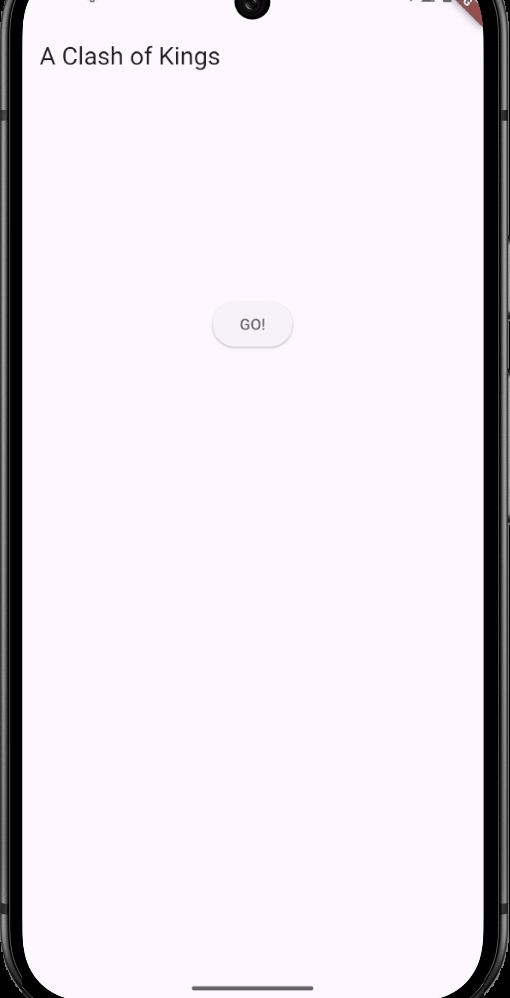
---
## Soal di praktikum 3

## 5. 
* Jelaskan maksud kode langkah 2 tersebut!
---
Maksud dari kode Langkah 2 (fungsi `getNumber()` dan `calculate()` adalah untuk **memisahkan proses membuat janji (*Future*) dari proses menepati janji (*Completion*)** secara manual.

* **Tujuan:** Memungkinkan kita mengontrol kapan tugas *asynchronous* yang lambat dianggap selesai.
* **Bagaimana Ia Bekerja:**
    * **`getNumber()`** mengembalikan objek janji kosong (`Future`).
    * **`calculate()`** melakukan tugas lambat (delay 5 detik), dan setelah selesai, ia menggunakan **`completer.complete(42)`** untuk secara eksplisit menepati janji tersebut dengan nilai 42.

***
---
* Capture hasil praktikum Anda berupa GIF dan lampirkan di README. Lalu lakukan commit dengan pesan **"W11: Soal 5"**.


---
## 6. 
* Jelaskan maksud perbedaan kode langkah 2 dengan langkah 5-6 tersebut!
---
Perbedaan utamanya terletak pada kemampuan untuk **mengendalikan status kegagalan** (*failure*) dari *Future*.

* **Langkah 2 (Awal):** Hanya menangani kasus sukses. `calculate()` selalu memanggil `completer.complete(42)`.
* **Langkah 5 & 6 (Error Handling):** Memungkinkan *Future* **gagal secara sengaja**. `calculate()` sekarang menggunakan kondisi `if/else` dan memanggil **`completer.completeError(...)`** untuk mengirimkan sinyal kegagalan, yang kemudian ditangkap oleh `.catchError(e)` di `onPressed`.

---
* Capture hasil praktikum Anda berupa GIF dan lampirkan di README. Lalu lakukan commit dengan pesan **"W11: Soal 6"**.


---
## Praktikum 4: Memanggil Future secara paralel
*Langkah 1: Buka file main.dart*
---
Tambahkan method ini ke dalam class `_FuturePageState`
```dart
void returnFG() {
  FutureGroup<int> futureGroup = FutureGroup<int>();
  futureGroup.add(returnOneAsync());
  futureGroup.add(returnTwoAsync());
  futureGroup.add(returnThreeAsync());
  futureGroup.close();
  futureGroup.future.then((List<int> value) {
    int total = 0;
    for (var element in value) {
      total += element;
    }
    setState(() {
      result = total.toString();
    });
  });
}
```
---
*Langkah 2: Edit onPressed()*
---
Anda bisa hapus atau comment kode sebelumnya, kemudian panggil method dari langkah 1 tersebut.
```dart
onPressed: () {
  returnFG();
}
```
*Langkah 3: Run*
---
Anda akan melihat hasilnya dalam 3 detik berupa angka 6 lebih cepat dibandingkan praktikum sebelumnya menunggu sampai 9 detik.

---

---
*Langkah 4: Ganti variabel futureGroup*
---
Anda dapat menggunakan FutureGroup dengan `Future.wait` seperti kode berikut.

```dart
final futures = Future.wait<int>([
  returnOneAsync(),
  returnTwoAsync(),
  returnThreeAsync(),
]);
```
---
*Hasil kesuluruhan kode:*
---

---

## Soal di praktikum 4

### 7. Capture hasil praktikum Anda berupa GIF dan lampirkan di README. Lalu lakukan commit dengan pesan **"W11: Soal 7"**.


---
### 8. Jelaskan maksud perbedaan kode langkah 1 dan 4!
Inti perbedaan antara `futureGroup.add()` dan `futureGroup.addFuture()` adalah pada kemampuan untuk mendapatkan **umpan balik instan** dari setiap tugas yang berjalan secara paralel.

#### Maksud Langkah 1: Menggunakan `futureGroup.add()`

Langkah 1 menggunakan **`futureGroup.add(future)`** yang merupakan cara dasar untuk menjalankan tugas paralel.

* **Tujuan:** Hanya untuk memasukkan *Future* ke dalam grup eksekusi.
* **Penanganan Hasil:** Semua hasil (sukses atau gagal) hanya dapat diketahui di **akhir**, yaitu melalui blok `.then()` dan `.catchError()` pada `futureGroup.future` secara keseluruhan. Kita harus menunggu semua tugas selesai.

#### Maksud Langkah 4: Menggunakan `futureGroup.addFuture()`

Langkah 4 menggunakan **`futureGroup.addFuture(future, onSuccess, onError)`**. Ini adalah metode yang lebih canggih.

* **Tujuan:** Selain memasukkan *Future* ke dalam grup, kita juga memberikan **handler khusus** (`onSuccess` dan `onError`) untuk *Future* tersebut.
* **Penanganan Hasil:** Kita bisa langsung bereaksi terhadap keberhasilan atau kegagalan dari *Future* tersebut **saat itu juga** (misalnya, mencatat log), tanpa harus menunggu seluruh grup selesai.
* **Intinya:** Memungkinkan kita melakukan **penanganan *error* individu** untuk setiap tugas, meskipun tugas tersebut berjalan dalam kelompok paralel.
## Praktikum 5: Menangani Respon Error pada Async Code
*Langkah 1: Buka file main.dart*
---
Tambahkan method ini ke dalam class `_FuturePageState`
```dart
Future returnError() async {
  await Future.delayed(const Duration(seconds: 2));
  throw Exception('Something terrible happened!');
}
```
---
*Langkah 2: ElevatedButton*
---
Ganti dengan kode berikut
```dart
returnError()
    .then((value){
      setState(() {
        result = 'Success';
      });
    })
    .catchError((onError){
      setState(() {
        result = onError.toString();
      });
    })
    .whenComplete(() => print('Complete'));
```
*Langkah 3: Run*
---
Lakukan run dan klik tombol **GO!** maka akan menghasilkan seperti gambar berikut.

---

---
*Langkah 4: Tambah method handleError()*
---
Tambahkan kode ini di dalam class `_FutureStatePage`

```dart
Future handleError() async {
  try {
    await returnError();
  }
  catch (error) {
    setState(() {
      result = error.toString();
    });
  }
  finally {
    print('Complete');
  }
}
```
---
*Hasil kesuluruhan kode:*
---

---
## Soal di praktikum 5

### 9. Capture hasil praktikum Anda berupa GIF dan lampirkan di README. Lalu lakukan commit dengan pesan **"W11: Soal 7"**.


---
### 10. Panggil method `handleError()` tersebut di `ElevatedButton`, lalu run. Apa hasilnya? Jelaskan perbedaan kode langkah 1 dan 4!

#### A. Hasil yang Diharapkan
Saat method `handleError()` dipanggil dari `ElevatedButton`, aplikasi akan menampilkan **pesan *error*** setelah jeda waktu tertentu (sekitar 5 detik, jika diasumsikan memanggil fungsi `calculate()` yang kita modifikasi di Praktikum 3).

#### B. Penjelasan
Method `handleError()` dirancang untuk **mensimulasikan kegagalan** yang mungkin terjadi pada *Future* (misalnya, kegagalan koneksi atau *timeout*).

Jika `handleError()` memanggil fungsi yang sengaja melempar *error* (seperti `getNumber()`/`calculate()` Anda saat ini), maka blok **`.catchError(e)`** akan menangkap error tersebut dan memperbarui UI dengan pesan error (`'Error: Completer Error'`).

---

### 2. Perbedaan Kode Langkah 1 dan 4 (Praktikum 4)

Perbedaan utamanya terletak pada cara kita memberi tahu grup tentang keberhasilan atau kegagalan dari setiap tugas yang ada di dalamnya.

#### A. Langkah 1: Menggunakan `futureGroup.add()`

Langkah 1 menggunakan **`futureGroup.add(future)`** yang merupakan cara dasar.

* **Tujuan:** Hanya untuk memasukkan *Future* ke dalam grup eksekusi paralel.
* **Penanganan Hasil:** Semua hasil (sukses atau gagal) ditangani di **akhir** melalui blok `.then()` dan `.catchError()` pada *Future* grup secara keseluruhan.

#### B. Langkah 4: Menggunakan `futureGroup.addFuture()`

Langkah 4 menggunakan **`futureGroup.addFuture(future, onSuccess, onError)`** yang lebih canggih.

* **Tujuan:** Memasukkan *Future* dan memberikan **handler sukses/gagal secara individu** untuk *Future* tersebut.
* **Penanganan Hasil:** Selain hasil akhir (seperti pada Langkah 1), kita bisa langsung bereaksi melalui *callback* `onSuccess` atau `onError` **saat tugas spesifik itu selesai**, tanpa perlu menunggu semua tugas di grup selesai.
* **Intinya:** Memungkinkan **penanganan *error* individu** untuk setiap tugas di dalam kelompok paralel.
## Praktikum 6: Menggunakan Future dengan StatefulWidget
*Langkah 1: install plugin geolocator*
---
Tambahkan plugin geolocator dengan mengetik perintah berikut di terminal.
```dart
flutter pub add geolocator
```
---

---
*Langkah 2: Tambah permission GPS*
---
Jika Anda menargetkan untuk platform Android, maka tambahkan baris kode berikut di file `android/app/src/main/androidmanifest.xml`
```dart
<uses-permission android:name="android.permission.ACCESS_FINE_LOCATION"/>
<uses-permission android:name="android.permission.ACCESS_COARSE_LOCATION"/>
```
Jika Anda menargetkan untuk platform **iOS**, maka tambahkan kode ini ke file `Info.plist`
```dart
<key>NSLocationWhenInUseUsageDescription</key>
<string>This app needs to access your location</string>
```
*Langkah 3: Buat file geolocation.dart*
---
Tambahkan file baru ini di folder lib project Anda

*Langkah 4: Buat StatefulWidget*
---
Buat `class LocationScreen` di dalam file `geolocation.dart`

*Langkah 5: Isi kode geolocation.dart*
---
Buat `class LocationScreen` di dalam file `geolocation.dart`

```dart
import 'package:flutter/material.dart';
import 'package:geolocator/geolocator.dart';

class LocationScreen extends StatefulWidget {
  const LocationScreen({super.key});

  @override
  State<LocationScreen> createState() => _LocationScreenState();
}

class _LocationScreenState extends State<LocationScreen> {
  String myPosition = '';

  @override
  void initState() {
    super.initState();
    getPosition().then((Position myPos) {
      myPosition =
          'Latitude: ${myPos.latitude.toString()} - Longitude: ${myPos.longitude.toString()}';
      setState(() {
        myPosition = myPosition;
      });
    });
  }

  @override
  Widget build(BuildContext context) {
    return Scaffold(
      appBar: AppBar(title: const Text('Current Location')),
      body: Center(child: Text(myPosition)),
    );
  }

  Future<Position> getPosition() async {
    await Geolocator.requestPermission();
    Position? position =
        await Geolocator.getCurrentPosition(desiredAccuracy: LocationAccuracy.high);
    return position!;
  }
}
```
---
*Langkah 6: Edit main.dart*
---
Panggil screen baru tersebut di file main Anda seperti berikut.

*Langkah 7: Run*
---
Run project Anda di device atau emulator (bukan browser), maka akan tampil seperti berikut ini.

---
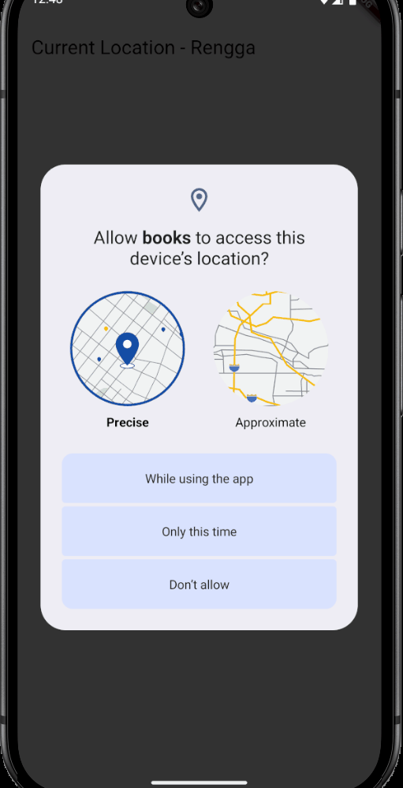
---
*Langkah 8: Tambahkan animasi loading*
---
Tambahkan widget loading seperti kode berikut. Lalu hot restart, perhatikan perubahannya.
```dart
@override
Widget build(BuildContext context) {
  final myWidget = myPosition == ''
      ? const CircularProgressIndicator()
      : const Text(myPosition);

  return Scaffold(
    appBar: AppBar(title: Text('Current Location')),
    body: Center(child: myWidget),
  );
}
```
---
*Hasil kesuluruhan kode:*
---
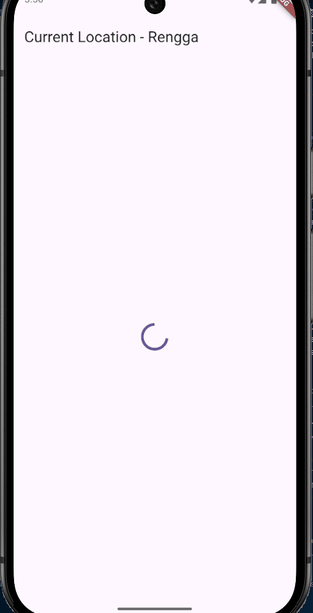
---
## Soal di praktikum 6

### 11. Tambahkan nama panggilan Anda pada tiap properti `title` sebagai identitas pekerjaan Anda.

```dart
appBar: AppBar(title: const Text('Current Location - Rengga')),
```
---
### 12. 

* Jika Anda tidak melihat animasi loading tampil, kemungkinan itu berjalan sangat cepat. Tambahkan delay pada method `getPosition()` dengan kode await `Future.delayed(const Duration(seconds: 3));`

```dart
  Future<Position> getPosition() async {
    await Geolocator.requestPermission();
    await Future.delayed(const Duration(seconds: 3));
    Position? position =
        await Geolocator.getCurrentPosition(desiredAccuracy: LocationAccuracy.high);
    return position!;
  }
```

---
* Apakah Anda mendapatkan koordinat GPS ketika run di browser? Mengapa demikian?

  * **Jawaban:** Ya, Anda **bisa** mendapatkan koordinat GPS ketika menjalankan di *browser* (misalnya Chrome), tetapi ini bergantung pada izin dan ketersediaan lokasi di perangkat keras Anda.
  * **Penjelasan:** Browser modern (seperti Chrome) mendukung API geolokasi standar yang bisa diakses oleh Flutter Web. Browser akan **meminta izin** Anda untuk mengakses lokasi. Jika Anda memberikan izin, browser akan meneruskan data lokasi ke aplikasi Flutter.

---
* Capture hasil praktikum Anda berupa GIF dan lampirkan di README. Lalu lakukan commit dengan pesan "W11: Soal 12".


---
## Praktikum 7: Manajemen Future dengan FutureBuilder
*Langkah 1: Modifikasi method getPosition()*
---
Buka file `geolocation.dart` kemudian ganti isi method dengan kode ini.
```dart
Future<Position> getPosition() async {
  await Geolocator.isLocationServiceEnabled();
  await Future.delayed(const Duration(seconds: 3));
  Position position = await Geolocator.getCurrentPosition();
  return position;
}
```
---
*Langkah 2: Tambah variabel*
---
Tambah variabel ini di class `_LocationScreenState`
```dart
Future<Position>? position;
```
---
*Langkah 3: Tambah initState()*
---
Tambah method ini dan set variabel `position`

```dart
@override
void initState() {
  super.initState();
  position = getPosition();
}
```
*Langkah 4: Edit method build()*
---
Ketik kode berikut dan sesuaikan. Kode lama bisa Anda comment atau hapus.

```dart
@override
Widget build(BuildContext context) {
  return Scaffold(
    appBar: AppBar(title: Text('Current Location')),
    body: Center(
      child: FutureBuilder(
        future: position,
        builder: (BuildContext context, AsyncSnapshot<Position> snapshot) {
          if (snapshot.connectionState == ConnectionState.waiting) {
            return const CircularProgressIndicator();
          } else if (snapshot.connectionState == ConnectionState.done) {
            return Text(snapshot.data.toString());
          } else {
            return const Text('');
          }
        },
      ),
    ),
  );
}
```
---
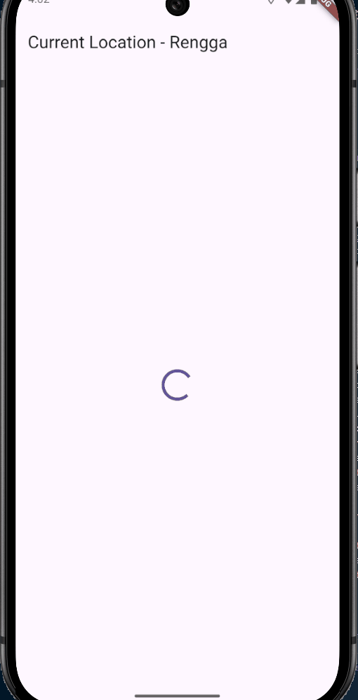
---
*Langkah 5: Tambah handling error*
---
Tambahkan kode berikut untuk menangani ketika terjadi error. Kemudian hot restart.

```dart
else if (snapshot.connectionState == ConnectionState.done) {
  if (snapshot.hasError) {
     return Text('Something terrible happened!');
  }
  return Text(snapshot.data.toString());
}
```
---
*Hasil kesuluruhan kode:*
---

---
## Soal di praktikum 7

### 13. 
* Apakah ada perbedaan UI dengan praktikum sebelumnya? Mengapa demikian?

  Secara visual, UI tidak ada perbedaan dengan praktikum sebelumnya
---
* Capture hasil praktikum Anda berupa GIF dan lampirkan di README. Lalu lakukan commit dengan pesan **"W11: Soal 13"**.

---

---
* Seperti yang Anda lihat, menggunakan FutureBuilder lebih efisien, clean, dan reactive dengan Future bersama UI.

---
### 14. 

* Apakah ada perbedaan UI dengan langkah sebelumnya? Mengapa demikian?

  Perbedaan UI hanya muncul pada kondisi error. Langkah 5 menambah cabang khusus `snapshot.hasError` di FutureBuilder, sehingga UI kini bisa menampilkan pesan error

---
* Capture hasil praktikum Anda berupa GIF dan lampirkan di README. Lalu lakukan commit dengan pesan **"W11: Soal 14"**.

---

---

## Praktikum 8: Navigation route dengan Future Function
*Langkah 1: Buat file baru navigation_first.dart*
---
Buatlah file baru ini di project lib Anda.

*Langkah 2: Isi kode navigation_first.dart*
---
Tambah variabel ini di class `_LocationScreenState`
```dart
import 'package:flutter/material.dart';

class NavigationFirst extends StatefulWidget {
  const NavigationFirst({super.key});

  @override
  State<NavigationFirst> createState() => _NavigationFirstState();
}

class _NavigationFirstState extends State<NavigationFirst> {
  Color color = Colors.blue.shade700;

  @override
  Widget build(BuildContext context) {
    return Scaffold(
      backgroundColor: color,
      appBar: AppBar(
        title: const Text('Navigation First Screen'),
      ),
      body: Center(
        child: ElevatedButton(
          child: const Text('Change Color'),
          onPressed: () {
            _navigateAndGetColor(context);
          },
        ),
      ),
    );
  }
}
```
---
*Langkah 3: Tambah method di class _NavigationFirstState*
---
Tambah method ini.
```dart
Future _navigateAndGetColor(BuildContext context) async {
   color = await Navigator.push(context,
        MaterialPageRoute(builder: (context) => const NavigationSecond()),) ?? Colors.blue;
   setState(() {});
   });
}
```
---
*Langkah 4: Buat file baru navigation_second.dart*
---
Buat file baru ini di project lib Anda. Silakan jika ingin mengelompokkan view menjadi satu folder dan sesuaikan impor yang dibutuhkan.

---
*Langkah 5: Buat class NavigationSecond dengan StatefulWidget*
---

```dart
import 'package:flutter/material.dart';

class NavigationSecond extends StatefulWidget {
  const NavigationSecond({super.key});

  @override
  State<NavigationSecond> createState() => _NavigationSecondState();
}

class _NavigationSecondState extends State<NavigationSecond> {
  @override
  Widget build(BuildContext context) {
    Color color; // Declared but not initialized, will be assigned inside button handlers.
    return Scaffold(
      appBar: AppBar(
        title: const Text('Navigation Second Screen'),
      ),
      body: Center(
        child: Column(
          mainAxisAlignment: MainAxisAlignment.spaceEvenly,
          children: [
            ElevatedButton(
              child: const Text('Red'),
              onPressed: () {
                color = Colors.red.shade700;
                Navigator.pop(context, color);
              },
            ),
            ElevatedButton(
              child: const Text('Green'),
              onPressed: () {
                color = Colors.green.shade700;
                Navigator.pop(context, color);
              },
            ),
            ElevatedButton(
              child: const Text('Blue'),
              onPressed: () {
                color = Colors.blue.shade700;
                Navigator.pop(context, color);
              },
            ),
          ],
        ),
      ),
    );
  }
}
```
*Langkah 6: Edit main.dart*
---
Lakukan edit properti home.

```dart
home: const NavigationFirst(),
```
*Langkah 8: Run*
---
Lakukan run, jika terjadi error silakan diperbaiki.

---
*Hasil kesuluruhan kode:*
---
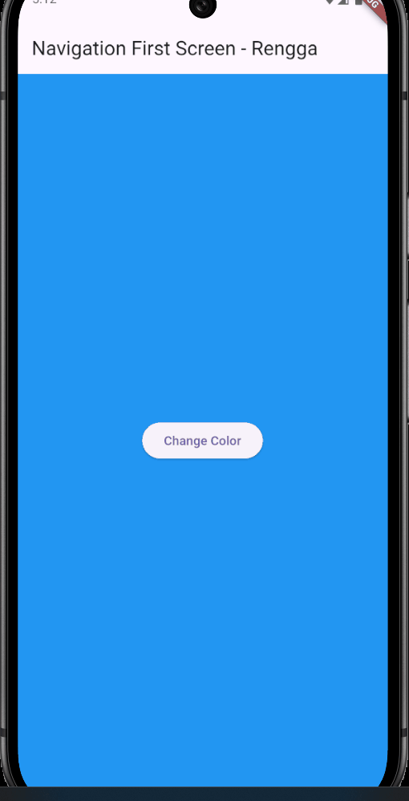
---
## Soal di praktikum 8

### 15. 
* Tambahkan nama panggilan Anda pada tiap properti title sebagai identitas pekerjaan Anda.

  ```dart
  title: const Text('Navigation First Screen - Rengga'),
  ```
---
* Silakan ganti dengan warna tema favorit Anda.


  ```dart
  Color color = const Color.fromARGB(255, 32, 113, 193);
  ```
---
### 16. 

* Cobalah klik setiap button, apa yang terjadi ? Mengapa demikian ?

  Ketika setiap button pada halaman kedua diklik, halaman kedua akan tertutup dan kembali ke halaman pertama. Warna background halaman pertama kemudian berubah mengikuti warna button yang ditekan.

  Hal ini terjadi karena setiap button pada halaman kedua memanggil `Navigator.pop(context, <warna>)` dan mengirimkan nilai warna sebagai hasil. Halaman pertama memanggil `Navigator.push(...)` dan menunggu nilai balikan tersebut dengan `await`. Setelah nilai warna diterima, nilai tersebut disimpan ke variabel `color` dan `setState()` dipanggil sehingga tampilan diperbarui dengan warna background yang baru.


---
* Gantilah 3 warna pada langkah 5 dengan warna favorit Anda!

---
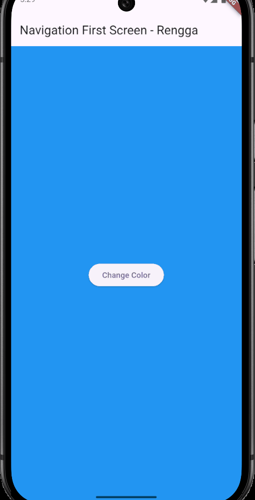
---

* Capture hasil praktikum Anda berupa GIF dan lampirkan di README. Lalu lakukan commit dengan pesan **"W11: Soal 16"**.

---

---
## Praktikum 9: Memanfaatkan async/await dengan Widget Dialog
*Langkah 1: Buat file baru navigation_dialog.dart*
---
Buat file dart baru di folder lib project Anda.

*Langkah 2: Isi kode navigation_dialog.dart*
---
```dart
import 'package:flutter/material.dart';

class NavigationDialogScreen extends StatefulWidget {
  const NavigationDialogScreen({super.key});

  @override
  State<NavigationDialogScreen> createState() => _NavigationDialogScreenState();
}

class _NavigationDialogScreenState extends State<NavigationDialogScreen> {
  Color color = Colors.blue.shade700;

  @override
  Widget build(BuildContext context) {
    return Scaffold(
      backgroundColor: color,
      appBar: AppBar(
        title: const Text('Navigation Dialog Screen'),
      ),
      body: Center(
        child: ElevatedButton(
          child: const Text('Change Color'),
          onPressed: () {},
        ),
      ),
    );
  }
}
```
---
*Langkah 3: Tambah method async*
---
Tambah method ini.
```dart
_showColorDialog(BuildContext context) async {
  final color = await showDialog(
    barrierDismissible: false,
    context: context,
    builder: (_) {
      return AlertDialog(
        title: const Text('Very important question'),
        content: const Text('Please choose a color'),
        actions: <Widget>[
          TextButton(
            child: const Text('Red'),
            onPressed: () {
              Navigator.pop(context, Colors.red.shade700);
            },
          ),
          TextButton(
            child: const Text('Green'),
            onPressed: () {
              Navigator.pop(context, Colors.green.shade700);
            },
          ),
          TextButton(
            child: const Text('Blue'),
            onPressed: () {
              Navigator.pop(context, Colors.blue.shade700);
            },
          ),
        ],
      );
    },
  );
  setState(() {
    this.color = color as Color; // Assuming 'color' is the state variable
  });
}
```
---
*Langkah 4: Panggil method di ElevatedButton*
---

```dart
onPressed: () {
  _showColorDialog(context);
},
```
---
*Langkah 5: Edit main.dart*
---
Ubah properti home

```dart
home: const NavigationDialog(),
```
*Langkah 6: Run*
---
Coba ganti warna background dengan widget dialog tersebut. Jika terjadi error, silakan diperbaiki. Jika berhasil, akan tampil seperti gambar berikut.

---
*Hasil kesuluruhan kode:*
---
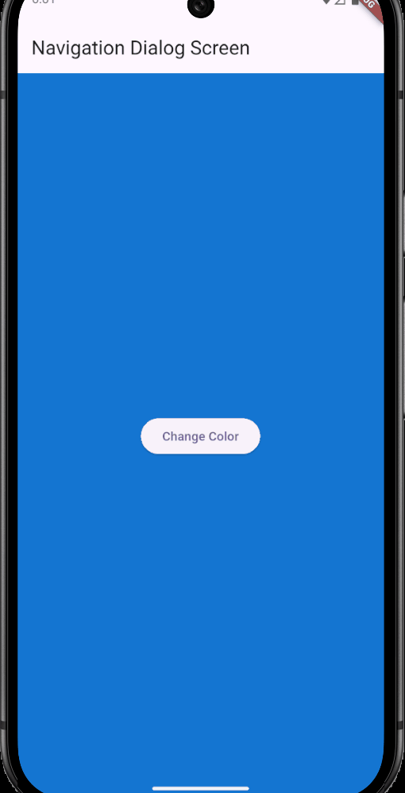
---
## Soal di praktikum 9

### 17. 
* Cobalah klik setiap button, apa yang terjadi ? Mengapa demikian ?

  Ketika setiap button pada dialog diklik, dialog akan tertutup dan tampilan kembali ke screen utama. Warna background pada screen utama kemudian berubah mengikuti warna dari button yang diklik. 

  Hal ini terjadi karena setiap button pada dialog menutup dialog dengan `Navigator.pop(context, <warna>)` atau `Navigator.pop(context)` tanpa nilai. Di screen utama, pemanggilan `await showDialog(...)` menunggu nilai balikan dari dialog tersebut. Nilai yang diterima digunakan untuk mengubah variabel warna di state, lalu `setState()` dipanggil sehingga UI diperbarui dengan background sesuai warna hasil dialog, atau tidak berubah jika hasilnya `null`.


---
* Gantilah 3 warna pada langkah 3 dengan warna favorit Anda!

---

---
* Capture hasil praktikum Anda berupa GIF dan lampirkan di README. Lalu lakukan commit dengan pesan **"W11: Soal 17"**.

---

---