# Jobsheet Week 12 - Lanjutan State Management dengan Streams

## Praktikum 1: Dart Streams
*Langkah 1: Buat Project Baru*
---
Buatlah sebuah project flutter baru dengan nama **stream_nama** (beri nama panggilan Anda) di folder **week-12/src/** repository GitHub Anda.

---
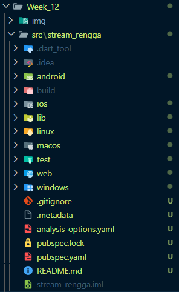
---
*Langkah 2: Buka file main.dart*
---
Ketiklah kode seperti berikut ini.

---
```dart
import 'package:flutter/material.dart';

void main() {
  runApp(const MyApp());
}

class MyApp extends StatelessWidget {
  const MyApp({super.key});

  @override
  Widget build(BuildContext context) {
    return MaterialApp(
      title: 'Stream',
      theme: ThemeData(
        primarySwatch: Colors.deepPurple,
      ),
      home: const StreamHomePage(),
    );
  }
}

class StreamHomePage extends StatefulWidget {
  const StreamHomePage({super.key});

  @override
  State<StreamHomePage> createState() => _StreamHomePageState();
}

class _StreamHomePageState extends State<StreamHomePage> {
  @override
  Widget build(BuildContext context) {
    return Container();
  }
}
```

*Langkah 3: Buat file baru stream.dart*
---
Buat file baru di folder lib project Anda. Lalu isi dengan kode berikut.

```dart
import 'package:flutter/material.dart';

class ColorStream {
  
}
```
---
*Langkah 4: Tambah variabel colors*
---
Tambahkan variabel di dalam class `ColorStream` seperti berikut.

```dart
  final List<Color> colors = [
    Colors.blueGrey,
    Colors.amber,
    Colors.deepPurple,
    Colors.lightBlue,
    Colors.teal,
  ];
```
---
*Langkah 5: Tambah method getColors()*
---
Di dalam `class ColorStream` ketik method seperti kode berikut. Perhatikan tanda bintang di akhir keyword `async*` (ini digunakan untuk melakukan `Stream` data)

```dart
Stream<Color> getColors() async* {
    
  }
```
*Langkah 6: Tambah perintah yield* *
---
Tambahkan kode berikut ini.

```dart
yield* Stream.periodic(
  const Duration(seconds: 1), (int t) {
    int index = t % colors.length;
    return colors[index];
});
```
*Langkah 7: Buka main.dart*
---
Ketik kode impor file ini pada file `main.dart`

```dart
import 'stream.dart';
```
*Langkah 8: Tambah variabel*
---
Ketik dua properti ini di dalam class `_StreamHomePageState`

```dart
  Color? _color;
  late ColorStream _colorStream;
```
*Langkah 9: Tambah method changeColor()*
---
Tetap di file main, Ketik kode seperti berikut

```dart
  void changeColor() {
    _colorStream.getColors().listen((event) {
      setState(() {
        _color = event;
      });
    });
  }
```
*Langkah 10: Lakukan override initState()*
---
Ketika kode seperti berikut

```dart
  @override
  void initState() {
    super.initState();
    _colorStream = ColorStream();
    changeColor(); 
  }
```
*Langkah 11: Ubah isi Scaffold()*
---
Sesuaikan kode seperti berikut.

```dart
    return Scaffold(
      appBar: AppBar(
        title: const Text('Stream', style: TextStyle(color: Colors.white)),
        backgroundColor: Colors.deepPurple,
      ),
      body: Container(
        decoration: BoxDecoration(
          color: _color ?? Colors.grey[200], 
        ),
      ),
    )
```
*Langkah 12: Run*
---
Lakukan running pada aplikasi Flutter Anda, maka akan terlihat berubah warna background setiap detik.

---

---
*Langkah 13: Ganti isi method `changeColor()`*
---
Anda boleh comment atau hapus kode sebelumnya, lalu ketika kode seperti berikut.

```dart
    _colorStream.getColors().listen((event) {
      setState(() {
        _color = event;
      });
    });
```
---
*Hasil keseluruhan kode:*
---

---
## Soal di praktikum 1

### 1. 

#### * Tambahkan nama panggilan Anda pada `title` app sebagai identitas hasil pekerjaan Anda.
```dart
  title: 'Stream App - Rengga', 
```
---
#### * Gantilah warna tema aplikasi sesuai kesukaan Anda.
```dart
    final List<Color> colors = [
    Colors.red,
    Colors.green,
    Colors.lightGreen,
    Colors.purple,
    Colors.orange,
  ];
```
---
#### * Lakukan commit hasil jawaban Soal 1 dengan pesan "W12: Jawaban Soal 1"

---
### 2. 

#### * Tambahkan 5 warna lainnya sesuai keinginan Anda pada variabel `colors` tersebut.
```dart
  final List<Color> colors = [
    Colors.blueGrey,
    Colors.amber,
    Colors.deepPurple,
    Colors.lightBlue,
    Colors.teal,
    Colors.red,
    Colors.green,
    Colors.lightGreen,
    Colors.purple,
    Colors.orange,
  ];
```
---
#### * Lakukan commit hasil jawaban Soal 2 dengan pesan "W12: Jawaban Soal 2"

---
### 3. 

#### * Jelaskan fungsi keyword `yield*` pada kode tersebut!

Keyword **`yield*`** (dibaca "yield star") digunakan dalam fungsi generator asinkron (`async*`). Fungsinya adalah untuk **meneruskan (forward)** semua nilai, *error*, dan *done events* yang dihasilkan oleh **Stream lain** (disebut *inner stream*) ke **Stream saat ini** (disebut *outer stream*).

Ia mengambil seluruh aliran data dari satu Stream, dan memindahkannya ke Stream yang sedang Anda definisikan. Ini lebih ringkas daripada harus mendengarkan *inner stream* dan melakukan `yield` pada setiap nilainya.

---
#### * Apa maksud isi perintah kode tersebut?
Isi perintah kode tersebut adalah untuk **membuat Stream yang menghasilkan objek `Color` secara periodik setiap satu detik**.

```dart
yield* Stream.periodic(
  const Duration(seconds: 1), (int t) {
    int index = t % colors.length;
    return colors[index];
});
```

**Maksudnya adalah:**

1.  **`Stream.periodic(const Duration(seconds: 1), ...)`**: Membuat Stream baru yang akan mengeluarkan (emit) nilai setiap **1 detik** secara terus-menerus.
2.  **`(int t)`**: Ini adalah fungsi *callback* yang dijalankan setiap 1 detik. Variabel `t` adalah *counter* (hitungan waktu) yang dimulai dari 0 dan terus bertambah (0, 1, 2, 3, ...).
3.  **`int index = t % colors.length;`**: Menghitung indeks (posisi) warna yang akan diambil. Penggunaan operator **modulo (`%`)** memastikan bahwa indeks selalu berada dalam batas panjang list `colors`. Misalnya, jika ada 10 warna, indeks akan berputar dari 0 hingga 9, lalu kembali ke 0.
4.  **`return colors[index];`**: Mengembalikan objek `Color` dari list `colors` pada indeks yang sudah dihitung.

Jadi, kode ini secara keseluruhan menciptakan aliran data yang terus-menerus menghasilkan warna yang berbeda, berganti setiap satu detik, dan aliran data ini diteruskan ke fungsi `getColors()` menggunakan `yield*`.

---
#### * Lakukan commit hasil jawaban Soal 3 dengan pesan "W12: Jawaban Soal 3"

---
### 4. 

#### * Capture hasil praktikum Anda berupa GIF dan lampirkan di README.


---
#### * Lakukan commit hasil jawaban Soal 4 dengan pesan "W12: Jawaban Soal 4"

---
### 5. 

#### * Jelaskan perbedaan menggunakan listen dan await for (langkah 9) !
Perbedaan utama terletak pada **sifat blocking** dan **kontrol** terhadap aliran data:

1.  **`stream.listen()` (Non-Blocking)**:
    * Kode di bawah `listen` akan dieksekusi **langsung** tanpa menunggu data dari Stream. Stream berjalan di latar belakang.
    * Memberikan **kontrol penuh** berupa objek `StreamSubscription`. Objek ini sangat penting di Flutter karena memungkinkan kita untuk memanggil `cancel()` pada Stream di method `dispose()`, sehingga mencegah **kebocoran memori (memory leak)** saat widget dimusnahkan.

2.  **`await for (var event in stream)` (Blocking Asinkron)**:
    * Hanya bisa digunakan di dalam fungsi yang berlabel **`async`**.
    * Eksekusi kode di bawah blok `await for` akan **tertahan (terblokir)** sampai Stream tersebut benar-benar **selesai** (ditutup).
    * Tidak memberikan kontrol eksplisit seperti `pause()` atau `cancel()`. Biasanya lebih cocok untuk skrip yang memproses seluruh data Stream hingga selesai, bukan untuk *state management* UI yang berkelanjutan di Flutter.

**Intinya:** Kita menggunakan **`listen`** di UI Flutter karena sifatnya yang non-blocking dan kemampuannya untuk dikontrol dan dibersihkan (dibatalkan) saat tidak lagi dibutuhkan.


#### * Lakukan commit hasil jawaban Soal 5 dengan pesan "W12: Jawaban Soal 5"

---
## Praktikum 2: Stream controllers dan sinks
*Langkah 1: Buka file stream.dart*
---
Lakukan impor dengan mengetik kode ini.
```dart
import 'dart:async';
```
---
*Langkah 2: Tambah class NumberStream*
---
Tetap di file `stream.dart` tambah class baru seperti berikut.
```dart
class NumberStreams {

}
```
*Langkah 3: Tambah StreamController*
---
Di dalam `class NumberStream` buatlah variabel seperti berikut.

```dart
final StreamController<int> controller = StreamController<int>();
```
---
*Langkah 4: Tambah method addNumberToSink*
---
Tetap di `class NumberStream` buatlah method ini

```dart
  void addNumberToSink(int newNumber) {
    controller.sink.add(newNumber);
  }
```
*Langkah 5: Tambah method close()*
---


```dart
  void close() {
    controller.close();
  }
```
*Langkah 6: Buka main.dart*
---
Ketik kode import seperti berikut

```dart
import 'dart:async';
import 'dart:math';
```
*Langkah 7: Tambah variabel*
---
Di dalam `class _StreamHomePageState` ketik variabel berikut

```dart
  int lastNumber = 0;
  late StreamController<int> numberStreamController;
  late Stream<int> numberStream;
  late NumberStream _numberStream;
```
*Langkah 8: Edit initState()*
---

```dart
  @override
  void initState() {
    _numberStream = NumberStream();
    numberStreamController = _numberStream.controller;
    numberStream = numberStreamController.stream;
    numberStream.listen((event) {
      setState(() {
        lastNumber = event;
      });
    });
    super.initState();
  }
```
*Langkah 9: Edit dispose()*
---

```dart
  @override
  void dispose() {
    numberStreamController.close();
    super.dispose();
  }
```
*Langkah 10: Tambah method addRandomNumber()*
---

```dart
  void addRandomNumber() {
    final random = Random();
    final myNum = random.nextInt(10);
    _numberStream.addNumberToSink(myNum);
  }
```
*Langkah 11: Edit method build()*
---

```dart
      body: SizedBox(
        width: double.infinity,
        child: Column(
          mainAxisAlignment: MainAxisAlignment.spaceEvenly,
          crossAxisAlignment: CrossAxisAlignment.center,
          children: [
            Text(lastNumber.toString()),
            ElevatedButton(
              onPressed: () => addRandomNumber(),
              child: const Text('New Random Number'),
            ),
          ],
        ),
      )
```
*Langkah 12: Run*
---
Lakukan running pada aplikasi Flutter Anda, maka akan terlihat seperti gambar berikut.

---
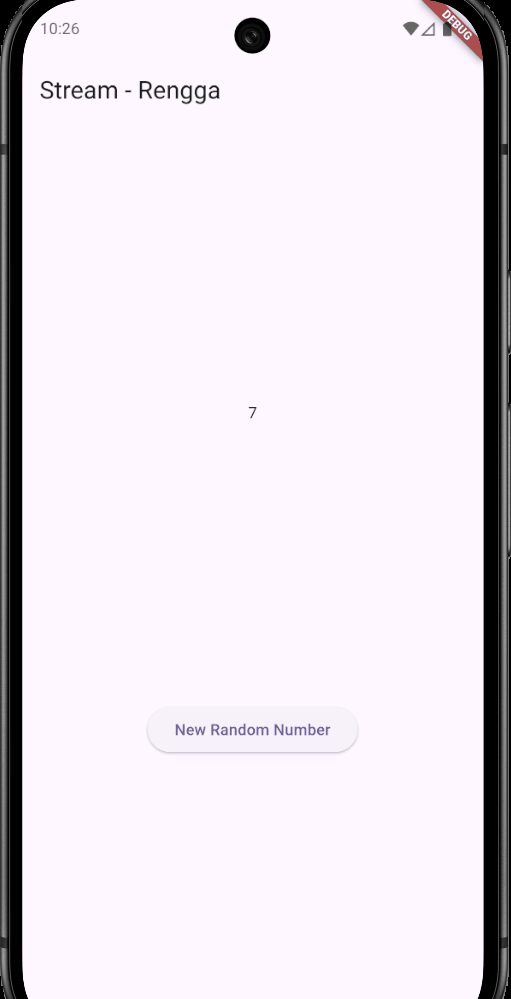
---
*Langkah 13: Buka stream.dart*
---
Tambahkan method berikut ini.

```dart
  void addError() {
    controller.sink.addError('error');
  }
```
*Langkah 14: Buka main.dart*
---
Tambahkan method `onError` di dalam `class StreamHomePageState` pada method `listen` di fungsi `initState()` seperti berikut ini.

```dart

    }).onError((error) {
      setState(() {
        lastNumber = -1;
      });
```
*Langkah 15: Edit method addRandomNumber()*
---
Lakukan comment pada dua baris kode berikut, lalu ketik kode seperti berikut ini.

```dart
  void addRandomNumber() {
    final random = Random();
    // int myNum = random.nextInt(10);
    // _numberStream.addNumberToSink(myNum);
    _numberStream.addError();
  }
```
---
*Hasil keseluruhan kode:*
---
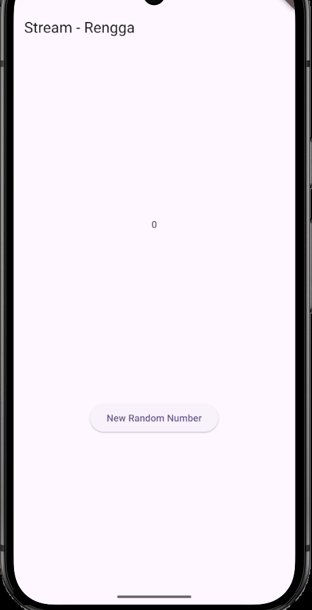
---
## Soal di praktikum 2

## 6. 
* Jelaskan maksud kode langkah 8 dan 10 tersebut!

Pada **Langkah 8**, kita mengedit method `initState()` untuk melakukan dua tugas penting:

1.  **Inisialisasi Stream:** Kita membuat objek baru dari `NumberStream` (`numberStream = NumberStream();`). Objek ini berisi `StreamController` dan `Sink` yang akan kita gunakan.
2.  **Mendengarkan Stream:** Kita memanggil method `listen()` pada `numberStream.getStream()`. Fungsi `listen` ini adalah mekanisme utama di mana UI kita menunggu data dari Stream. Ketika data (angka acak) diterima, fungsi di dalamnya (`setState(() { _randomNumber = event; });`) akan dijalankan. `setState` bertugas memberi tahu Flutter bahwa nilai `_randomNumber` telah berubah dan UI harus digambar ulang untuk menampilkan angka baru tersebut.

Tujuan dari Langkah 8 adalah menyiapkan jembatan komunikasi: **data siap dikirim** dan **UI siap menerima** data untuk ditampilkan.

Sedangkan pada **Langkah 10**, kita membuat method `addRandomNumber()` yang bertugas sebagai **pemicu atau penghasil data**.

1.  Method ini pertama-tama menghasilkan angka acak (`myNum`) antara 0 sampai 9.
2.  Kemudian, angka acak tersebut dikirim ke Stream menggunakan `numberStream.addNumberToSink(myNum);`. Method `addNumberToSink()` ini, pada dasarnya, memanggil `_controller.sink.add(myNum)`, yang berarti data (angka) tersebut disuntikkan ke dalam pipa Stream.

Singkatnya, **Langkah 10** adalah logika yang berjalan saat tombol ditekan (sumber data), dan **Langkah 8** adalah logika yang menangkap dan menampilkan data tersebut di layar (penerima data).

---
* Capture hasil praktikum Anda berupa GIF dan lampirkan di README.

>DONE

---
* Lalu lakukan commit dengan pesan "W12: Jawaban Soal 6".

---
## 7. 
* Jelaskan maksud kode langkah 13 sampai 15 tersebut!

Kode pada Langkah 13 sampai 15 memiliki tujuan utama untuk mendemonstrasikan bagaimana **penanganan *error*** (kesalahan) dilakukan dalam aliran Stream.

### 1. Tujuan Penambahan Kode (Langkah 13 & 14)

* **Langkah 13** menambahkan method `addError()` di dalam *class* `NumberStream`. Method ini bertindak sebagai **jalur darurat** untuk mengirimkan sinyal *error* secara manual ke dalam pipa Stream (`_controller.sink.addError`).
* **Langkah 14** menambahkan parameter **`onError`** ke fungsi `listen()` di `initState()`. Fungsi `onError` ini adalah **mekanisme penangkap *error***. Ketika Stream mengirimkan sinyal *error* (bukan data normal), fungsi ini akan dieksekusi, memungkinkan kita mencatat (*logging*) atau menampilkan pesan kesalahan tanpa menyebabkan aplikasi *crash*.

Tujuannya adalah: **Memastikan *Subscriber* (UI) siap menerima dan menangani sinyal *error* yang mungkin dikirim oleh *Controller*.**

### 2. Tujuan Modifikasi Kode (Langkah 15)

* **Langkah 15** (sementara) mengubah isi method `addRandomNumber()`. Daripada mengirim angka acak, kode tersebut diubah untuk **secara paksa** memanggil `numberStream.addError('Something went wrong')`.

Tujuannya adalah: **Menguji apakah mekanisme penanganan *error* yang telah disiapkan di Langkah 14 berfungsi.**

---
* Kembalikan kode seperti semula pada Langkah 15, comment addError() agar Anda dapat melanjutkan ke praktikum 3 berikutnya.
```dart
  void addRandomNumber() {
    final random = Random();
    final myNum = random.nextInt(10);
    _numberStream.addNumberToSink(myNum);
  }
```

---
* Lalu lakukan commit dengan pesan "W12: Jawaban Soal 7".

---
## Praktikum 3: Injeksi data ke streams
*Langkah 1: Buka main.dart*
---
Tambahkan variabel baru di dalam `class _StreamHomePageState`
```dart
late StreamTransformer<int, int> transformer;
```
---
*Langkah 2: Tambahkan kode ini di initState*
---
```dart
    transformer = StreamTransformer<int, int>.fromHandlers(
      handleData: (value, sink) {
        sink.add(value * 10);
      },
      handleError: (error, trace, sink) {
        sink.add(-1);
      },
      handleDone: (sink) => sink.close(),
    );
```
---
*Langkah 3: Tetap di initState*
---
Lakukan edit seperti kode berikut.

```dart
    numberStream.transform(transformer).listen((event) {
      setState(() {
        lastNumber = event;
      });
    }).onError((error) {
      setState(() {
        lastNumber = -1;
      });
    });

    super.initState();
```
---
*Langkah 4: Run*
---
Terakhir, **run** atau tekan **F5** untuk melihat hasilnya jika memang belum running. Bisa juga lakukan **hot restart** jika aplikasi sudah running. Maka hasilnya akan seperti gambar berikut ini. Anda akan melihat tampilan angka dari 0 hingga 90.

---
*Hasil kesuluruhan kode:*
---
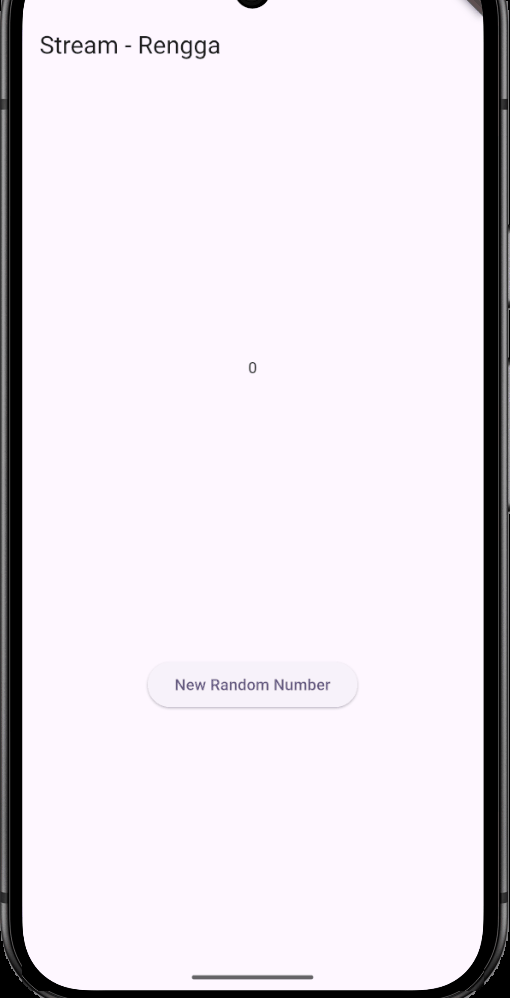
---
## Soal di praktikum 3

## 8. 
* Jelaskan maksud kode langkah 1-3 tersebut!

Tujuan dari Langkah 1 hingga 3 adalah untuk mendemonstrasikan bagaimana kita dapat **memanipulasi dan memfilter data Stream** sebelum data tersebut digunakan untuk memperbarui UI, menggunakan fitur *Stream Transformer* seperti `map` dan `where`.

### 1. Langkah 1 (Penambahan Variabel)

* **Maksud:** Menambahkan variabel `int _latestValue = 0;` di `_StreamHomePageState`.
* **Fungsi:** Variabel ini berfungsi sebagai penampung akhir. Nilai ini akan diisi oleh data yang sudah melalui proses transformasi dan filter di Stream, kemudian ditampilkan di UI.

### 2. Langkah 2 & 3 (Implementasi Transformasi)

Pada `initState()`, kita menyiapkan aliran data dengan menyisipkan dua operator di tengahnya:

* **`.map((event) => event * 10)`**: Ini adalah operator **`map`**. Tugasnya adalah **mengubah nilai** setiap data yang masuk. Setiap angka acak yang dikirim oleh Stream sumber ($0$ sampai $9$) akan **dikalikan 10**. Hasilnya, data yang diteruskan ke tahap selanjutnya adalah kelipatan $10$ ($0, 10, 20, ..., 90$).
* **`.where((event) => event.isEven)`**: Ini adalah operator **`where`**. Tugasnya adalah **memfilter data**. Ia hanya akan meneruskan nilai yang memenuhi kondisi, yaitu angka tersebut harus **genap**.

---
* Capture hasil praktikum Anda berupa GIF dan lampirkan di README.

>DONE

---
* Lalu lakukan commit dengan pesan "**W12: Jawaban Soal 8**".


---
## Praktikum 4: Subscribe ke stream events
*Langkah 1: Tambah variabel*
---
Tambahkan variabel berikut di `class _StreamHomePageState`
```dart
  late StreamSubscription subscription;
```
---
*Langkah 2: Edit initState()*
---
Edit kode seperti berikut ini.
```dart
  void initState() {
    _numberStream = NumberStream();
    numberStreamController = _numberStream.controller;
    numberStream = numberStreamController.stream;

    subscription = numberStream.listen((event) {
      setState(() {
        lastNumber = event;
      });
    });
    super.initState();
  }
```
---
*Langkah 3: Tetap di initState()*
---
Tambahkan kode berikut ini.
```dart
    subscription.onError((error) {
      setState(() {
        lastNumber = -1;
      });
    });
```
---
*Langkah 4: Tambah properti onDone()*
---
Tambahkan dibawahnya kode ini setelah `onError`

```dart
    subscription.onDone(() {
      print('OnDone was called');
    });
```
---
*Langkah 5: Tambah method baru*
---
Ketik method ini di dalam `class _StreamHomePageState`

```dart
  void stopStream() {
    numberStreamController.close();
  }
```
---
*Langkah 6: Pindah ke method dispose()*
---
Jika method `dispose()` belum ada, Anda dapat mengetiknya dan dibuat override. Ketik kode ini didalamnya.

```dart
    subscription.cancel();
```
---
*Langkah 7: Pindah ke method build()*
---
Tambahkan button kedua dengan isi kode seperti berikut ini.

```dart
            ElevatedButton(
              onPressed: () => stopStream(),
              child: const Text('Stop Subscription'),
            ),
```
---
*Langkah 8: Edit method addRandomNumber()*
---
Edit kode seperti berikut ini.

```dart
  void addRandomNumber() {
    final random = Random();
    final myNum = random.nextInt(10);
    if (!numberStreamController.isClosed) {
      _numberStream.addNumberToSink(myNum);
    } else {
      setState(() {
        lastNumber = -1;
      });
    }
  }
```
---
*Langkah 9: Run*
---
Anda akan melihat dua button seperti gambar berikut.

---
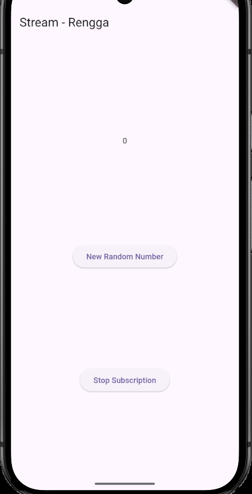
---
*Langkah 10: Tekan button ‘Stop Subscription'*
---
Anda akan melihat pesan di Debug Console seperti berikut.

---
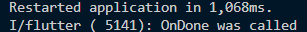
---
*Hasil kesuluruhan kode:*
---

---

## Soal di praktikum 4

## 9. 
* Jelaskan maksud kode langkah 2, 6 dan 8 tersebut!

### 1. Langkah 2: Menggunakan `StreamSubscription`

* **Maksud:** Mengubah pemanggilan `listen()` agar nilai yang dikembalikan disimpan dalam variabel `_subscription` yang telah dibuat sebelumnya.
* **Fungsi:** Daripada langsung memanggil `listen()` tanpa menyimpan hasilnya, kita menyimpan objek `StreamSubscription`. Objek ini adalah **kunci kontrol** terhadap Stream. Dengan memilikinya, kita bisa memanggil method `pause()` atau `cancel()` kapan saja.

### 2. Langkah 6: Memanggil `cancel()` di `dispose()`

* **Maksud:** Meng-implementasikan method `dispose()` pada *StatefulWidget* dan di dalamnya memanggil **`_subscription.cancel()`**.
* **Fungsi:** Method `dispose()` dijalankan saat *widget* dihapus secara permanen dari layar (misalnya, saat pengguna pindah halaman). Memanggil **`cancel()`** memastikan bahwa koneksi pendengaran Stream **dihentikan** dan semua *resource* yang digunakan oleh *Subscription* dibebaskan. Ini adalah **praktik terbaik** untuk mencegah **kebocoran memori (memory leak)**.

### 3. Langkah 8: Menggunakan `pause()` dan `resume()`

* **Maksud:** Mengubah method `addRandomNumber()` (yang dipanggil saat tombol ditekan) untuk menyertakan logika **`pause()`** dan **`resume()`** pada `_subscription`.
* **Fungsi:** Logika ini adalah demonstrasi kontrol. Jika Stream sedang berjalan, ia dapat dihentikan sementara (`pause()`) saat tombol "Stop Subscription" ditekan, dan dapat dilanjutkan (`resume()`) saat tombol "New Random Number" ditekan lagi. Ini menunjukkan kemampuan untuk mengelola aliran data secara dinamis.

---
* Capture hasil praktikum Anda berupa GIF dan lampirkan di README.

>DONE

---
* Lalu lakukan commit dengan pesan "**W12: Jawaban Soal 9**".


---


## Praktikum 5: Menangani Respon Error pada Async Code
*Langkah 1: Buka file main.dart*
---
Ketik variabel berikut di `class _StreamHomePageState`
```dart
  late StreamSubscription subscription2;
  String values = '';
```
---
*Langkah 2: Edit initState()*
---
Ketik kode seperti berikut.
```dart
    subscription = numberStream.listen((event) {
      setState(() {
        values += '$event - ';
      });
    });

    subscription2 = numberStream.listen((event) {
      setState(() {
        values += '$event - ';
      });
    });
```
*Langkah 3: Run*
---
Lakukan run maka akan tampil error seperti gambar berikut.

---
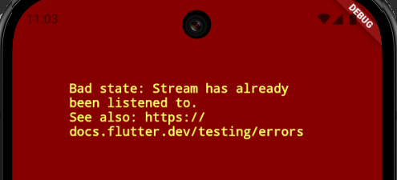
---
*Langkah 4: Set broadcast stream*
---
Ketik kode seperti berikut di method `initState()`

```dart
    numberStream = numberStreamController.stream.asBroadcastStream();
```
---
*Langkah 5: Edit method build()*
---
Tambahkan text seperti berikut

```dart
            Text(values),
```
---
*Langkah 6: Run*
---
Tekan button **‘New Random Number'** beberapa kali, maka akan tampil teks angka terus bertambah sebanyak dua kali.

---
*Hasil kesuluruhan kode:*
---

---
## Soal di praktikum 5
## 10. 
* Jelaskan mengapa error itu bisa terjadi ?

Error **"Bad state: Stream has already been listened to."** terjadi karena kode tersebut mencoba membuat **dua pendengar (Subscription)** pada Stream yang sama secara bersamaan.

### Penjelasan:

1.  **Sifat Stream Bawaan:** Secara *default*, Stream di Dart bersifat **Single-Subscription** (satu langganan). Ini berarti Stream hanya dirancang untuk mengirimkan data ke **satu** penerima pada satu waktu.
2.  **Konflik Langganan:** Pada Langkah 2 Praktikum 5, kode membuat dua *Subscription* terpisah (`_subscription` dan `_subscription2`) dari objek Stream yang sama (`numberStream.getStream()`).
3.  **Kesimpulan:** Saat `_subscription` menjadi pendengar pertama, Stream terkunci. Ketika `_subscription2` mencoba mendengarkan, Stream menolak permintaan tersebut karena sudah memiliki pendengar aktif, yang kemudian memicu *error* **Bad State**.

---
## 11. 
* Jelaskan mengapa hal itu bisa terjadi ?

Hal tersebut terjadi karena Stream telah diubah menjadi **Broadcast Stream** pada **Langkah 4 Praktikum 5**.

### Penjelasan:

1.  **Pengubahan Sifat Stream:** Dengan memanggil `asBroadcastStream()`, Stream diubah dari yang semula hanya mengizinkan satu pendengar menjadi Stream yang dapat menampung **banyak pendengar (multiple listeners)** secara serentak.
2.  **Dua Kali Pemrosesan Data:** Karena kode telah membuat **dua *Subscription*** (`_subscription` dan `_subscription2`) yang aktif mendengarkan Stream yang sama, setiap kali data (angka acak) dikirim melalui *sink*, kedua *Subscription* tersebut menerima salinan data tersebut.
3.  **Dua Kali Pembaruan UI:** Masing-masing *Subscription* menjalankan `setState()` secara independen. Akibatnya, tampilan angka di layar diperbarui sebanyak dua kali untuk setiap penekanan tombol, menyebabkan nilai angka acak yang baru ditampilkan sebanyak dua kali di UI.

---
* Capture hasil praktikum Anda berupa GIF dan lampirkan di README

>DONE

---
* Lalu lakukan commit dengan pesan **"W12: Jawaban Soal 10,11"**.


---
## Praktikum 6: StreamBuilder
*Langkah 1: Buat Project Baru*
---
Buatlah sebuah project flutter baru dengan nama **streambuilder_nama** (beri nama panggilan Anda) di folder **week-12/src/** repository GitHub Anda.

---
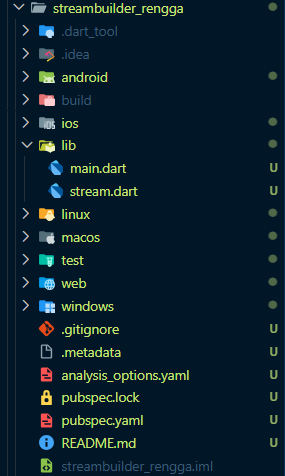
---
*Langkah 2: Buat file baru stream.dart*
---
Ketik kode ini
```dart
class NumberStream {}
```
---
*Langkah 3: Tetap di file stream.dart*
---
Ketik kode seperti berikut.
```dart
import 'dart:math';

class NumberStream {
  Stream<int> getNumbers() async* {
    yield* Stream.periodic(const Duration(seconds: 1), (int t) {
      Random random = Random();
      int myNum = random.nextInt(10);
      return myNum;
    });
  }
}
```
---
*Langkah 4: Edit main.dart*
---
Ketik kode seperti berikut ini.
```dart
import 'package:flutter/material.dart';
import 'stream.dart';
import 'dart:async';

void main() {
  runApp(const MyApp());
}

class MyApp extends StatelessWidget {
  const MyApp({super.key});

  @override
  Widget build(BuildContext context) {
    return MaterialApp(
      title: 'Stream',
      theme: ThemeData(primarySwatch: Colors.deepPurple),
      home: const StreamHomePage(),
    );
  }
}

class StreamHomePage extends StatefulWidget {
  const StreamHomePage({super.key});

  @override
  State<StreamHomePage> createState() => _StreamHomePageState();
}
```
---

*Langkah 5: Tambah variabel*
---
Di dalam `class _StreamHomePageState`, ketika variabel ini.

```dart
  late Stream<int> numberStream;

```
---
*Langkah 6: Edit initState()*
---
Ketik kode seperti berikut.
```dart
  void initState() {
    numberStream = NumberStream().getNumbers();
    super.initState();
  }
```
---
*Langkah 7: Edit method build()*
---
```dart
  Widget build(BuildContext context) {
    return Scaffold(
      appBar: AppBar(title: const Text('Stream')),
      body: StreamBuilder<int>(
        stream: numberStream,
        initialData: 0,
        builder: (context, snapshot) {
          if (snapshot.hasError) {
            print('Error');
          }
          if (snapshot.hasData) {
            return Center(
              child: Text(
                snapshot.data.toString(),
                style: const TextStyle(fontSize: 96),
              ),
            );
          } else {
            return const SizedBox.shrink();
          }
        },
      ),
    );
  }
```
---
*Langkah 8: Run*
---
Hasilnya, setiap detik akan tampil angka baru seperti berikut.

*Hasil kesuluruhan kode:*
---
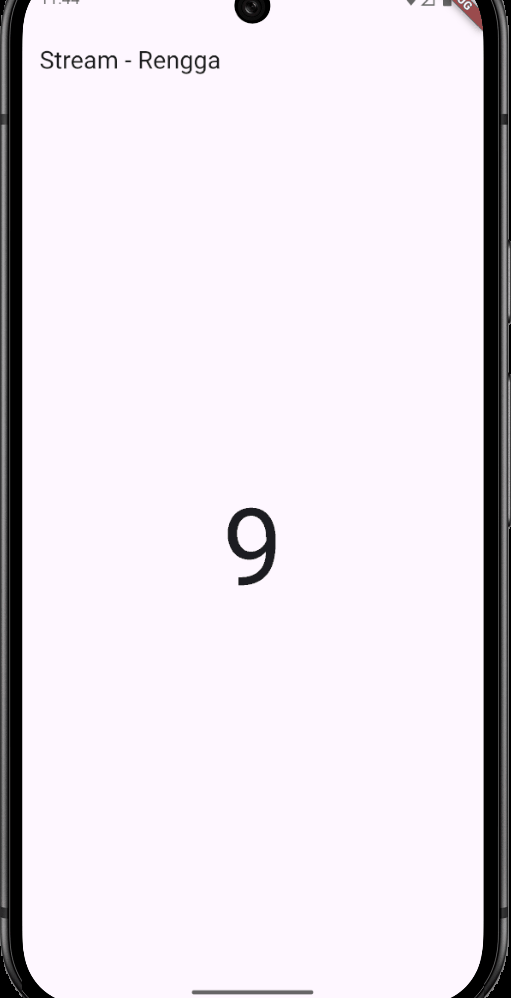
---
## Soal di praktikum 6

## 12. 
* Jelaskan maksud kode pada langkah 3 dan 7 !

### 1. Langkah 3: Membuat Stream Periodik (`getStream()`)

* **Maksud:** Mendefinisikan method `getStream()` di dalam *class* `NumberStream` untuk menghasilkan aliran data.
* **Fungsi:** Method ini membuat Stream menggunakan `Stream.periodic()`, yang secara otomatis mengeluarkan (emit) angka *counter* ($t$) setiap **satu detik**. Stream ini tidak bergantung pada tombol atau *sink* manual.

### 2. Langkah 7: Menggunakan `StreamBuilder` di `build()`

* **Maksud:** Menggunakan *widget* **`StreamBuilder`** pada method `build()` di *widget* utama.
* **Fungsi:**
    * **`stream: numberStream.getStream()`**: Properti ini menentukan Stream mana yang akan diawasi. Setiap data baru dari Stream ini akan memicu pembangunan ulang `StreamBuilder`.
    * **`builder: (context, snapshot)`**: Ini adalah fungsi yang dipanggil setiap kali ada data baru. Variabel `snapshot` berisi informasi tentang status Stream saat ini (misalnya, apakah ada data, apakah *error*, atau apakah sedang menunggu).
    * **Logika Kondisional:** Kode di dalamnya memeriksa status `snapshot` untuk menentukan apa yang ditampilkan:
        * Jika Stream memiliki data (`snapshot.hasData`), tampilkan data tersebut (`snapshot.data`).
        * Jika tidak ada data, tampilkan pesan *loading*.

---
* Capture hasil praktikum Anda berupa GIF dan lampirkan di README.

>DONE

---
* Lalu lakukan commit dengan pesan "**W12: Jawaban Soal 12**".


---
## Praktikum 7: BLoC Pattern
*Langkah 1: Buat Project baru*
---
Buatlah sebuah project flutter baru dengan nama **bloc_random_nama** (beri nama panggilan Anda) di folder **week-12/src/** repository GitHub Anda. Lalu buat file baru di folder `lib` dengan nama `random_bloc.dart`

---
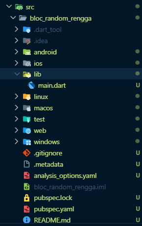
---
*Langkah 2: Isi kode random_bloc.dart*
---
Ketik kode impor berikut ini.
```dart
import 'dart:async';
import 'dart:math';
```
---
*Langkah 3: Buat class RandomNumberBloc()*
---
```dart
class RandomNumberBloc {}
```
*Langkah 4: Buat variabel StreamController*
---
Di dalam `class RandomNumberBloc()` ketik variabel berikut ini

```dart
  // StreamController untuk input events
  final _generateRandomController = StreamController<void>();
  
  // StreamController untuk output
  final _randomNumberController = StreamController<int>();

  // Input Sink
  Sink<void> get generateRandom => _generateRandomController.sink;

  // Output Stream
  Stream<int> get randomNumber => _randomNumberController.stream;
```
*Langkah 5: Buat constructor*
---
```dart
  RandomNumberBloc() {
    _generateRandomController.stream.listen((_) {
      final random = Random().nextInt(10);
      _randomNumberController.sink.add(random);
    });
  }
```
---
*Langkah 6: Buat method dispose()*
---

```dart
  void dispose() {
    _generateRandomController.close();
    _randomNumberController.close();
  }
```
---
*Langkah 7: Edit main.dart*
---

```dart
class MyApp extends StatelessWidget {
  const MyApp({super.key});

  @override
  Widget build(BuildContext context) {
    return MaterialApp(
      title: 'Flutter Demo',
      theme: ThemeData(primarySwatch: Colors.blue),
      home: const RandomScreen(),
    );
  }
}
```
---
*Langkah 8: Buat file baru random_screen.dart*
---
Di dalam folder `lib` project Anda, buatlah file baru ini.
```dart

```
---
*Langkah 9: Lakukan impor material dan random_bloc.dart*
---
Ketik kode ini di file baru `random_screen.dart`
```dart
import 'package:flutter/material.dart';
import 'random_bloc.dart';
```
---
*Langkah 10: Buat StatefulWidget RandomScreen*
---
Buatlah di dalam file `random_screen.dart`

---
*Langkah 11: Buat variabel*
---
Ketik kode ini di dalam `class _RandomScreenState`
```dart
  final _bloc = RandomNumberBloc();
```
---
*Langkah 12: Buat method dispose()*
---
Ketik kode ini di dalam `class _StreamHomePageState`
```dart
  void dispose() {
    _bloc.dispose();
    super.dispose();
  }
```
---
*Langkah 13: Edit method build()*
---
Ketik kode ini di dalam `class _StreamHomePageState`
```dart
  Widget build(BuildContext context) {
    return Scaffold(
      appBar: AppBar(title: const Text('Random Number - Rengga')),
      body: Center(
        child: StreamBuilder<int>(
          stream: _bloc.randomNumber,
          initialData: 0,
          builder: (context, snapshot) {
            return Text(
              'Random Number: ${snapshot.data}',
              style: const TextStyle(fontSize: 24),
            );
          },
        ),
      ),
      floatingActionButton: FloatingActionButton(
        onPressed: () => _bloc.generateRandom.add(null),
        child: const Icon(Icons.refresh),
      ),
    );
  }
```
Run aplikasi, maka Anda akan melihat angka acak antara angka 0 sampai 9 setiap kali menekan tombol `FloactingActionButton`.

---
*Hasil kesuluruhan kode:*
---
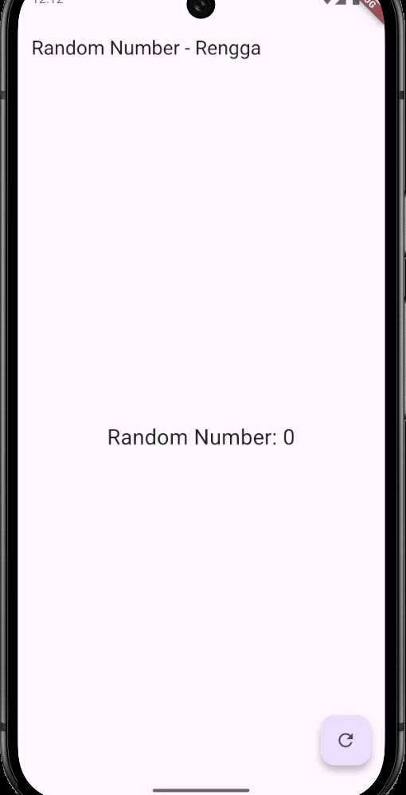
---
## Soal di praktikum 7

## 13. 
* Jelaskan maksud praktikum ini ! Dimanakah letak konsep pola BLoC-nya ?

### Maksud Praktikum Ini

Maksud utama dari praktikum ini adalah untuk memperkenalkan dan mengimplementasikan **pola BLoC (Business Logic Component)** pada aplikasi Flutter yang sangat sederhana.

Tujuannya adalah:

1.  **Memisahkan Tanggung Jawab:** Memisahkan secara tegas antara **Logika Bisnis** (menghasilkan angka acak) dengan **Presentasi UI** (menampilkan angka di layar).
2.  **Menggunakan Stream untuk Komunikasi:** Membiasakan diri menggunakan **Stream dan Sink** sebagai satu-satunya saluran komunikasi antara Logika (BLoC) dan UI (*widget*).

### Letak Konsep Pola BLoC-nya

Konsep pola BLoC terletak pada pemisahan tiga komponen utama:

1.  **UI (*Widget* `RandomScreen`):**
    * Tugasnya hanya **mengirimkan *event*** (penekanan tombol) dan **menerima *state*** (angka acak).
    * UI **TIDAK** tahu bagaimana angka itu dihasilkan. Ia hanya memanggil `randomNumberBloc.addRandomNumber()` (mengirim *event*) dan menampilkan `snapshot.data` (menerima *state*).

2.  **BLoC (`RandomNumberBloc`):**
    * Tugasnya menyimpan dan mengelola **Logika Bisnis**.
    * BLoC **TIDAK** tahu bagaimana angka itu ditampilkan. Ia hanya memiliki `StreamController` dan method `addRandomNumber()` yang berisi logika penghasil angka acak.

3.  **Saluran Komunikasi (Stream/Sink):**
    * **Sink (Input):** Method seperti `addRandomNumber()` yang digunakan UI untuk *mengirimkan perintah* (event) ke BLoC.
    * **Stream (Output):** Properti `randomStream` (`_controller.stream`) yang digunakan BLoC untuk *mengirimkan data* (state baru) ke UI.

---
* Capture hasil praktikum Anda berupa GIF dan lampirkan di README.

>DONE

---
* Lalu lakukan commit dengan pesan "**W12: Jawaban Soal 13**".


---