# Jobsheet Week 13 - Persistensi Data

## Praktikum 1: Dart Streams

#### main.dart:
```dart
import 'package:flutter/material.dart';
import 'dart:async';
import 'dart:convert';
import 'package:flutter/services.dart';
import 'model/pizza.dart';

void main() {
  runApp(const MyApp());
}

class MyApp extends StatelessWidget {
  const MyApp({super.key});

  @override
  Widget build(BuildContext context) {
    return MaterialApp(
      title: 'Flutter Demo',
      theme: ThemeData(
        colorScheme: ColorScheme.fromSeed(seedColor: Colors.deepPurple),
      ),
      home: const MyHomePage(title: 'JSON - Rengga'),
    );
  }
}

class MyHomePage extends StatefulWidget {
  const MyHomePage({super.key, required this.title});

  final String title;

  @override
  State<MyHomePage> createState() => _MyHomePageState();
}

class _MyHomePageState extends State<MyHomePage> {
  List<Pizza> myPizzas = [];

  Future<List<Pizza>> readJsonFile() async {
    try {
      String myString = await rootBundle.loadString('assets/pizzalist.json');
      List pizzaMapList = jsonDecode(myString);
      
      setState(() {
        myPizzas = [];
        for (var pizza in pizzaMapList) {
          Pizza myPizza = Pizza.fromJson(pizza);
          myPizzas.add(myPizza);
        }
      });

      String json = convertToJSON(myPizzas);
      print(json);
      
      return myPizzas;
    } catch (e) {
      print('Error loading JSON: $e');
      return [];
    }
  }

  String convertToJSON(List<Pizza> pizzas) {
    return jsonEncode(pizzas.map((pizza) => jsonEncode(pizza)).toList());
  }

  @override
  void initState() {
    super.initState();
    readJsonFile().then((value) {
      setState(() {
        myPizzas = value;
      });
    });
  }

  @override
  Widget build(BuildContext context) {
    return Scaffold(
      appBar: AppBar(
        backgroundColor: Theme.of(context).colorScheme.inversePrimary,
        title: Text(widget.title),
      ),
      body: ListView.builder(
        itemCount: myPizzas.length,
        itemBuilder: (context, index) {
          return ListTile(
            title: Text(myPizzas[index].pizzaName),
            subtitle: Text(myPizzas[index].description),
          );
        },
      ),
    );
  }
}
```
---
#### pizzalist.json:
```dart
[ 
    { 
      "id": "1", 
      "pizzaName": "Margherita", 
      "description": "Pizza with tomato, fresh mozzarella and basil",
      "price": "8.75", 
      "imageUrl": "images/margherita.png" 
    }, 
    { 
      "id": "2", 
      "pizzaName": "Marinara", 
      "description": "Pizza with tomato, garlic and oregano",
      "price": "7.50",
      "imageUrl": "images/marinara.png"  
    }, 
    { 
      "id": "3", 
      "pizzaName": "Napoli", 
      "description": "Pizza with tomato, garlic and anchovies",
      "price": "9.50",
      "imageUrl": null
    }, 
    { 
      "id": "4", 
      "pizzaName": "Carciofi", 
      "description": "Pizza with tomato, fresh mozzarella and artichokes",
      "price": "8.80",
      "imageUrl": "images/marinara.png"  
    }, 
    { 
      "id": "5", 
      "pizzaName": "Bufala", 
      "description": "Pizza with tomato, buffalo mozzarella and basil",
      "price": "12.50"
    }
]
```
---
#### pizza.dart:
```dart
class Pizza {
  final int id;
  final String pizzaName;
  final String description;
  final double price;
  final String imageUrl;

  Pizza({
    required this.id,
    required this.pizzaName,
    required this.description,
    required this.price,
    required this.imageUrl,
  });

  Pizza.fromJson(Map<String, dynamic> json)
      : id = int.tryParse(json['id'].toString()) ?? 0,
        pizzaName = json['pizzaName']?.toString() ?? '',
        description = json['description']?.toString() ?? '',
        price = double.tryParse(json['price'].toString()) ?? 0.0,
        imageUrl = json['imageUrl'] ?? '';

  Map<String, dynamic> toJson() {
    return {
      'id': id,
      'pizzaName': pizzaName,
      'description': description,
      'price': price,
      'imageUrl': imageUrl,
    };
  }
}
```
*Keseluruhan tangkapan layar pada praktikum ini:*
---
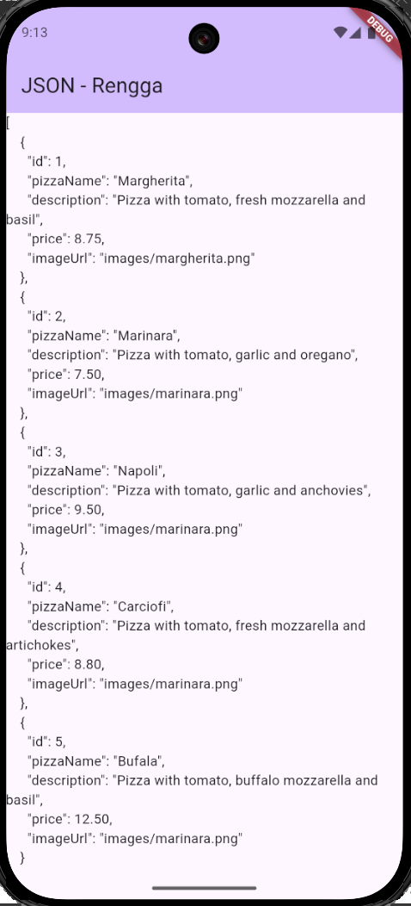
---
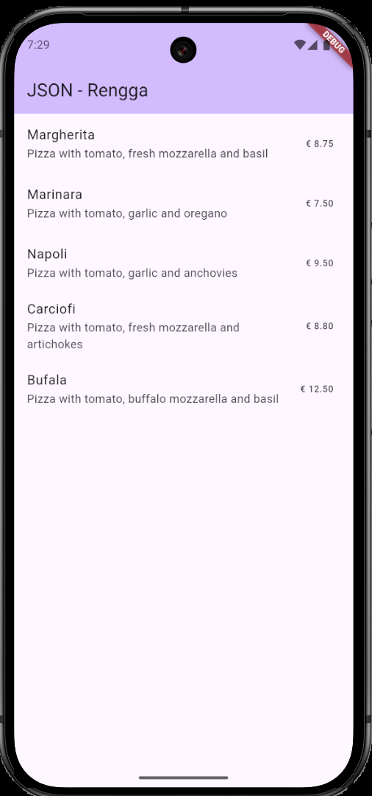
---
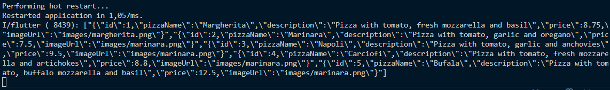
---
## Soal di praktikum 1

### 1. 

#### * Tambahkan nama panggilan Anda pada `title` app sebagai identitas hasil pekerjaan Anda.
```dart
home: const MyHomePage(title: 'JSON - Rengga'),
```
---
#### * Gantilah warna tema aplikasi sesuai kesukaan Anda.
```dart
colorScheme: ColorScheme.fromSeed(seedColor: Colors.deepPurple),
```
---
#### * Lakukan commit hasil jawaban Soal 1 dengan pesan "W13: Jawaban Soal 1"

---
### 2. 

#### * Masukkan hasil capture layar ke laporan praktikum Anda.
>DONE
---
#### * Lakukan commit hasil jawaban Soal 2 dengan pesan "W13: Jawaban Soal 2"

---
### 3. 

#### * Masukkan hasil capture layar ke laporan praktikum Anda.
> DONE
---
#### * Lakukan commit hasil jawaban Soal 3 dengan pesan "W13: Jawaban Soal 3"

---
## Praktikum 2: Handle kompatibilitas data JSON

#### pizza.dart:
```dart
class Pizza {
  final int id;
  final String pizzaName;
  final String description;
  final double price;
  final String imageUrl;

  Pizza({
    required this.id,
    required this.pizzaName,
    required this.description,
    required this.price,
    required this.imageUrl,
  });

  Pizza.fromJson(Map<String, dynamic> json)
      : id = int.tryParse(json['id'].toString()) ?? 0,
        pizzaName = json['pizzaName'] != null ? json['pizzaName'].toString() : 'No name',
        description = json['description'] != null ? json['description'].toString() : 'No description',
        price = double.tryParse(json['price'].toString()) ?? 0.0,
        imageUrl = json['imageUrl'] != null ? json['imageUrl'].toString() : '';

  Map<String, dynamic> toJson() {
    return {
      'id': id,
      'pizzaName': pizzaName,
      'description': description,
      'price': price,
      'imageUrl': imageUrl,
    };
  }
}
```
*Keseluruhan tangkapan layar pada praktikum ini:*
---
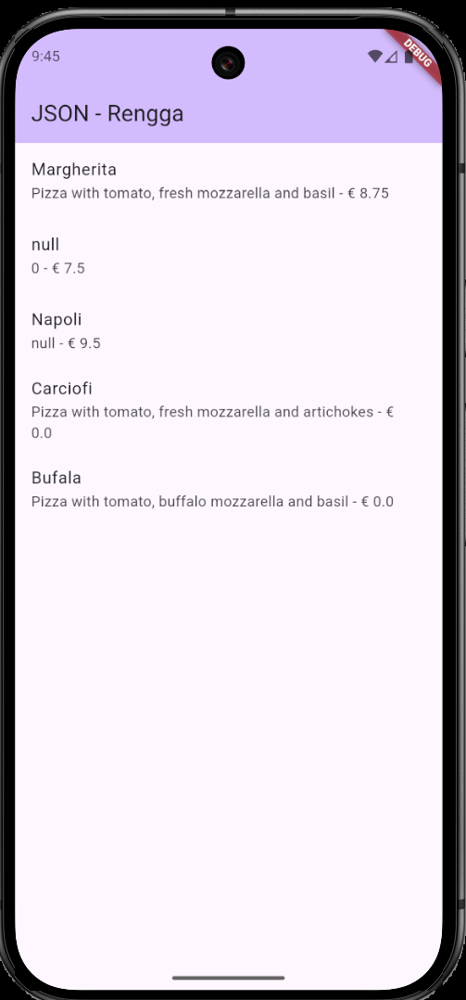
---
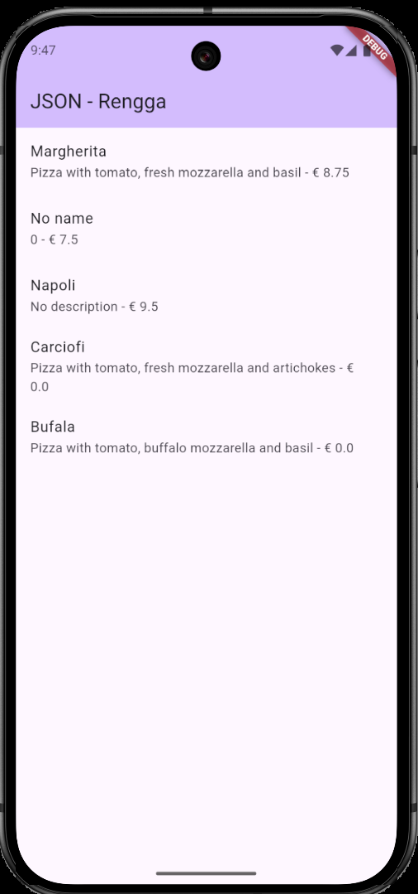
---
## Soal di praktikum 2

### 4. 

#### * Masukkan hasil capture layar ke laporan praktikum Anda.
> DONE
---
#### * Lakukan commit hasil jawaban Soal 3 dengan pesan "W13: Jawaban Soal 4"

---
## Praktikum 3: Menangani error JSON

#### pizza.dart:
```dart
const String keyId = 'id';
const String keyName = 'pizzaName';
const String keyDescription = 'description';
const String keyPrice = 'price';
const String keyImage = 'imageUrl';

class Pizza {
  final int id;
  final String pizzaName;
  final String description;
  final double price;
  final String imageUrl;

  Pizza({
    required this.id,
    required this.pizzaName,
    required this.description,
    required this.price,
    required this.imageUrl,
  });

  Pizza.fromJson(Map<String, dynamic> json)
      : id = int.tryParse(json[keyId].toString()) ?? 0,
        pizzaName = json[keyName] != null ? json[keyName].toString() : 'No name',
        description = json[keyDescription] != null ? json[keyDescription].toString() : 'No description',
        price = double.tryParse(json[keyPrice].toString()) ?? 0.0,
        imageUrl = json[keyImage] != null ? json[keyImage].toString() : '';

  Map<String, dynamic> toJson() {
    return {
      keyId: id,
      keyName: pizzaName,
      keyDescription: description,
      keyPrice: price,
      keyImage: imageUrl,
    };
  }
}
```
*Keseluruhan tangkapan layar pada praktikum ini:*
---
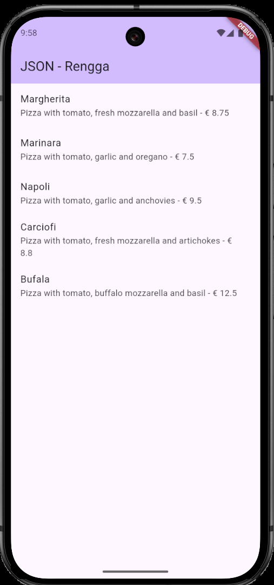
---
## Soal di praktikum 3

### 5. 

#### * Jelaskan maksud kode lebih safe dan maintainable!

Kode menjadi lebih **aman (*safe*)** dan **mudah dipelihara (*maintainable*)** dengan menggunakan *widget* **`FutureBuilder`** karena ini adalah cara standar Flutter untuk mengelola data yang dimuat secara asinkron (tidak instan).

`FutureBuilder` membuat kode lebih **aman** karena secara otomatis tahu kapan data sedang **menunggu** (*loading*), kapan data **berhasil** dimuat, dan kapan terjadi **kesalahan (*error*)**. Ini mencegah aplikasi Anda *crash* atau menampilkan layar kosong karena mencoba menggunakan data yang belum selesai dimuat. 

Sedangkan kode menjadi lebih **mudah dipelihara** karena semua logika pemuatan data (menampilkan *loading indicator*, menampilkan *error*, dan menampilkan hasil) dikelompokkan menjadi satu *widget* saja, terpisah dari logika *widget* lainnya. Ini juga menghilangkan kebutuhan untuk menulis kode **`setState`** manual di dalam fungsi pemuatan data, sehingga kode lebih bersih dan mengurangi peluang timbulnya *bug* saat *widget* di-*update*.

---
#### * Capture hasil praktikum Anda dan lampirkan di README.
> DONE
---
#### * Lakukan commit hasil jawaban Soal 3 dengan pesan "W13: Jawaban Soal 5"

---
## Praktikum 4: SharedPreferences

#### main.dart:
```dart
import 'package:flutter/material.dart';
import 'dart:async';
import 'dart:convert';
import 'package:flutter/services.dart';
import 'model/pizza.dart';
// Langkah 3: Import shared_preferences
import 'package:shared_preferences/shared_preferences.dart';

void main() {
  runApp(const MyApp());
}

class MyApp extends StatelessWidget {
  const MyApp({super.key});

  @override
  Widget build(BuildContext context) {
    return MaterialApp(
      title: 'Flutter Demo',
      theme: ThemeData(
        colorScheme: ColorScheme.fromSeed(seedColor: Colors.deepPurple),
      ),
      home: const MyHomePage(title: 'Shared Preferences - Rengga'),
    );
  }
}

class MyHomePage extends StatefulWidget {
  const MyHomePage({super.key, required this.title});

  final String title;

  @override
  State<MyHomePage> createState() => _MyHomePageState();
}

class _MyHomePageState extends State<MyHomePage> {
  List<Pizza> myPizzas = [];
  // Langkah 4: Tambahkan variabel appCounter
  int appCounter = 0;

  Future<List<Pizza>> readJsonFile() async {
    // ...existing code...
    try {
      String myString = await rootBundle.loadString('assets/pizzalist.json');
      List pizzaMapList = jsonDecode(myString);
      
      setState(() {
        myPizzas = [];
        for (var pizza in pizzaMapList) {
          Pizza myPizza = Pizza.fromJson(pizza);
          myPizzas.add(myPizza);
        }
      });

      String json = convertToJSON(myPizzas);
      print(json);
      
      return myPizzas;
    } catch (e) {
      print('Error loading JSON: $e');
      return [];
    }
  }

  String convertToJSON(List<Pizza> pizzas) {
    return jsonEncode(pizzas.map((pizza) => pizza.toJson()).toList());
  }

  // Langkah 5, 6, 7, 8, 9: Method readAndWritePreference
  Future readAndWritePreference() async {
    SharedPreferences prefs = await SharedPreferences.getInstance();
    appCounter = prefs.getInt('appCounter') ?? 0;
    appCounter++;
    await prefs.setInt('appCounter', appCounter);
    
    setState(() {
      appCounter = appCounter;
    });
  }

  // Langkah 13: Buat Method deletePreference()
  Future deletePreference() async {
    SharedPreferences prefs = await SharedPreferences.getInstance();
    await prefs.clear();
    setState(() {
      appCounter = 0;
    });
  }

  @override
  void initState() {
    super.initState();
    readJsonFile().then((value) {
      setState(() {
        myPizzas = value;
      });
    });
    // Langkah 10: Panggil di initState
    readAndWritePreference();
  }

  @override
  Widget build(BuildContext context) {
    return Scaffold(
      appBar: AppBar(
        backgroundColor: Theme.of(context).colorScheme.inversePrimary,
        title: Text(widget.title),
      ),
      body: Center(
        child: Column(
          mainAxisAlignment: MainAxisAlignment.spaceEvenly,
          children: [
            Text(
              'You have opened the app $appCounter times.',
              style: const TextStyle(fontSize: 18),
            ),
            ElevatedButton(
              // Langkah 14: Panggil deletePreference()
              onPressed: () {
                deletePreference();
              },
              child: const Text('Reset counter'),
            ),
          ],
        ),
      ),
    );
  }
}
```
*Keseluruhan tangkapan layar pada praktikum ini:*
---
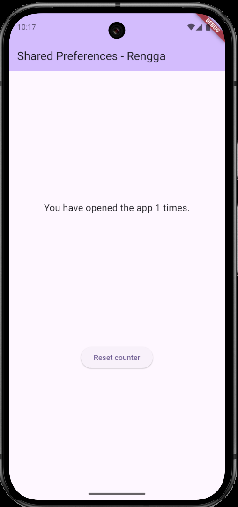
---
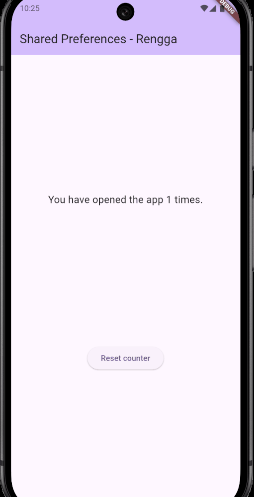
---
## Soal di praktikum 4

### 6. 

#### * Masukkan hasil capture layar ke laporan praktikum Anda.
> DONE
---
#### * Lakukan commit hasil jawaban Soal 3 dengan pesan "W13: Jawaban Soal 6"

---
## Praktikum 5: Akses filesystem dengan path_provider

#### main.dart:
```dart
import 'package:flutter/material.dart';
import 'dart:async';
import 'dart:convert';
import 'package:flutter/services.dart';
import 'model/pizza.dart';
import 'package:shared_preferences/shared_preferences.dart';
import 'package:path_provider/path_provider.dart';

void main() {
  runApp(const MyApp());
}

class MyApp extends StatelessWidget {
  const MyApp({super.key});

  @override
  Widget build(BuildContext context) {
    return MaterialApp(
      title: 'Flutter Demo',
      theme: ThemeData(
        colorScheme: ColorScheme.fromSeed(seedColor: Colors.deepPurple),
      ),
      home: const MyHomePage(title: 'Path Provider - Rengga'),
    );
  }
}

class MyHomePage extends StatefulWidget {
  const MyHomePage({super.key, required this.title});

  final String title;

  @override
  State<MyHomePage> createState() => _MyHomePageState();
}

class _MyHomePageState extends State<MyHomePage> {
  List<Pizza> myPizzas = [];
  
  String documentsPath = '';
  String tempPath = '';

  Future<List<Pizza>> readJsonFile() async {
    try {
      String myString = await rootBundle.loadString('assets/pizzalist.json');
      List pizzaMapList = jsonDecode(myString);
      
      setState(() {
        myPizzas = [];
        for (var pizza in pizzaMapList) {
          Pizza myPizza = Pizza.fromJson(pizza);
          myPizzas.add(myPizza);
        }
      });
      return myPizzas;
    } catch (e) {
      print('Error loading JSON: $e');
      return [];
    }
  }

  Future getPaths() async {
    final docDir = await getApplicationDocumentsDirectory();
    final tempDir = await getTemporaryDirectory();
    
    setState(() {
      documentsPath = docDir.path;
      tempPath = tempDir.path;
    });
  }

  @override
  void initState() {
    super.initState();
    readJsonFile().then((value) {
      setState(() {
        myPizzas = value;
      });
    });
    getPaths();
  }

  @override
  Widget build(BuildContext context) {
    return Scaffold(
      appBar: AppBar(
        backgroundColor: Theme.of(context).colorScheme.inversePrimary,
        title: Text(widget.title),
      ),
      body: Column(
        mainAxisAlignment: MainAxisAlignment.spaceEvenly,
        children: [
          Text('Doc path: $documentsPath'),
          Text('Temp path: $tempPath'),
        ],
      ),
    );
  }
}
```
*Keseluruhan tangkapan layar pada praktikum ini:*
---
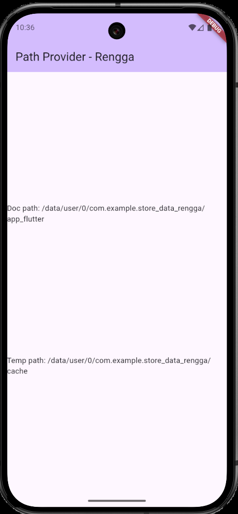
---
## Soal di praktikum 5

### 7. 

#### * Masukkan hasil capture layar ke laporan praktikum Anda.
> DONE
---
#### * Lakukan commit hasil jawaban Soal 3 dengan pesan "W13: Jawaban Soal 7"

---
## Praktikum 6: Akses filesystem dengan direktori

#### main.dart:
```dart
import 'package:flutter/material.dart';
import 'dart:async';
import 'dart:convert';
// Langkah 1: Lakukan Import dart:io
import 'dart:io'; 
import 'package:flutter/services.dart';
import 'model/pizza.dart';
import 'package:shared_preferences/shared_preferences.dart';
import 'package:path_provider/path_provider.dart';

void main() {
  runApp(const MyApp());
}

class MyApp extends StatelessWidget {
  const MyApp({super.key});

  @override
  Widget build(BuildContext context) {
    return MaterialApp(
      title: 'Flutter Demo',
      theme: ThemeData(
        colorScheme: ColorScheme.fromSeed(seedColor: Colors.deepPurple),
      ),
      home: const MyHomePage(title: 'Path Provider - Rengga'),
    );
  }
}

class MyHomePage extends StatefulWidget {
  const MyHomePage({super.key, required this.title});

  final String title;

  @override
  State<MyHomePage> createState() => _MyHomePageState();
}

class _MyHomePageState extends State<MyHomePage> {
  List<Pizza> myPizzas = [];
  String documentsPath = '';
  String tempPath = '';

  // Langkah 2: Tambahkan Variabel File dan Text
  late File myFile;
  String fileText = '';

  Future<List<Pizza>> readJsonFile() async {
    try {
      String myString = await rootBundle.loadString('assets/pizzalist.json');
      List pizzaMapList = jsonDecode(myString);
      
      setState(() {
        myPizzas = [];
        for (var pizza in pizzaMapList) {
          Pizza myPizza = Pizza.fromJson(pizza);
          myPizzas.add(myPizza);
        }
      });
      return myPizzas;
    } catch (e) {
      print('Error loading JSON: $e');
      return [];
    }
  }

  Future getPaths() async {
    final docDir = await getApplicationDocumentsDirectory();
    final tempDir = await getTemporaryDirectory();
    
    setState(() {
      documentsPath = docDir.path;
      tempPath = tempDir.path;
    });
  }

  // Langkah 3: Buat Method writeFile()
  Future<bool> writeFile() async {
    try {
      await myFile.writeAsString('Rengga - 2341720160'); 
      return true;
    } catch (e) {
      return false;
    }
  }

  // Langkah 5: Buat Method readFile()
  Future<bool> readFile() async {
    try {
      // Read the file
      String fileContent = await myFile.readAsString();
      setState(() {
        fileText = fileContent;
      });
      return true;
    } catch (e) {
      // On error, return false
      return false;
    }
  }

  @override
  void initState() {
    super.initState();
    readJsonFile().then((value) {
      setState(() {
        myPizzas = value;
      });
    });
    
    // Langkah 4: Inisialisasi File dan Panggil writeFile()
    getPaths().then((_) {
      myFile = File('$documentsPath/pizzas.txt');
      writeFile();
    });
  }

  @override
  Widget build(BuildContext context) {
    return Scaffold(
      appBar: AppBar(
        backgroundColor: Theme.of(context).colorScheme.inversePrimary,
        title: Text(widget.title),
      ),
      // Langkah 6: Edit build() dan Tambahkan Tombol Baca
      body: Column(
        mainAxisAlignment: MainAxisAlignment.spaceEvenly,
        children: [
          Text('Doc path: $documentsPath'),
          Text('Temp path: $tempPath'),
          ElevatedButton(
            child: const Text('Read File'),
            onPressed: () => readFile(),
          ),
          Text(fileText), // Menampilkan isi file yang dibaca
        ],
      ),
    );
  }
}
```
*Keseluruhan tangkapan layar pada praktikum ini:*
---
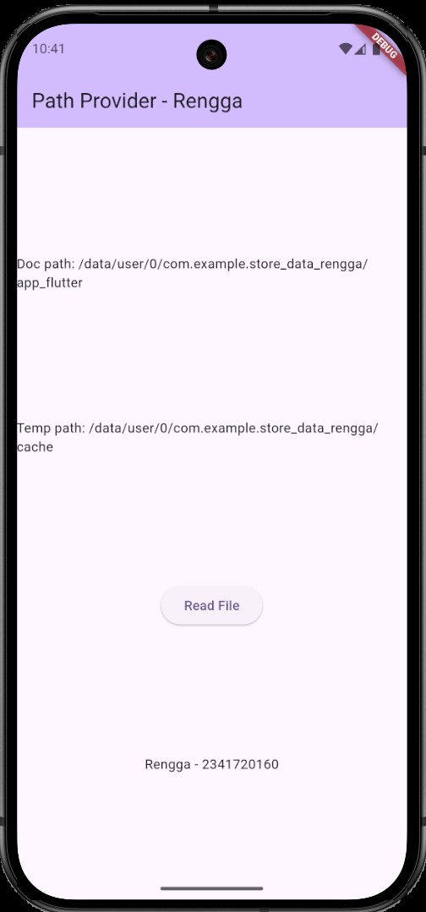
---
## Soal di praktikum 6

### 8. 

#### * Jelaskan maksud kode pada langkah 3 dan 7 !

#### Langkah 3: Membuat Objek `SharedPreferences`

Kode pada langkah 3 bertujuan untuk **menyiapkan dan menghubungkan** aplikasi dengan penyimpanan data sederhana di perangkat (*key-value store*). Baris ini harus menggunakan `await` karena ia meminta sistem operasi untuk memuat data preferensi yang sudah ada atau membuat yang baru. Hasilnya, variabel `prefs` akan menampung objek yang siap dipakai untuk **membaca atau menulis** data ke dalam penyimpanan lokal. 

---

#### Langkah 7: Membaca Data dari `SharedPreferences`

Kode pada langkah 7 bertujuan untuk **mengambil nilai** yang terakhir kali disimpan di perangkat. Secara spesifik, kode ini mencoba membaca nilai integer yang disimpan dengan kunci `'counter'`. Bagian `?? 0` berfungsi sebagai pengaman (*safety net*): jika data dengan kunci tersebut **belum pernah disimpan** atau tidak ditemukan, kode akan secara otomatis menggunakan nilai **`0`** sebagai *default*. Ini memastikan variabel `counter` selalu memiliki nilai awal yang valid (integer) dan mencegah *error* saat aplikasi pertama kali dijalankan.

---
#### * Masukkan hasil capture layar ke laporan praktikum Anda.
> DONE
---
#### * Lakukan commit hasil jawaban Soal 3 dengan pesan "W13: Jawaban Soal 8"

---
## Praktikum 7: Menyimpan data dengan enkripsi/dekripsi

#### main.dart:
```dart
import 'package:flutter/material.dart';
import 'dart:async';
import 'dart:convert';
import 'dart:io'; 
import 'package:flutter/services.dart';
import 'model/pizza.dart';
import 'package:shared_preferences/shared_preferences.dart';
import 'package:path_provider/path_provider.dart';
import 'package:flutter_secure_storage/flutter_secure_storage.dart';

void main() {
  runApp(const MyApp());
}

class MyApp extends StatelessWidget {
  const MyApp({super.key});

  @override
  Widget build(BuildContext context) {
    return MaterialApp(
      title: 'Flutter Demo',
      theme: ThemeData(
        colorScheme: ColorScheme.fromSeed(seedColor: Colors.deepPurple),
      ),
      home: const MyHomePage(title: 'Path Provider - Rengga'),
    );
  }
}

class MyHomePage extends StatefulWidget {
  const MyHomePage({super.key, required this.title});

  final String title;

  @override
  State<MyHomePage> createState() => _MyHomePageState();
}

class _MyHomePageState extends State<MyHomePage> {
  List<Pizza> myPizzas = [];
  
  String documentsPath = '';
  String tempPath = '';
  late File myFile;
  String fileText = '';

  final pwdController = TextEditingController();
  String myPass = '';

  final storage = const FlutterSecureStorage();
  final myKey = 'myPass';

  Future<List<Pizza>> readJsonFile() async {
    try {
      String myString = await rootBundle.loadString('assets/pizzalist.json');
      List pizzaMapList = jsonDecode(myString);
      
      setState(() {
        myPizzas = [];
        for (var pizza in pizzaMapList) {
          Pizza myPizza = Pizza.fromJson(pizza);
          myPizzas.add(myPizza);
        }
      });
      return myPizzas;
    } catch (e) {
      print('Error loading JSON: $e');
      return [];
    }
  }

  Future getPaths() async {
    final docDir = await getApplicationDocumentsDirectory();
    final tempDir = await getTemporaryDirectory();
    
    setState(() {
      documentsPath = docDir.path;
      tempPath = tempDir.path;
    });
  }

  Future<bool> writeFile() async {
    try {
      await myFile.writeAsString('Rengga - 2341720160'); 
      return true;
    } catch (e) {
      return false;
    }
  }

  Future<bool> readFile() async {
    try {
      String fileContent = await myFile.readAsString();
      setState(() {
        fileText = fileContent;
      });
      return true;
    } catch (e) {
      return false;
    }
  }

  Future writeToSecureStorage() async {
    await storage.write(key: myKey, value: pwdController.text);
  }

  Future<String> readFromSecureStorage() async {
    String secret = await storage.read(key: myKey) ?? '';
    return secret;
  }

  @override
  void initState() {
    super.initState();
    readJsonFile().then((value) {
      setState(() {
        myPizzas = value;
      });
    });
    
    getPaths().then((_) {
      myFile = File('$documentsPath/pizzas.txt');
      writeFile();
    });
  }

  @override
  Widget build(BuildContext context) {
    return Scaffold(
      appBar: AppBar(
        backgroundColor: Theme.of(context).colorScheme.inversePrimary,
        title: Text(widget.title),
      ),
      body: SingleChildScrollView(
        child: Padding(
          padding: const EdgeInsets.all(20.0),
          child: Column(
            children: [
              TextField(
                controller: pwdController,
                decoration: const InputDecoration(labelText: 'Enter Password'),
              ),
              const SizedBox(height: 20),
              ElevatedButton(
                child: const Text('Save Value'),
                onPressed: () {
                  writeToSecureStorage();
                },
              ),
              const SizedBox(height: 20),
              ElevatedButton(
                child: const Text('Read Value'),
                onPressed: () {
                  readFromSecureStorage().then((value) {
                    setState(() {
                      myPass = value;
                    });
                  });
                },
              ),
              const SizedBox(height: 20),
              Text(
                myPass,
                style: const TextStyle(fontSize: 20, fontWeight: FontWeight.bold),
              ),
            ],
          ),
        ),
      ),
    );
  }
}
```
*Keseluruhan tangkapan layar pada praktikum ini:*
---
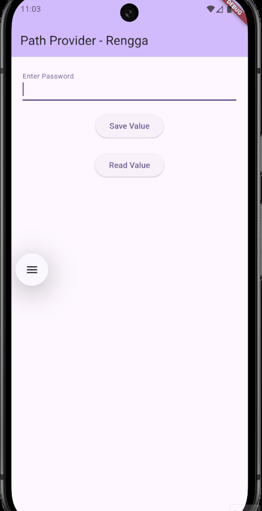
---
## Soal di praktikum 7

### 9. 

#### * Capture hasil praktikum Anda berupa GIF dan lampirkan di README.
> DONE
---
#### * Lakukan commit hasil jawaban Soal 3 dengan pesan "W13: Jawaban Soal 9"

---