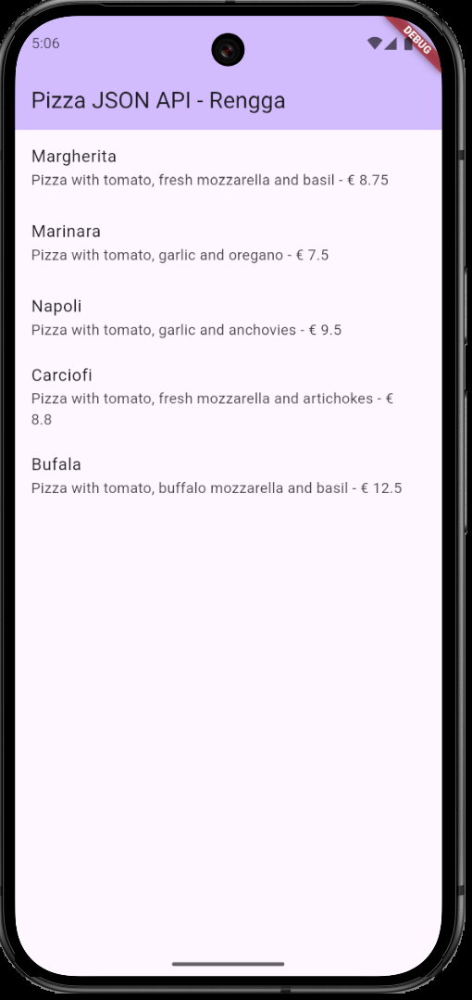
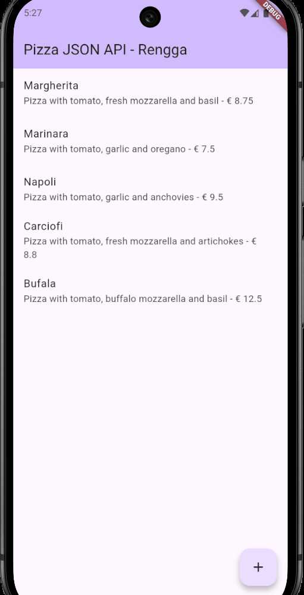
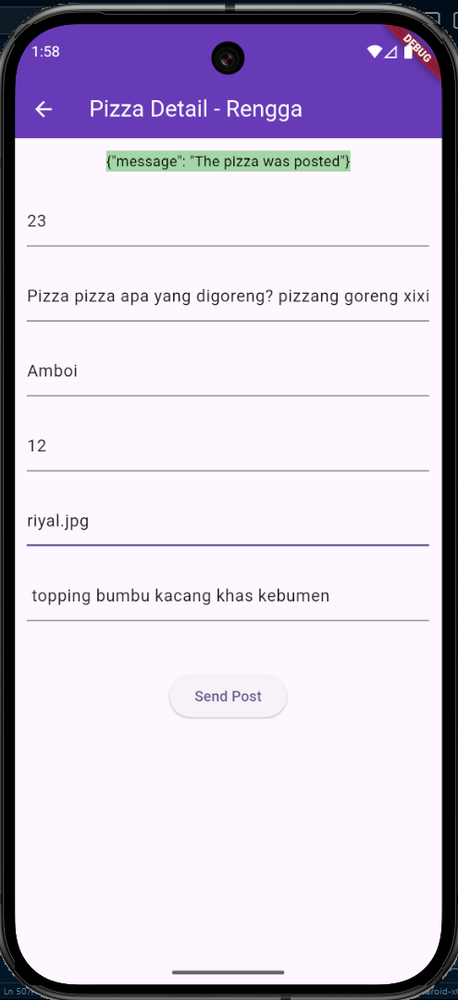
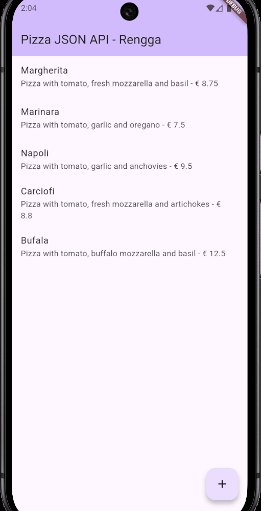
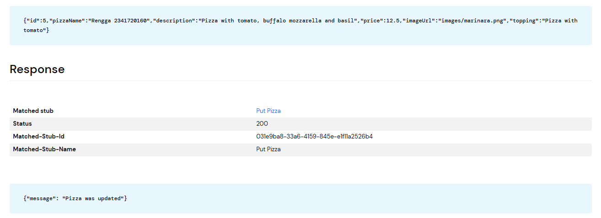
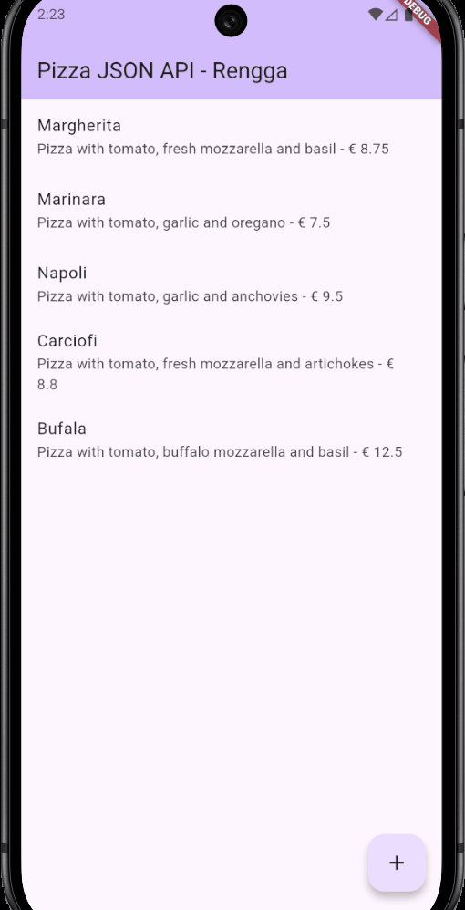

# Jobsheet Week 14 - RESTful API

## Praktikum 1: Membuat layanan Mock API

#### main.dart:
```dart
import 'package:flutter/material.dart';
import 'httphelper.dart'; 
import 'model/pizza.dart';

void main() {
  runApp(const MyApp());
}

class MyApp extends StatelessWidget {
  const MyApp({super.key});

  @override
  Widget build(BuildContext context) {
    return MaterialApp(
      title: 'Flutter API Demo',
      theme: ThemeData(
        colorScheme: ColorScheme.fromSeed(seedColor: Colors.deepPurple),
        useMaterial3: true,
      ),
      home: const MyHomePage(title: 'Pizza JSON API - Rengga'),
    );
  }
}

class MyHomePage extends StatefulWidget {
  const MyHomePage({super.key, required this.title});

  final String title;

  @override
  State<MyHomePage> createState() => _MyHomePageState();
}

class _MyHomePageState extends State<MyHomePage> {
  
  // Langkah 8: Method callPizzas
  Future<List<Pizza>> callPizzas() async {
    HttpHelper helper = HttpHelper();
    List<Pizza> pizzas = await helper.getPizzaList();
    return pizzas;
  }

  @override
  Widget build(BuildContext context) {
    return Scaffold(
      appBar: AppBar(
        backgroundColor: Theme.of(context).colorScheme.inversePrimary,
        title: Text(widget.title),
      ),
      // Langkah 9: FutureBuilder untuk menampilkan data
      body: FutureBuilder(
        future: callPizzas(),
        builder: (BuildContext context, AsyncSnapshot<List<Pizza>> snapshot) {
          if (snapshot.hasError) {
            return const Center(
              child: Text('Something went wrong'),
            );
          }
          if (!snapshot.hasData) {
            return const Center(
              child: CircularProgressIndicator(),
            );
          }
          return ListView.builder(
            itemCount: (snapshot.data == null) ? 0 : snapshot.data!.length,
            itemBuilder: (BuildContext context, int position) {
              return ListTile(
                title: Text(snapshot.data![position].pizzaName),
                subtitle: Text(
                  '${snapshot.data![position].description} - € ${snapshot.data![position].price}'
                ),
              );
            },
          );
        },
      ),
    );
  }
}

```
---
#### httphelper.dart:
```dart
import 'dart:io'; 
import 'package:http/http.dart' as http; 
import 'dart:convert'; 
import 'model/pizza.dart'; 

class HttpHelper {
  final String authority = '9ydwl.wiremockapi.cloud';
  final String path = 'pizzalist';
  Future<List<Pizza>> getPizzaList() async {
    final Uri url = Uri.https(authority, path);
    final http.Response result = await http.get(url);
    if (result.statusCode == HttpStatus.ok) {
      final jsonResponse = json.decode(result.body);
      //provide a type argument to the map method to avoid type 
      //error
      List<Pizza> pizzas =
          jsonResponse.map<Pizza>((i) => 
            Pizza.fromJson(i)).toList();
      return pizzas;
    } else {
      return [];
    }
  }
}
```
---
#### pizza.dart:
```dart
const String keyId = 'id';
const String keyName = 'pizzaName';
const String keyDescription = 'description';
const String keyPrice = 'price';
const String keyImage = 'imageUrl';

class Pizza {
  final int id;
  final String pizzaName;
  final String description;
  final double price;
  final String imageUrl;

  Pizza({
    required this.id,
    required this.pizzaName,
    required this.description,
    required this.price,
    required this.imageUrl,
  });

  Pizza.fromJson(Map<String, dynamic> json)
      : id = int.tryParse(json[keyId].toString()) ?? 0,
        pizzaName = json[keyName] != null ? json[keyName].toString() : 'No name',
        description = json[keyDescription] != null ? json[keyDescription].toString() : 'No description',
        price = double.tryParse(json[keyPrice].toString()) ?? 0.0,
        imageUrl = json[keyImage] != null ? json[keyImage].toString() : '';

  Map<String, dynamic> toJson() {
    return {
      keyId: id,
      keyName: pizzaName,
      keyDescription: description,
      keyPrice: price,
      keyImage: imageUrl,
    };
  }
}
```
*Keseluruhan tangkapan layar pada praktikum ini:*
---

---
## Soal di praktikum 1

### 1. 

#### * Tambahkan nama panggilan Anda pada `title` app sebagai identitas hasil pekerjaan Anda.
```dart
home: const MyHomePage(title: 'Pizza JSON API - Rengga'),
```
---
#### * Gantilah warna tema aplikasi sesuai kesukaan Anda.
```dart
colorScheme: ColorScheme.fromSeed(seedColor: Colors.deepPurple),
```
---
#### * Capture hasil aplikasi Anda, lalu masukkan ke laporan di README dan lakukan commit hasil jawaban Soal 1 dengan pesan **"W14: Jawaban Soal 1"**

---

## Praktikum 2: Mengirim Data ke Web Service (POST)

#### main.dart:
```dart
import 'package:flutter/material.dart';
import 'httphelper.dart';
import 'model/pizza.dart';
// Langkah 13: Import pizza_detail
import 'pizza_detail.dart'; 

void main() {
  runApp(const MyApp());
}

class MyApp extends StatelessWidget {
  const MyApp({super.key});

  @override
  Widget build(BuildContext context) {
    return MaterialApp(
      title: 'Flutter API Demo',
      theme: ThemeData(
        colorScheme: ColorScheme.fromSeed(seedColor: Colors.deepPurple),
        useMaterial3: true,
      ),
      home: const MyHomePage(title: 'Pizza JSON API - Rengga'),
    );
  }
}

class MyHomePage extends StatefulWidget {
  const MyHomePage({super.key, required this.title});

  final String title;

  @override
  State<MyHomePage> createState() => _MyHomePageState();
}

class _MyHomePageState extends State<MyHomePage> {
  
  // Langkah 8: Method callPizzas
  Future<List<Pizza>> callPizzas() async {
    HttpHelper helper = HttpHelper();
    List<Pizza> pizzas = await helper.getPizzaList();
    return pizzas;
  }

  @override
  Widget build(BuildContext context) {
    return Scaffold(
      appBar: AppBar(
        backgroundColor: Theme.of(context).colorScheme.inversePrimary,
        title: Text(widget.title),
      ),
      // Langkah 9: FutureBuilder untuk menampilkan data
      body: FutureBuilder(
        future: callPizzas(),
        builder: (BuildContext context, AsyncSnapshot<List<Pizza>> snapshot) {
          if (snapshot.hasError) {
            return const Center(
              child: Text('Something went wrong'),
            );
          }
          if (!snapshot.hasData) {
            return const Center(
              child: CircularProgressIndicator(),
            );
          }
          return ListView.builder(
            itemCount: (snapshot.data == null) ? 0 : snapshot.data!.length,
            itemBuilder: (BuildContext context, int position) {
              return ListTile(
                title: Text(snapshot.data![position].pizzaName),
                subtitle: Text(
                  '${snapshot.data![position].description} - € ${snapshot.data![position].price}'
                ),
              );
            },
          );
        },
      ),
      // Langkah 14: FloatingActionButton
      floatingActionButton: FloatingActionButton(
        child: const Icon(Icons.add),
        onPressed: () {
          Navigator.push(
            context,
            MaterialPageRoute(builder: (context) => const PizzaDetailScreen()),
          );
        },
      ),
    );
  }
}
```
#### httphelper.dart:
```dart
import 'dart:io';
import 'package:http/http.dart' as http;
import 'dart:convert';
import 'model/pizza.dart';

class HttpHelper {
  static final HttpHelper _httpHelper = HttpHelper._internal();
  
  HttpHelper._internal();
  
  factory HttpHelper() {
    return _httpHelper;
  }

  final String authority = '9ydwl.wiremockapi.cloud'; 
  final String path = 'pizzalist';

  Future<List<Pizza>> getPizzaList() async {
    final Uri url = Uri.https(authority, path);
    
    try {
      final http.Response result = await http.get(url);
      
      if (result.statusCode == HttpStatus.ok) {
        final jsonResponse = json.decode(result.body);
        List<Pizza> pizzas =
            jsonResponse.map<Pizza>((i) => Pizza.fromJson(i)).toList();
        return pizzas;
      } else {
        print('Request failed with status: ${result.statusCode}.');
        return [];
      }
    } catch (e) {
      // Tambahkan print error agar terlihat di Debug Console kenapa "Something went wrong"
      print('Error fetching data: $e');
      rethrow; // Lempar error agar ditangkap oleh FutureBuilder (snapshot.hasError)
    }
  }

  // Langkah 4: Method postPizza
  Future<String> postPizza(Pizza pizza) async {
    const postPath = '/pizza';
    String post = json.encode(pizza.toJson());
    Uri url = Uri.https(authority, postPath);
    
    http.Response r = await http.post(
      url,
      body: post,
    );
    
    return r.body;
  }
}
```
#### pizza_detail.dart:
```dart
import 'package:flutter/material.dart';
import 'model/pizza.dart';
import 'httphelper.dart';

class PizzaDetailScreen extends StatefulWidget {
  const PizzaDetailScreen({super.key});

  @override
  State<PizzaDetailScreen> createState() => _PizzaDetailScreenState();
}

class _PizzaDetailScreenState extends State<PizzaDetailScreen> {
  // Langkah 8: Controller dan Variabel
  final TextEditingController txtId = TextEditingController();
  final TextEditingController txtName = TextEditingController();
  final TextEditingController txtDescription = TextEditingController();
  final TextEditingController txtPrice = TextEditingController();
  final TextEditingController txtImageUrl = TextEditingController();
  String operationResult = '';

  // Langkah 9: Dispose Controller
  @override
  void dispose() {
    txtId.dispose();
    txtName.dispose();
    txtDescription.dispose();
    txtPrice.dispose();
    txtImageUrl.dispose();
    super.dispose();
  }

  // Langkah 12: Method postPizza
  Future postPizza() async {
    HttpHelper helper = HttpHelper();
    
    // PERBAIKAN: Masukkan data langsung ke dalam constructor
    Pizza pizza = Pizza(
      id: int.tryParse(txtId.text) ?? 0,
      pizzaName: txtName.text,
      description: txtDescription.text,
      price: double.tryParse(txtPrice.text) ?? 0.0,
      imageUrl: txtImageUrl.text,
    );

    String result = await helper.postPizza(pizza);
    setState(() {
      operationResult = result;
    });
  }

  @override
  Widget build(BuildContext context) {
    // Langkah 10 & 11: UI Form
    return Scaffold(
      appBar: AppBar(
        title: const Text('Pizza Detail - Rengga'),
        backgroundColor: Colors.deepPurple,
        foregroundColor: Colors.white,
      ),
      body: Padding(
        padding: const EdgeInsets.all(12),
        child: SingleChildScrollView(
          child: Column(
            children: [
              Text(
                operationResult,
                style: TextStyle(
                  backgroundColor: Colors.green[200],
                  color: Colors.black,
                ),
              ),
              const SizedBox(height: 24),
              TextField(
                controller: txtId,
                decoration: const InputDecoration(hintText: 'Insert ID'),
              ),
              const SizedBox(height: 24),
              TextField(
                controller: txtName,
                decoration: const InputDecoration(hintText: 'Insert Pizza Name'),
              ),
              const SizedBox(height: 24),
              TextField(
                controller: txtDescription,
                decoration: const InputDecoration(hintText: 'Insert Description'),
              ),
              const SizedBox(height: 24),
              TextField(
                controller: txtPrice,
                decoration: const InputDecoration(hintText: 'Insert Price'),
              ),
              const SizedBox(height: 24),
              TextField(
                controller: txtImageUrl,
                decoration: const InputDecoration(hintText: 'Insert Image Url'),
              ),
              const SizedBox(height: 48),
              ElevatedButton(
                child: const Text('Send Post'),
                onPressed: () {
                  postPizza();
                },
              ),
            ],
          ),
        ),
      ),
    );
  }
}
```
*Keseluruhan tangkapan layar pada praktikum ini:*
---

---
## Soal di praktikum 2

### 2. 

#### * Tambahkan **field baru** dalam JSON maupun POST ke Wiremock!
```dart
              const SizedBox(height: 24),
              TextField(
                controller: txtTopping,
                decoration: const InputDecoration(hintText: 'Insert Topping'),
              ),
```

---
#### * Lakukan commit hasil jawaban Soal 3 dengan pesan "W14: Jawaban Soal 2"

---
## Praktikum 3: Memperbarui Data di Web Service (PUT)

#### main.dart:
```dart
import 'package:flutter/material.dart';
import 'httphelper.dart';
import 'model/pizza.dart';
// Langkah 13: Import pizza_detail
import 'pizza_detail.dart'; 

void main() {
  runApp(const MyApp());
}

class MyApp extends StatelessWidget {
  const MyApp({super.key});

  @override
  Widget build(BuildContext context) {
    return MaterialApp(
      title: 'Flutter API Demo',
      theme: ThemeData(
        colorScheme: ColorScheme.fromSeed(seedColor: Colors.deepPurple),
        useMaterial3: true,
      ),
      home: const MyHomePage(title: 'Pizza JSON API - Rengga'),
    );
  }
}

class MyHomePage extends StatefulWidget {
  const MyHomePage({super.key, required this.title});

  final String title;

  @override
  State<MyHomePage> createState() => _MyHomePageState();
}

class _MyHomePageState extends State<MyHomePage> {
  
  // Langkah 8: Method callPizzas
  Future<List<Pizza>> callPizzas() async {
    HttpHelper helper = HttpHelper();
    List<Pizza> pizzas = await helper.getPizzaList();
    return pizzas;
  }

  @override
  Widget build(BuildContext context) {
    return Scaffold(
      appBar: AppBar(
        backgroundColor: Theme.of(context).colorScheme.inversePrimary,
        title: Text(widget.title),
      ),
      // Langkah 9: FutureBuilder untuk menampilkan data
      body: FutureBuilder(
        future: callPizzas(),
        builder: (BuildContext context, AsyncSnapshot<List<Pizza>> snapshot) {
          if (snapshot.hasError) {
            return const Center(
              child: Text('Something went wrong'),
            );
          }
          if (!snapshot.hasData) {
            return const Center(
              child: CircularProgressIndicator(),
            );
          }
          return ListView.builder(
            itemCount: (snapshot.data == null) ? 0 : snapshot.data!.length,
            itemBuilder: (BuildContext context, int position) {
              return ListTile(
                title: Text(snapshot.data![position].pizzaName),
                subtitle: Text(
                  '${snapshot.data![position].description} - € ${snapshot.data![position].price}'
                ),
                // Langkah 8: Tambahkan onTap untuk Edit (isNew: false)
                onTap: () {
                  Navigator.push(
                    context,
                    MaterialPageRoute(
                      builder: (context) => PizzaDetailScreen(
                        pizza: snapshot.data![position],
                        isNew: false,
                      ),
                    ),
                  );
                },
              );
            },
          );
        },
      ),
      // Langkah 9: Update FloatingActionButton untuk Tambah Baru (isNew: true)
      floatingActionButton: FloatingActionButton(
        child: const Icon(Icons.add),
        onPressed: () {
          Navigator.push(
            context,
            MaterialPageRoute(
              builder: (context) => PizzaDetailScreen(
                // Kirim objek Pizza kosong untuk data baru
                pizza: Pizza(
                  id: 0, 
                  pizzaName: '', 
                  description: '', 
                  price: 0, 
                  imageUrl: '', 
                  topping: ''
                ),
                isNew: true,
              ),
            ),
          );
        },
      ),
    );
  }
}
```
#### httphelper.dart:
```dart
import 'dart:io';
import 'package:http/http.dart' as http;
import 'dart:convert';
import 'model/pizza.dart';

class HttpHelper {
  static final HttpHelper _httpHelper = HttpHelper._internal();
  
  HttpHelper._internal();
  
  factory HttpHelper() {
    return _httpHelper;
  }

  final String authority = '9ydwl.wiremockapi.cloud'; 
  final String path = 'pizzalist';

  Future<List<Pizza>> getPizzaList() async {
    final Uri url = Uri.https(authority, path);
    
    try {
      final http.Response result = await http.get(url);
      
      if (result.statusCode == HttpStatus.ok) {
        final jsonResponse = json.decode(result.body);
        List<Pizza> pizzas =
            jsonResponse.map<Pizza>((i) => Pizza.fromJson(i)).toList();
        return pizzas;
      } else {
        print('Request failed with status: ${result.statusCode}.');
        return [];
      }
    } catch (e) {
      // Tambahkan print error agar terlihat di Debug Console kenapa "Something went wrong"
      print('Error fetching data: $e');
      rethrow; // Lempar error agar ditangkap oleh FutureBuilder (snapshot.hasError)
    }
  }

  // Langkah 4: Method postPizza
  Future<String> postPizza(Pizza pizza) async {
    const postPath = '/pizza';
    String post = json.encode(pizza.toJson());
    Uri url = Uri.https(authority, postPath);
    
    http.Response r = await http.post(
      url,
      body: post,
    );
    
    return r.body;
  }

  // Langkah 4: Method putPizza (Update)
  Future<String> putPizza(Pizza pizza) async {
    const putPath = '/pizza';
    String put = json.encode(pizza.toJson());
    Uri url = Uri.https(authority, putPath);
    
    http.Response r = await http.put(
      url,
      body: put,
    );
    
    return r.body;
  }
}
```
#### pizza_detail.dart:
```dart
import 'package:flutter/material.dart';
import 'model/pizza.dart';
import 'httphelper.dart';

class PizzaDetailScreen extends StatefulWidget {
  // Langkah 5: Tambahkan properti pizza dan isNew di Constructor
  final Pizza pizza;
  final bool isNew;

  const PizzaDetailScreen({
    super.key, 
    required this.pizza, 
    required this.isNew
  });

  @override
  State<PizzaDetailScreen> createState() => _PizzaDetailScreenState();
}

class _PizzaDetailScreenState extends State<PizzaDetailScreen> {
  final TextEditingController txtId = TextEditingController();
  final TextEditingController txtName = TextEditingController();
  final TextEditingController txtDescription = TextEditingController();
  final TextEditingController txtPrice = TextEditingController();
  final TextEditingController txtImageUrl = TextEditingController();
  final TextEditingController txtTopping = TextEditingController(); 
  
  String operationResult = '';

  // Langkah 6: Override initState untuk mengisi form jika mode Edit
  @override
  void initState() {
    if (!widget.isNew) {
      txtId.text = widget.pizza.id.toString();
      txtName.text = widget.pizza.pizzaName;
      txtDescription.text = widget.pizza.description;
      txtPrice.text = widget.pizza.price.toString();
      txtImageUrl.text = widget.pizza.imageUrl;
      txtTopping.text = widget.pizza.topping;
    }
    super.initState();
  }

  @override
  void dispose() {
    txtId.dispose();
    txtName.dispose();
    txtDescription.dispose();
    txtPrice.dispose();
    txtImageUrl.dispose();
    txtTopping.dispose(); 
    super.dispose();
  }

  // Langkah 7: Ganti nama method jadi savePizza dan tambahkan logika PUT/POST
  Future savePizza() async {
    HttpHelper helper = HttpHelper();
    
    Pizza pizza = Pizza(
      id: int.tryParse(txtId.text) ?? 0,
      pizzaName: txtName.text,
      description: txtDescription.text,
      price: double.tryParse(txtPrice.text) ?? 0.0,
      imageUrl: txtImageUrl.text,
      topping: txtTopping.text,
    );

    // Logika: Jika baru POST, jika lama PUT
    final result = await (widget.isNew
        ? helper.postPizza(pizza)
        : helper.putPizza(pizza));

    setState(() {
      operationResult = result;
    });
  }

  @override
  Widget build(BuildContext context) {
    // Langkah 10 & 11: UI Form
    return Scaffold(
      appBar: AppBar(
        title: const Text('Pizza Detail - Rengga'),
        backgroundColor: Colors.deepPurple,
        foregroundColor: Colors.white,
      ),
      body: Padding(
        padding: const EdgeInsets.all(12),
        child: SingleChildScrollView(
          child: Column(
            children: [
              Text(
                operationResult,
                style: TextStyle(
                  backgroundColor: Colors.green[200],
                  color: Colors.black,
                ),
              ),
              const SizedBox(height: 24),
              TextField(
                controller: txtId,
                decoration: const InputDecoration(hintText: 'Insert ID'),
              ),
              const SizedBox(height: 24),
              TextField(
                controller: txtName,
                decoration: const InputDecoration(hintText: 'Insert Pizza Name'),
              ),
              const SizedBox(height: 24),
              TextField(
                controller: txtDescription,
                decoration: const InputDecoration(hintText: 'Insert Description'),
              ),
              const SizedBox(height: 24),
              TextField(
                controller: txtPrice,
                decoration: const InputDecoration(hintText: 'Insert Price'),
              ),
              const SizedBox(height: 24),
              TextField(
                controller: txtImageUrl,
                decoration: const InputDecoration(hintText: 'Insert Image Url'),
              ),
              // 3. Tambahkan Input Field Topping di UI
              const SizedBox(height: 24),
              TextField(
                controller: txtTopping,
                decoration: const InputDecoration(hintText: 'Insert Topping'),
              ),
              const SizedBox(height: 48),
              ElevatedButton(
                child: const Text('Save Pizza'), // Ubah teks tombol
                onPressed: () {
                  savePizza(); // Panggil method savePizza
                },
              ),
            ],
          ),
        ),
      ),
    );
  }
}
```

*Keseluruhan tangkapan layar pada praktikum ini:*
---

---
## Soal di praktikum 3

### 3. 

#### * Ubah salah satu data dengan Nama dan NIM Anda, lalu perhatikan hasilnya di Wiremock.


---
#### * Lakukan commit hasil jawaban Soal 3 dengan pesan "W14: Jawaban Soal 3"

---
## Praktikum 4: Menghapus Data dari Web Service (DELETE)

#### main.dart:
```dart
import 'package:flutter/material.dart';
import 'httphelper.dart';
import 'model/pizza.dart';
// Langkah 13: Import pizza_detail
import 'pizza_detail.dart'; 

void main() {
  runApp(const MyApp());
}

class MyApp extends StatelessWidget {
  const MyApp({super.key});

  @override
  Widget build(BuildContext context) {
    return MaterialApp(
      title: 'Flutter API Demo',
      theme: ThemeData(
        colorScheme: ColorScheme.fromSeed(seedColor: Colors.deepPurple),
        useMaterial3: true,
      ),
      home: const MyHomePage(title: 'Pizza JSON API - Rengga'),
    );
  }
}

class MyHomePage extends StatefulWidget {
  const MyHomePage({super.key, required this.title});

  final String title;

  @override
  State<MyHomePage> createState() => _MyHomePageState();
}

class _MyHomePageState extends State<MyHomePage> {
  
  // Langkah 8: Method callPizzas
  Future<List<Pizza>> callPizzas() async {
    HttpHelper helper = HttpHelper();
    List<Pizza> pizzas = await helper.getPizzaList();
    return pizzas;
  }

  @override
  Widget build(BuildContext context) {
    return Scaffold(
      appBar: AppBar(
        backgroundColor: Theme.of(context).colorScheme.inversePrimary,
        title: Text(widget.title),
      ),
      // Langkah 9: FutureBuilder untuk menampilkan data
      body: FutureBuilder(
        future: callPizzas(),
        builder: (BuildContext context, AsyncSnapshot<List<Pizza>> snapshot) {
          if (snapshot.hasError) {
            return const Center(
              child: Text('Something went wrong'),
            );
          }
          if (!snapshot.hasData) {
            return const Center(
              child: CircularProgressIndicator(),
            );
          }
          return ListView.builder(
            itemCount: (snapshot.data == null) ? 0 : snapshot.data!.length,
            itemBuilder: (BuildContext context, int position) {
              // Langkah 5: Refactor menggunakan Dismissible
              return Dismissible(
                key: Key(snapshot.data![position].id.toString()),
                onDismissed: (item) {
                  HttpHelper helper = HttpHelper();
                  // Panggil API delete
                  helper.deletePizza(snapshot.data![position].id);
                  // Hapus item dari list lokal agar UI update tanpa refresh
                  snapshot.data!.removeAt(position);
                  // Opsional: Tampilkan snackbar konfirmasi
                  ScaffoldMessenger.of(context).showSnackBar(
                    const SnackBar(content: Text('Pizza deleted')),
                  );
                },
                background: Container(color: Colors.red), // Warna latar saat digeser
                child: ListTile(
                  title: Text(snapshot.data![position].pizzaName),
                  subtitle: Text(
                    '${snapshot.data![position].description} - € ${snapshot.data![position].price}'
                  ),
                  onTap: () {
                    Navigator.push(
                      context,
                      MaterialPageRoute(
                        builder: (context) => PizzaDetailScreen(
                          pizza: snapshot.data![position],
                          isNew: false,
                        ),
                      ),
                    );
                  },
                ),
              );
            },
          );
        },
      ),
      // Langkah 9: Update FloatingActionButton untuk Tambah Baru (isNew: true)
      floatingActionButton: FloatingActionButton(
        child: const Icon(Icons.add),
        onPressed: () {
          Navigator.push(
            context,
            MaterialPageRoute(
              builder: (context) => PizzaDetailScreen(
                // Kirim objek Pizza kosong untuk data baru
                pizza: Pizza(
                  id: 0, 
                  pizzaName: '', 
                  description: '', 
                  price: 0, 
                  imageUrl: '', 
                  topping: ''
                ),
                isNew: true,
              ),
            ),
          );
        },
      ),
    );
  }
}
```
#### httphelper.dart:
```dart
import 'dart:io';
import 'package:http/http.dart' as http;
import 'dart:convert';
import 'model/pizza.dart';

class HttpHelper {
  static final HttpHelper _httpHelper = HttpHelper._internal();
  
  HttpHelper._internal();
  
  factory HttpHelper() {
    return _httpHelper;
  }

  final String authority = '9ydwl.wiremockapi.cloud'; 
  final String path = 'pizzalist';

  Future<List<Pizza>> getPizzaList() async {
    final Uri url = Uri.https(authority, path);
    
    try {
      final http.Response result = await http.get(url);
      
      if (result.statusCode == HttpStatus.ok) {
        final jsonResponse = json.decode(result.body);
        List<Pizza> pizzas =
            jsonResponse.map<Pizza>((i) => Pizza.fromJson(i)).toList();
        return pizzas;
      } else {
        print('Request failed with status: ${result.statusCode}.');
        return [];
      }
    } catch (e) {
      // Tambahkan print error agar terlihat di Debug Console kenapa "Something went wrong"
      print('Error fetching data: $e');
      rethrow; // Lempar error agar ditangkap oleh FutureBuilder (snapshot.hasError)
    }
  }

  // Langkah 4: Method postPizza
  Future<String> postPizza(Pizza pizza) async {
    const postPath = '/pizza';
    String post = json.encode(pizza.toJson());
    Uri url = Uri.https(authority, postPath);
    
    http.Response r = await http.post(
      url,
      body: post,
    );
    
    return r.body;
  }

  // Langkah 4: Method putPizza (Update)
  Future<String> putPizza(Pizza pizza) async {
    const putPath = '/pizza';
    String put = json.encode(pizza.toJson());
    Uri url = Uri.https(authority, putPath);
    
    http.Response r = await http.put(
      url,
      body: put,
    );
    
    return r.body;
  }

  // Langkah 4: Method deletePizza
  Future<String> deletePizza(int id) async {
    const deletePath = '/pizza';
    Uri url = Uri.https(authority, deletePath);
    http.Response r = await http.delete(
      url,
    );
    return r.body;
  }
}
```
*Keseluruhan tangkapan layar pada praktikum ini:*
---

---
## Soal di praktikum 4

### 6. 

#### * Capture hasil aplikasi Anda berupa GIF di README dan lakukan commit hasil jawaban Soal 4 dengan pesan "W14: Jawaban Soal 4"

---